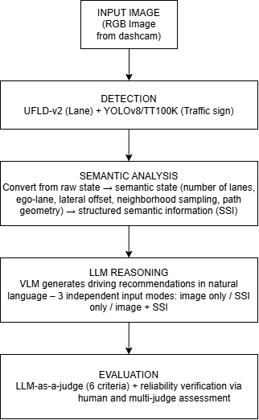
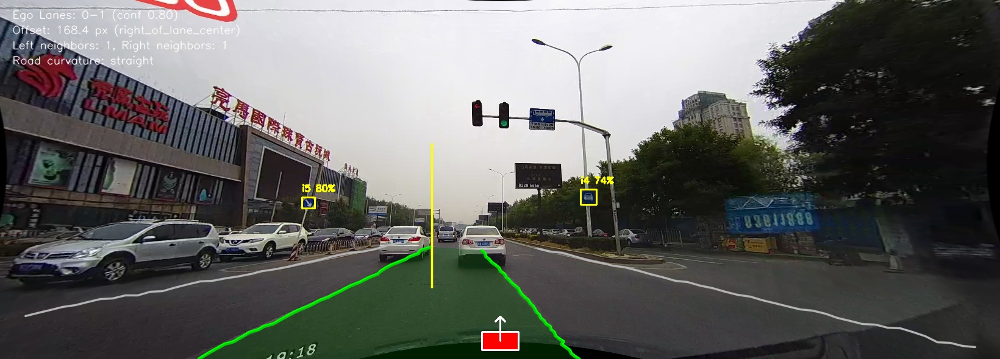

# VIỆN QUẢN TRỊ VÀ CÔNG NGHỆ FPT

## HIỂU LÀN ĐƯỜNG VÀ BIỂN BÁO GIAO THÔNG THEO NGỮ NGHĨA SỬ DỤNG MÔ HÌNH NGÔN NGỮ LỚN ĐỂ HỖ TRỢ RA QUYẾT ĐỊNH LÁI XE

*(Semantic Lane and Traffic Sign Understanding Using Large Language Models for Driving Decision Support)*

**LUẬN VĂN THẠC SĨ**

Chuyên ngành: Kỹ thuật Phần mềm

Học viên thực hiện: Đỗ Minh Hiếu

Người hướng dẫn khoa học: Tiến sĩ Đoàn Nhật Quang

Hà Nội, 2026

---

## LỜI CAM ĐOAN

Tôi xin cam đoan đây là công trình nghiên cứu do chính tôi thực hiện dưới sự hướng dẫn khoa học của Tiến sĩ Đoàn Nhật Quang.

Các số liệu, kết quả thực nghiệm trình bày trong luận văn là trung thực, được thu thập và xử lý bằng các công cụ, mã nguồn do tôi tự xây dựng, chưa từng được công bố trong bất kỳ công trình nào khác. Các nội dung tham khảo từ công trình của tác giả khác đều được trích dẫn đầy đủ, rõ ràng trong mục Tài liệu tham khảo.

Nếu có bất kỳ sự gian dối hay vi phạm quy định về liêm chính khoa học nào, tôi xin chịu hoàn toàn trách nhiệm trước Hội đồng và Nhà trường.

## LỜI CẢM ƠN

Để hoàn thành chương trình đào tạo Thạc sĩ và hoàn thiện công trình nghiên cứu này, bên cạnh những nỗ lực của bản thân, tôi đã nhận được sự dạy dỗ, hướng dẫn và động viên vô cùng to lớn của các thầy, cô, nhà trường, bạn bè và gia đình.

Trước tiên, tôi xin bày tỏ lòng biết ơn chân thành đến giảng viên hướng dẫn luận văn của mình — Tiến sĩ Đoàn Nhật Quang. Thầy là người đã truyền cảm hứng và định hướng cho tôi hình thành nên ý tưởng của đề tài nghiên cứu này, đã dành nhiều thời gian chỉ dẫn, truyền tải kiến thức, đồng thời đánh giá và góp ý trong suốt quá trình thực hiện đề tài. Những chỉ bảo tâm huyết của thầy không chỉ giúp tôi hoàn thiện bài luận văn mà còn là hành trang quý giá cho con đường phát triển chuyên môn của tôi sau này.

Tôi xin chân thành cảm ơn đội ngũ giảng viên, nhân viên tại Viện Quản trị & Công nghệ FPT (FSB) vì đã tạo ra một môi trường giáo dục chuyên nghiệp, cởi mở để tôi có thể theo học những kiến thức chuyên môn vững chắc và tham gia những buổi hội thảo hữu ích. Tôi cũng xin gửi lời cảm ơn đến các bạn bè, đồng nghiệp đã luôn sẵn sàng chia sẻ kiến thức, thảo luận và đồng hành cùng tôi trong suốt quá trình học tập.

Cuối cùng, tôi xin dành trọn tình cảm và lòng biết ơn vô hạn tới cha mẹ, anh chị em trong gia đình. Gia đình luôn là điểm tựa vững chắc nhất, mang lại sự bình yên, niềm tin và luôn tạo điều kiện tốt nhất để tôi kiên trì nỗ lực vượt qua khó khăn, hoàn thành ước mơ học tập của mình.

Mặc dù đã có nhiều cố gắng trong quá trình nghiên cứu và trình bày, công việc này không tránh khỏi những hạn chế nhất định. Tôi rất mong nhận được những ý kiến đóng góp quý báu từ Quý Thầy/Cô trong Hội đồng để công trình nghiên cứu này được hoàn thiện hơn.

---

## MỤC LỤC

- CHƯƠNG 1. GIỚI THIỆU
  - 1.1. Bối cảnh và động lực
  - 1.2. Khoảng trống nghiên cứu và bài toán
  - 1.3. Mục tiêu và câu hỏi nghiên cứu
  - 1.4. Phạm vi nghiên cứu
  - 1.5. Đóng góp chính
  - 1.6. Cấu trúc luận văn
- CHƯƠNG 2. TỔNG QUAN VÀ CÁC CÔNG TRÌNH LIÊN QUAN
  - 2.1. Phát hiện làn đường và biển báo giao thông
    - 2.1.1. Phát hiện làn đường
    - 2.1.2. Phát hiện biển báo
  - 2.2. Mô hình Thị giác - Ngôn ngữ (VLM) trong bài toán giao thông
  - 2.3. Phương pháp luận đánh giá LLM-as-a-Judge
  - 2.4. Tóm tắt khoảng trống nghiên cứu
- CHƯƠNG 3. PHƯƠNG PHÁP LUẬN
  - 3.1. Kiến trúc tổng thể hệ thống
  - 3.2. Dữ liệu và tiền xử lý
  - 3.3. Mô-đun trích xuất SSI
    - 3.3.1. Trích xuất ngữ nghĩa làn đường
    - 3.3.2. Trích xuất ngữ nghĩa biển báo
    - 3.3.3. Xây dựng SSI
  - 3.4. Thiết kế kỹ thuật gợi ý
  - 3.5. Thiết kế thực nghiệm đối chứng và khung đánh giá
    - 3.5.1. Các chế độ đầu vào
    - 3.5.2. Tiêu chí đánh giá
    - 3.5.3. LLM-as-a-Judge
    - 3.5.4. Human evaluation và multi-judge
    - 3.5.5. Kiểm định thống kê
  - 3.6. Ví dụ minh họa toàn trình
- CHƯƠNG 4. KẾT QUẢ VÀ BÀN LUẬN
  - 4.1. Thiết lập thực nghiệm
  - 4.2. Kết quả định lượng các mô-đun
    - 4.2.1. Module hiểu làn đường (CULane)
    - 4.2.2. Kiểm chứng độc lập trên dữ liệu real-life
    - 4.2.3. Module biển báo giao thông trên CULane
  - 4.3. Kết quả VLM và kiểm định giả thuyết
    - 4.3.1. So sánh mô hình LLM cho bước xử lý suy luận
    - 4.3.2. Kết quả chính: đóng góp của SSI
  - 4.4. Kiểm chứng độ tin cậy của phương pháp đánh giá
  - 4.5. Phân tích chuyên sâu
    - 4.5.1. Kiểm chứng khả năng tự nhận diện làn đường của VLM
    - 4.5.2. Bàn luận: giả thuyết về cơ chế đóng góp của SSI
  - 4.6. Thảo luận và Hạn chế
    - 4.6.1. Rủi ro trùng lặp dữ liệu (data leakage) và hiệu chỉnh tham số
    - 4.6.2. Hạn chế tổng thể
- CHƯƠNG 5. KẾT LUẬN
  - 5.1. Kết luận
  - 5.2. Tóm tắt đóng góp
  - 5.3. Hướng phát triển tiếp theo
- TÀI LIỆU THAM KHẢO

## DANH MỤC TỪ VIẾT TẮT

| Từ viết tắt | Tiếng Anh | Giải thích |
|---|---|---|
| ADAS | Advanced Driver Assistance System | Hệ thống hỗ trợ lái xe tiên tiến |
| XAI | Explainable AI | AI khả giải |
| LKAS | Lane Keeping Assistance System | Hệ thống hỗ trợ giữ làn |
| VLM | Vision-Language Model | Mô hình thị giác ngôn ngữ |
| LLM | Large Language Model | Mô hình ngôn ngữ lớn |
| MLLM | Multimodal Large Language Model | Mô hình ngôn ngữ lớn đa phương thức |
| BEV | Bird's-Eye View | Biểu diễn không gian nhìn từ trên xuống |
| UFLD-v2 | Ultra Fast Lane Detection v2 | Kiến trúc phát hiện làn đường tốc độ cao (phiên bản 2) |
| SCNN | Spatial Convolutional Neural Network | Mạng nơ-ron tích chập không gian |
| YOLO | You Only Look Once | Họ kiến trúc object detection một giai đoạn |
| TSR | Traffic Sign Recognition | Nhận diện biển báo giao thông |
| TT100K | Tsinghua-Tencent 100K | Bộ dữ liệu biển báo giao thông quy mô lớn |
| MAE | Mean Absolute Error | Sai số tuyệt đối trung bình |
| IoU | Intersection over Union | Tỉ lệ giao trên hợp (metric localization) |
| F1 | F1-score | Trung bình điều hòa của Precision và Recall |
| API | Application Programming Interface | Giao diện lập trình ứng dụng |
| NIM | NVIDIA Inference Microservices | Dịch vụ suy luận model của NVIDIA (nền tảng gọi VLM trong đề tài) |
| SSI | Structured Semantic Information | Thông tin ngữ nghĩa có cấu trúc — bộ ngữ nghĩa $S=(\ell,o,c,N)$ và tập biển báo $D$ suy ra từ output nhận diện thô |
| JSON | JavaScript Object Notation | Định dạng dữ liệu có cấu trúc dùng để hiện thực hóa SSI |
| QCVN | Quy chuẩn Việt Nam | Hệ thống quy chuẩn kỹ thuật quốc gia (áp dụng cho biển báo Việt Nam) |

## DANH MỤC BẢNG

| STT | Ký hiệu | Tên bảng |
|---|---|---|
| 1 | Bảng 2.1 | Tổng hợp các công trình liên quan về LLM/VLM cho lái xe |
| 2 | Bảng 3.1 | Các trường thông tin được gán nhãn thủ công (ground truth) |
| 3 | Bảng 3.2 | Tổng hợp các bộ dữ liệu sử dụng trong nghiên cứu |
| 4 | Bảng 3.2b | Danh sách 51 lớp biển báo TT100K dùng để tinh chỉnh YOLOv8n, theo nhóm |
| 5 | Bảng 3.3 | Tổng hợp tham số cấu hình của mô-đun phân tích ngữ nghĩa |
| 6 | Bảng 3.3b | Kết quả phân tích độ nhạy ±10% các tham số heuristic |
| 7 | Bảng 3.4 | Tổng hợp các trường trong SSI: nguồn, biểu diễn, mục đích, độ tin cậy |
| 8 | Bảng 3.5 | Cấu hình gọi API dùng chung cho ba mô hình ứng viên và ba chế độ input |
| 9 | Bảng 3.6 | Mô tả từng mức điểm trong thang đánh giá 1–5 |
| 10 | Bảng 3.7 | Điểm và lý do của judge Gemini cho ảnh minh họa (mục 3.6) |
| 11 | Bảng 4.1 | Độ chính xác module hiểu làn đường trên CULane (N=200) |
| 12 | Bảng 4.2 | So sánh hiệu năng module hiểu làn đường theo nhóm có/không vạch kẻ đường rõ |
| 13 | Bảng 4.3 | Đối chiếu module hiểu làn đường và biển báo giữa CULane và dữ liệu real-life độc lập |
| 14 | Bảng 4.4 | So sánh chi tiết chất lượng nội dung giữa nemotron-nano-8b và ising-calibration-31b (Mean ± SD, kiểm định thống kê) |
| 15 | Bảng 4.5 | Điểm chất lượng khuyến nghị lái xe (Mean ± SD) theo 3 chế độ input, chấm bởi 3 judge độc lập |
| 16 | Bảng 4.6 | Kiểm định ý nghĩa thống kê khi so sánh cặp giữa 3 chế độ input, theo từng judge (N=200, dữ liệu bắt cặp theo ảnh) |
| 17 | Bảng 4.7 | Điểm trung bình (Mean ± SD) 6 tiêu chí đánh giá của judge Gemini theo từng chế độ input |
| 18 | Bảng 4.8 | Xếp hạng độ tin cậy của 3 judge khi đối chiếu với đánh giá của con người |
| 19 | Bảng 4.9 | So sánh khả năng tự nhận diện ngữ nghĩa làn đường giữa pipeline UFLD-v2 và VLM |
| 20 | Bảng 5.1 | Câu hỏi nghiên cứu và bằng chứng trả lời tương ứng |

## DANH MỤC HÌNH

| STT | Ký hiệu | Tên hình |
|---|---|---|
| 1 | Hình 3.1 | Kiến trúc tổng thể của pipeline 4 giai đoạn: Perception – Semantic Analysis – LLM Reasoning – Evaluation |
| 2 | Hình 3.2 | Ví dụ trực quan hóa output của mô-đun phân tích ngữ nghĩa trên một ảnh CULane |

---

# CHƯƠNG 1. GIỚI THIỆU

## 1.1. Bối cảnh và động lực

ADAS (Advanced Driver Assistance Systems) là các hệ thống điện tử trên xe, dùng cảm biến (camera, radar, LiDAR...) để tự động phát hiện tình huống giao thông và hỗ trợ hành vi lái xe — ví dụ cảnh báo chệch làn, hỗ trợ giữ làn, phanh khẩn cấp tự động [20]. Nhu cầu này gắn liền với quy mô vấn đề an toàn giao thông toàn cầu: tai nạn đường bộ gây khoảng 1,19 triệu ca tử vong mỗi năm [31], trong khi hệ thống cảnh báo chệch làn đã được chứng minh giảm 11% tỉ lệ va chạm và 21% tỉ lệ thương tích liên quan [32].

Phần lớn nghiên cứu ADAS hiện nay tập trung vào bước xử lý nhận diện, với các mô-đun phát hiện làn đường, biển báo ngày càng nhanh và chính xác. Tuy nhiên, đầu ra của các mô-đun này — tọa độ điểm ảnh, bounding box, class ID — được thiết kế cho thuật toán điều khiển, không phải để con người trực tiếp đọc hiểu (khả năng diễn giải cho con người là một hạn chế đã được ghi nhận ở nhiều hệ ADAS dựa trên AI [19]); điều này đòi hỏi một bước xử lý trung gian chuyển thông tin nhận diện thô thành ngữ nghĩa giao thông — làn đường, độ lệch tâm, hình dạng đường, biển báo cần tuân thủ — trước khi trình bày cho người lái bằng ngôn ngữ tự nhiên.

Sự phát triển của mô hình thị giác ngôn ngữ (Vision-Language Model — VLM) mở ra khả năng tổng hợp quan sát thị giác và sinh khuyến nghị lái xe bằng ngôn ngữ tự nhiên. Dù vậy, việc phụ thuộc hoàn toàn vào dữ liệu điểm ảnh thô (raw RGB) khiến VLM đối mặt với hai hạn chế lớn: khả năng định vị không gian kém chính xác và nguy cơ xuất hiện ảo giác (hallucination) trong các tình huống giao thông phức tạp. Nguyên lý cấp thêm ngữ cảnh có cấu trúc để tăng độ chính xác và giảm ảo giác cho mô hình sinh đã được kiểm chứng cả ở LLM nói chung (Retrieval-Augmented Generation [34]) lẫn trong lái xe cụ thể: DriveVLM [23] kết hợp VLM với thông tin không gian có cấu trúc để bù hạn chế suy luận không gian, còn Talk2BEV [25] cho thấy đặt VLM vào biểu diễn bản đồ có cấu trúc cải thiện rõ chất lượng suy luận so với chỉ dùng ảnh.

## 1.2. Khoảng trống nghiên cứu và bài toán

Nguyên lý cấp ngữ cảnh có cấu trúc vừa nêu ở mục 1.1 đã được kiểm chứng ở LLM nói chung và ở một số hệ VLM lái xe cụ thể, nhưng chưa được kiểm chứng định lượng, có đối chứng trực tiếp, cho đúng bài toán sinh khuyến nghị lái xe từ ngữ nghĩa làn đường và biển báo giao thông. Các công trình gần nhất theo hướng kết hợp deep learning chuyên biệt với VLM/LLM (mục 2.2) hoặc dừng ở việc tích hợp thông tin có cấu trúc để tối đa hóa độ chính xác nhận diện, hoặc đặt trọng tâm khác — suy luận không gian, tương tác, tối ưu độ trễ — chưa công trình nào tách bạch định lượng, bằng một thực nghiệm đối chứng trực tiếp trên cùng một mô hình, phần đóng góp riêng của thông tin ngữ nghĩa có cấu trúc so với chỉ dùng ảnh thô. Đây là khoảng trống nghiên cứu cụ thể mà đề tài hướng tới lấp đầy; phân tích đầy đủ theo từng nhóm công trình liên quan được trình bày ở mục 2.4.

Từ khoảng trống đó, bài toán đặt ra là: xây dựng một quy trình chuyển đổi output thô của các mô hình nhận diện hạ tầng giao thông (làn đường, biển báo) thành thông tin ngữ nghĩa có cấu trúc, và kiểm chứng bằng thực nghiệm đối chứng định lượng liệu thông tin đó có cải thiện chất lượng khuyến nghị lái xe do VLM sinh ra hay không, so với khi chỉ dùng ảnh thô. Do không gian ngữ nghĩa giao thông đầy đủ bao quát rất nhiều yếu tố khác (phương tiện xung quanh, chướng ngại vật động...), bài toán được thu hẹp vào hai thành phần hạ tầng cố định nền tảng nhất — làn đường và biển báo giao thông (phạm vi cụ thể ở mục 1.4).

## 1.3. Mục tiêu và câu hỏi nghiên cứu

Giả thuyết trung tâm của nghiên cứu, phát biểu ở dạng kiểm chứng được: điểm chất lượng khuyến nghị trung bình do LLM-as-a-judge chấm ở chế độ có SSI (Structured Semantic Information — Thông tin ngữ nghĩa có cấu trúc — biểu diễn dữ liệu có cấu trúc gồm làn ego, số làn, độ lệch tâm, hình dạng đường, biển báo) sẽ cao hơn có ý nghĩa thống kê so với chế độ chỉ dùng ảnh đầu vào đơn thuần. Từ giả thuyết này, đề tài tập trung giải quyết câu hỏi nghiên cứu cốt lõi:

"Việc tích hợp SSI cải thiện chất lượng, độ chính xác và tính căn cứ của khuyến nghị lái xe do VLM sinh ra ở mức độ nào so với việc chỉ khai thác dữ liệu ảnh thô?"

Xuất phát từ câu hỏi này và bài toán đã nêu ở Mục 1.2, mục tiêu tổng quát của đề tài là xây dựng và kiểm chứng định lượng một quy trình chuyển đổi dữ liệu nhận diện hạ tầng giao thông thô (làn đường, biển báo) thành SSI, đóng vai trò ngữ cảnh bổ sung cho Mô hình Ngôn ngữ Đa phương thức (VLM) trong bài toán sinh khuyến nghị lái xe bằng ngôn ngữ tự nhiên. Ba mục tiêu cụ thể, mỗi mục tiêu giải quyết một khoảng trống riêng trong chuỗi xử lý đó:

1. **Phát triển mô-đun chuyển đổi ngữ nghĩa**: thiết kế và cài đặt mô-đun chuyển đổi output thô từ các mô hình nhận diện chuyên biệt — làn đường (số làn, làn ego, độ lệch tâm, làn lân cận, hình thái đường) và biển báo giao thông (định vị, phân loại, quy tắc tương ứng) — thành SSI, giải quyết khoảng trống về việc thiếu một bước xử lý biến tọa độ thô thành ngữ cảnh mà VLM có thể dùng được.
2. **Thiết kế prompt để VLM sinh khuyến nghị lái xe dựa trên thông tin ngữ nghĩa**: xây dựng kỹ thuật gợi ý (prompt engineering) giúp VLM sử dụng hiệu quả SSI khi sinh khuyến nghị lái xe, giải quyết khoảng trống về việc có thông tin ngữ nghĩa sẵn sàng không đồng nghĩa với việc VLM tự động khai thác tốt thông tin đó.
3. **Đánh giá gợi ý lái xe bằng một mô hình mạnh hơn, đồng thời kiểm chứng độ tin cậy của chính phép đánh giá đó**: ứng dụng LLM-as-a-Judge để định lượng chất lượng khuyến nghị khi có và không có SSI, và xác nhận độ tin cậy của công cụ đánh giá này bằng đối chiếu với con người và đa-judge — giải quyết khoảng trống về việc bản thân công cụ đánh giá cũng cần được kiểm chứng trước khi dùng làm căn cứ kết luận.

## 1.4. Phạm vi nghiên cứu

Do không gian ngữ nghĩa giao thông đầy đủ bao quát rất nhiều yếu tố (hạ tầng đường bộ, phương tiện xung quanh, chướng ngại vật động...), để đảm bảo tính khả thi, đề tài này thu hẹp phạm vi vào hai thành phần hạ tầng cố định nền tảng nhất — làn đường và biển báo giao thông — quyết định trực tiếp việc định vị không gian và quy tắc bắt buộc đối với phương tiện.

Về dữ liệu, đề tài kiểm chứng định lượng trên hai tập dữ liệu chuẩn công khai, phổ biến quốc tế — CULane [6] cho bài toán làn đường, TT100K [9] cho bài toán biển báo — nhằm đảm bảo khả năng tái lập và đối sánh khách quan với các công trình liên quan, đồng thời bổ sung một bộ dữ liệu tự thu thập (200 khung hình được cắt từ camera hành trình gắn trên xe), độc lập với dữ liệu huấn luyện của UFLD-v2, để kiểm chứng khả năng tổng quát hóa ngoài phân bố huấn luyện.

## 1.5. Đóng góp chính

Đóng góp chính của đề tài là một **khung đa mô hình (multi-model framework)** sinh khuyến nghị lái xe, kết hợp mô hình ngôn ngữ đa phương thức (VLM) với SSI được trích xuất từ ảnh/video camera hành trình gắn trên xe, cùng một thực nghiệm đối chứng (ablation) định lượng tách bạch phần đóng góp riêng của thông tin ngữ nghĩa đó đối với chất lượng khuyến nghị do VLM sinh ra — một câu hỏi mà các hướng nghiên cứu liên quan mới dừng ở việc tích hợp thông tin có cấu trúc để tối đa hóa độ chính xác, chưa tách bạch định lượng phần đóng góp riêng của thông tin đó bằng một thực nghiệm đối chứng so với chỉ dùng ảnh thô. Ba đóng góp cụ thể:

1. **[Đóng góp kỹ thuật] Một mô-đun biểu diễn ngữ nghĩa có cấu trúc, được kiểm chứng độc lập với ground truth** — đóng góp kỹ thuật trung tâm của đề tài: xây dựng quy trình chuyển đổi output thô của các mô hình nhận diện chuyên biệt (UFLD-v2, YOLOv8n) thành các thông tin ngữ nghĩa (số làn, làn ego, độ lệch tâm, làn lân cận, hình thái đường, biển báo), kiểm chứng độ chính xác bằng đối chiếu ground truth gán tay trên cả dữ liệu benchmark lẫn dữ liệu độc lập tự thu thập.
2. **[Đóng góp phương pháp luận] Một khung thực nghiệm để đo ảnh hưởng của biểu diễn ngữ nghĩa lên VLM**: so sánh có kiểm soát giữa ba chế độ input (chỉ ảnh / chỉ ngữ nghĩa / kết hợp) trên cùng mô hình, cùng ảnh, cùng bộ tiêu chí, kèm một công cụ đo đã được kiểm chứng độ tin cậy — quy trình đối chiếu đa giám khảo (multi-judge alignment) và đối chiếu với đánh giá của con người — để kết luận so sánh không phụ thuộc vào một công cụ đo chưa được xác nhận.
3. **[Đóng góp thực nghiệm] Một phép so sánh định lượng, đa-judge cho câu hỏi nghiên cứu cốt lõi**: kết quả đối chứng giữa ba chế độ input (chỉ ảnh / chỉ ngữ nghĩa / kết hợp) trên N=200 ảnh, kiểm chứng độc lập bởi ba judge — cung cấp bằng chứng định lượng tách bạch phần đóng góp riêng của SSI khỏi hiệu năng tổng thể của VLM.

## 1.6. Cấu trúc luận văn

Toàn văn luận văn được tổ chức thành 5 chương chính với nội dung trình bày theo thứ tự logic như sau:

Chương 1: Giới thiệu (Introduction): Trình bày tổng quan về bối cảnh nghiên cứu, động lực đề tài, khoảng trống nghiên cứu và bài toán, mục tiêu và câu hỏi nghiên cứu, phạm vi nghiên cứu, và các đóng góp chính của đề tài.

Chương 2: Tổng quan nghiên cứu và Cơ sở lý thuyết (Related Work & Theoretical Background): Trình bày nền tảng lý thuyết và tổng quan các công trình liên quan theo ba nhóm nội dung chính — phát hiện làn đường và biển báo giao thông, ứng dụng Mô hình Thị giác-Ngôn ngữ (VLM) trong bài toán giao thông, và phương pháp luận đánh giá LLM-as-a-Judge; qua đó xác định rõ khoảng trống tri thức mà đề tài hướng tới giải quyết.

Chương 3: Phương pháp đề xuất (Proposed Methodology): Mô tả chi tiết kiến trúc hệ thống tổng thể, quy trình thu thập và xử lý dữ liệu, thuật toán trích xuất ngữ nghĩa hạ tầng (làn đường và biển báo), thiết kế biểu diễn ngữ nghĩa có cấu trúc, kỹ thuật gợi ý (prompt engineering) và khung phương pháp luận đánh giá.

Chương 4: Kết quả và Bàn luận (Results & Discussion): Trình bày chi tiết cấu hình thực nghiệm, kết quả định lượng của từng mô-đun thành phần, kết quả thực nghiệm trung tâm về tác động của SSI đến VLM, kiểm chứng độ tin cậy của LLM-as-a-Judge, các phân tích chuyên sâu làm rõ cơ chế đóng góp thực sự của thông tin đó, cùng thảo luận khách quan về các hạn chế còn tồn tại.

Chương 5: Kết luận (Conclusion): Tổng kết các đóng góp chính, tổng hợp câu trả lời cho câu hỏi nghiên cứu, và đề xuất các hướng mở rộng nghiên cứu trong tương lai.

Tóm tắt Chương 1. Chương 1 đã phân tích rõ bối cảnh và động lực nghiên cứu, xác định khoảng trống nghiên cứu và bài toán cụ thể mà đề tài giải quyết. Trên cơ sở đó, chương này đã xác lập mục tiêu và câu hỏi nghiên cứu, phạm vi nghiên cứu, cùng các đóng góp cốt lõi của luận văn. Chương 2 tiếp theo sẽ trình bày tổng quan các nghiên cứu liên quan nhằm làm nét hơn nữa nền tảng lý thuyết và cơ sở khoa học cho phương pháp đề xuất.

---

# CHƯƠNG 2. TỔNG QUAN VÀ CÁC CÔNG TRÌNH LIÊN QUAN

Các hệ thống hỗ trợ lái xe tiên tiến (Advanced Driver Assistance Systems — ADAS) hiện là một phần gần như tiêu chuẩn trên xe hơi thương mại, với các tính năng đã phổ biến như cảnh báo chệch làn, hỗ trợ giữ làn, và nhận diện biển báo giao thông; đây cũng là nền tảng nhận thức cần thiết để tiến tới các cấp độ tự động hóa cao hơn. Nidamanuri và cộng sự [20] khảo sát tiến trình phát triển công nghệ ADAS qua các cấp độ tự động hóa, cho thấy xu hướng chuyển dịch từ hệ thống dựa trên cảm biến đơn lẻ sang các hệ đa cảm biến kết hợp học sâu nhằm tăng độ tin cậy trong điều kiện thực tế đa dạng. Song song với yêu cầu về độ chính xác, khả năng khả giải (explainability) của quyết định do AI đưa ra ngày càng được xem là một điều kiện quan trọng để ADAS được triển khai và chấp nhận ở quy mô lớn, đặc biệt trong các tình huống ranh giới (edge case): Kuznietsov và cộng sự [19] thực hiện tổng quan hệ thống đầu tiên về AI khả giải (Explainable AI — XAI) cho lái xe tự động an toàn, chỉ ra năm đóng góp chính của XAI — thiết kế khả giải, mô hình đại diện khả giải, giám sát khả giải, giải thích phụ trợ, và kiểm định khả giải. Tselentis và Papadimitriou [21] bổ sung thêm một khía cạnh nhân tố con người mà các hệ ADAS thuần cảm biến thường ít khai thác: nhận diện hồ sơ và mẫu hành vi lái xe (driver profile/pattern) như một tín hiệu đầu vào cho đánh giá an toàn giao thông. Ba hướng nghiên cứu này — công nghệ cảm biến, khả giải, và nhân tố con người — cùng phác họa bối cảnh chung mà đề tài này góp phần vào: xây dựng một tầng hỗ trợ quyết định vừa chính xác vừa có thể diễn giải bằng ngôn ngữ tự nhiên.

## 2.1. Phát hiện làn đường và biển báo giao thông

### 2.1.1. Phát hiện làn đường

Phát hiện làn đường là bài toán xác định vị trí các vạch kẻ/ranh giới làn đường trong ảnh, làm cơ sở trực tiếp cho các tính năng cảnh báo chệch làn và hỗ trợ giữ làn của ADAS. Trong khoảng một thập kỷ qua, hướng tiếp cận cho bài toán này đã chuyển dịch rõ rệt từ các phương pháp hình học truyền thống (dò biên, biến đổi Hough, fit đa thức) sang các kiến trúc học sâu, nhờ khả năng xử lý tốt hơn các điều kiện thực tế phức tạp như bóng đổ, vạch kẻ mờ, hay ánh sáng thay đổi. Trong nhóm phương pháp học sâu, ba họ thiết kế chính đã hình thành: (a) phân đoạn ngữ nghĩa (semantic segmentation) — coi mỗi điểm ảnh là thuộc làn hay không; (b) phân loại thứ tự theo lưới hàng/cột (ordinal classification) — dự đoán vị trí làn tại các hàng ảnh rời rạc thay vì hồi quy tọa độ trực tiếp; và (c) cơ chế anchor — đề xuất trước một tập đường/vùng ứng viên rồi tinh chỉnh. Ba họ này đánh đổi giữa độ chính xác hình học và tốc độ suy luận theo những cách khác nhau.

Về đánh giá, benchmark chuẩn cho bài toán này thường báo cáo các chỉ số ở tầng phát hiện điểm ảnh (point-wise localization), điển hình là F1 theo ngưỡng IoU giữa làn dự đoán và ground truth. Đây là loại chỉ số khác về bản chất so với các đại lượng ngữ nghĩa cấp cao hơn — ví dụ số làn, làn ego, hình dạng đường — vốn cần một bước xử lý hậu kỳ riêng để suy ra từ output phát hiện điểm ảnh thô; hai loại chỉ số này không thể so sánh trực tiếp với nhau.

Ultra-Fast-Lane-Detection-v2 (UFLD-v2) [1] là một kiến trúc phát hiện làn đường tốc độ cao tiêu biểu cho họ phương pháp phân loại thứ tự theo lưới hàng/cột (hybrid anchor-driven ordinal classification). Kiến trúc này đạt tốc độ suy luận trên 300 khung hình/giây ở phiên bản nhẹ, trong khi vẫn giữ độ chính xác cạnh tranh — F1 = 76,0% trên tập kiểm thử CULane với backbone ResNet-34, đúng biến thể pretrained (`culane_res34.pth`) mà đề tài sử dụng nguyên trạng ở mục 3.1. CULane [6] là benchmark chuẩn cho bài toán này (88,9 nghìn ảnh huấn luyện, 9,7 nghìn ảnh kiểm định, 34,7 nghìn ảnh kiểm thử), với đặc điểm dữ liệu chủ yếu là các tình huống đường đô thị đa dạng: giao lộ, mật độ giao thông cao, điều kiện ánh sáng thay đổi.

Đại diện cho họ anchor, LaneATT [39] và CLRNet [33] mở rộng theo hai hướng khác nhau — line-anchor kết hợp attention để dùng backbone nhẹ, và cross-layer refinement với hàm mất mát Line IoU đo trực tiếp độ khớp hình học — cùng đạt độ chính xác cao trên CULane tại thời điểm công bố. Khảo sát của He và cộng sự [40] hệ thống hóa bốn trục thiết kế chính của lĩnh vực (mô hình hóa tác vụ, tham số hóa làn đường, ngữ cảnh toàn cục cho làn bị che khuất, khử phối cảnh cho bài toán 3D); hai khảo sát sớm hơn [7], [8] cùng ghi nhận xu hướng chuyển dịch từ mô hình hình học truyền thống sang deep learning. Điểm chung của cả nhóm: các chỉ số được tối ưu (F1/IoU, tốc độ suy luận) đo ở tầng phát hiện điểm ảnh, khác bản chất với các đại lượng ngữ nghĩa cấp quyết định — số làn, làn ego, hình dạng đường — mà đề tài này hướng tới (mục 2.1.1).

Bên cạnh việc cải thiện thuật toán phát hiện, việc đánh giá chất lượng của các hệ thống hỗ trợ giữ làn (Lane Keeping Assistance Systems — LKAS) khi triển khai thực tế cũng là một hướng nghiên cứu riêng. Wei và cộng sự [28] tổng hợp các phương pháp đánh giá LKAS hiện có — từ nhóm chỉ số khách quan (độ lệch làn, thời gian phản ứng) đến nhóm phương pháp có tích hợp cảm nhận chủ quan của người lái — và chỉ ra rằng nhóm phương pháp thứ hai hiện vẫn ít được chuẩn hóa hơn.

### 2.1.2. Phát hiện biển báo

Nhận diện biển báo giao thông (Traffic Sign Recognition — TSR) là bài toán định vị và phân loại biển báo trong ảnh, phục vụ trực tiếp các tính năng nhắc nhở/hỗ trợ tài xế tuân thủ quy tắc giao thông. Về kiến trúc, hai hướng tiếp cận phổ biến là detector hai giai đoạn (two-stage — đề xuất vùng ứng viên rồi phân loại, ví dụ Mask R-CNN) và detector một giai đoạn (single-stage — dự đoán vị trí và lớp đồng thời trong một lượt suy luận, ví dụ họ YOLO, đánh đổi lấy tốc độ). Độ khó của bài toán phụ thuộc mạnh vào số lượng lớp mục tiêu (vài chục lớp cho ứng dụng lái xe thông thường so với hàng trăm lớp cho kiểm kê biển báo quy mô lớn) và kích thước vật thể trong ảnh — biển báo ở xa hoặc chụp góc nghiêng thường chỉ chiếm một vùng rất nhỏ, một thách thức chung của các kiến trúc một giai đoạn. Về đánh giá, cần phân biệt hai bài toán có độ khó khác nhau: phân loại (classification) trên vùng đã khoanh sẵn, thường báo cáo bằng Accuracy; và phát hiện từ đầu (detection) trên toàn khung hình không có gợi ý vị trí trước, thường báo cáo bằng Precision/Recall — bài toán sau khó hơn đáng kể vì gộp cả lỗi định vị lẫn lỗi phân loại.

YOLOv8 (Ultralytics) là kiến trúc object detection một giai đoạn hiện được sử dụng rộng rãi cho bài toán TSR nhờ cân bằng tốt giữa tốc độ và độ chính xác, phù hợp cho ứng dụng thời gian thực. TT100K (Tsinghua-Tencent 100K) [9] là benchmark quy mô lớn cho bài toán phát hiện và phân loại biển báo giao thông tại Trung Quốc, gồm khoảng 100.000 ảnh và 30.000 đối tượng biển báo được gán nhãn, với hệ thống mã hóa biển báo chi tiết theo loại: biển cấm ("p"), biển hiệu lệnh ("i"), biển cảnh báo ("w"), biển giới hạn tốc độ ("pl"/"il").

Trước YOLO, hướng hai giai đoạn đã chứng minh hiệu quả ở quy mô lớn hơn nhiều — Tabernik và Skočaj [41] dùng Mask R-CNN cho hàng trăm loại biển báo — cho thấy độ khó của TSR phụ thuộc mạnh vào số lượng lớp mục tiêu, không chỉ vào kiến trúc. Các công trình gần đây tích hợp attention/transformer vào YOLOv8 để cải thiện phát hiện vật thể nhỏ: Logeswaran và cộng sự [26] xác nhận tính khả thi khi phát hiện đồng thời người đi bộ và biển báo; Ji và cộng sự [27] bổ sung BoTNet, ODConv, LSKA vào YOLOv8n, cải thiện độ chính xác trên vật thể nhỏ ở TT100K. Nhóm công trình này tối ưu độ chính xác phát hiện/phân loại biển báo đơn lẻ, chưa gắn kết quả nhận diện với suy luận về quy tắc giao thông tương ứng — bước xử lý mà đề tài này thực hiện ở mô-đun phân tích ngữ nghĩa (mục 3.3).

## 2.2. Mô hình Thị giác - Ngôn ngữ (VLM) trong bài toán giao thông

Mô hình ngôn ngữ lớn đa phương thức (Vision-Language Model — VLM) mở rộng một LLM văn bản để nhận đồng thời ảnh và văn bản làm đầu vào, thường theo kiến trúc gồm ba thành phần: một bộ mã hóa thị giác (visual encoder) trích xuất đặc trưng từ ảnh, một tầng chiếu (projection layer) ánh xạ đặc trưng thị giác sang không gian embedding của LLM, và bản thân LLM sinh văn bản dựa trên chuỗi embedding kết hợp cả hai phương thức. Có hai hướng khai thác VLM cho một bài toán cụ thể: tinh chỉnh (fine-tuning) toàn bộ hoặc một phần mô hình trên dữ liệu chuyên biệt để tối ưu hiệu năng cho đúng tác vụ, hoặc dùng nguyên trạng (training-free) một VLM tổng quát đã huấn luyện sẵn, khai thác thông qua thiết kế câu lệnh (prompt engineering) mà không cập nhật tham số mô hình. Hướng thứ hai có chi phí triển khai thấp hơn đáng kể nhưng phụ thuộc nhiều hơn vào chất lượng ngữ cảnh và câu lệnh được cung cấp cho mô hình.

Các công trình ứng dụng mô hình ngôn ngữ lớn đa phương thức cho lái xe có thể chia thành ba nhóm theo mức độ tích hợp với vòng lặp điều khiển, tổng hợp ở Bảng 2.1, trước khi đi vào phân tích chi tiết từng nhóm.

**Bảng 2.1.** Tổng hợp các công trình liên quan về LLM/VLM cho lái xe.

| Nhóm | Công trình | Đặc điểm kỹ thuật chính | Kết quả nổi bật đã công bố |
|---|---|---|---|
| End-to-end quy mô lớn | DriveGPT4 [2] | Sinh giải thích ngôn ngữ tự nhiên kèm tín hiệu điều khiển, huấn luyện end-to-end | — |
| | DriveLM [3] | Đóng khung lái xe dưới dạng Graph Visual Question Answering | — |
| | LMDrive [4] | Lái xe closed-loop end-to-end bằng LLM | — |
| Tầng tương tác/suy luận gắn thêm | Drive as You Speak [22] | LLM tool-use, suy luận reasoning-acting, tương tác cá nhân hóa | — |
| | DriveVLM [23] | Kiến trúc lai DriveVLM-Dual: VLM + pipeline truyền thống cho suy luận không gian | Kiểm chứng trên nuScenes + triển khai thực tế |
| | Mô hình ngôn ngữ nhẹ confidence-aware [24] | Chưng cất từ hệ đa-agent, có nhận biết độ tin cậy | SOTA trên benchmark nuPlan, độ trễ thấp |
| | Talk2BEV [25] | VLM trên biểu diễn bird's-eye-view, không huấn luyện riêng từng tác vụ | Talk2BEV-Bench, >20.000 câu hỏi trên nuScenes |
| Hybrid deep learning + MLLM | SafeRoute [11] / Advancing-AV-Intelligence [12] | Multimodal Adapter dung hợp đặc trưng CNN với embedding EVA-CLIP | ResNet-50 99,8% / YOLOv8 98,0% / RT-DETR 96,6% (biển báo); Question Overall Accuracy 82,83% (làn đường) |
| | DSC-LLM [13] | Đặc trưng hành vi (LSTM/transformer) + ngữ cảnh ảnh, dự đoán quỹ đạo | — |

**Tiền thân trước kỷ nguyên LLM.** Hong và cộng sự [10] đã đặt nền móng cho ý tưởng mã hóa ngữ nghĩa cấp cao của tình huống giao thông thành một biểu diễn có cấu trúc (dạng lưới không gian) để mô hình học sâu suy luận hành vi lái xe. Công trình này dùng mạng convolutional thuần túy; hạn chế duy nhất là chưa sinh được giải thích bằng ngôn ngữ tự nhiên — điều mà các mô hình ngôn ngữ lớn ra đời sau đó mới giải quyết được.

**VLM cho hiểu ngữ nghĩa giao thông, không gắn trực tiếp với quyết định điều khiển.** Song song với các hệ VLM/LLM gắn liền vòng lặp điều khiển hoặc sinh khuyến nghị hành vi (Bảng 2.1), một nhánh nghiên cứu khác dùng VLM thuần túy cho mô tả và hiểu ngữ nghĩa tình huống giao thông, không nhất thiết hướng tới sinh khuyến nghị hành vi. Rivera và cộng sự [42] dùng các VLM tổng quát (GPT-4, LLaVA) để tự động phân loại và chú thích ngữ nghĩa cảnh giao thông đô thị trên BDD100K mà không cần huấn luyện lại theo từng tập nhãn mới — một minh chứng trực tiếp cho khả năng VLM tổng quát hiểu ngữ cảnh giao thông ở chế độ training-free. Fan và cộng sự [43] (MLLM-SUL) tiến thêm một bước: kết hợp bộ mã hóa thị giác hai nhánh với một LLM đã tinh chỉnh để đồng thời sinh mô tả ngữ nghĩa tình huống và định vị vùng rủi ro trên ảnh — hướng tiếp cận tinh chỉnh MLLM chuyên biệt, gần với nhóm hybrid ở Bảng 2.1 hơn. Cả hai công trình cho thấy khả năng hiểu ngữ nghĩa giao thông của VLM đang được khai thác theo nhiều hướng — từ tự động hóa gán nhãn dữ liệu đến định vị rủi ro — nhưng phần lớn tập trung vào ngữ nghĩa tổng thể của cảnh (loại tình huống, đối tượng, mức rủi ro), chưa đi sâu vào ngữ nghĩa làn đường và biển báo có cấu trúc.

**Các hệ VLM/LLM lái xe end-to-end quy mô lớn.** Với sự xuất hiện của các mô hình ngôn ngữ lớn đa phương thức, một hướng nghiên cứu tích cực đã hình thành nhằm tích hợp trực tiếp khả năng suy luận ngôn ngữ vào pipeline lái xe end-to-end — tiêu biểu là DriveGPT4 [2], DriveLM [3] và LMDrive [4] (Bảng 2.1). Các hệ này đạt được khả năng diễn giải tích hợp sâu ngay trong vòng lặp điều khiển, đổi lại đòi hỏi huấn luyện hoặc tinh chỉnh trên tập dữ liệu lái xe quy mô lớn (nuScenes, CARLA...) cùng hạ tầng tính toán và dữ liệu đáng kể.

**Các hệ LLM/VLM đóng vai trò bước xử lý tương tác/suy luận gắn thêm.** Một nhóm công trình gần đây dùng LLM/VLM như một bước xử lý suy luận hoặc tương tác gắn thêm vào pipeline lái xe sẵn có — Drive as You Speak [22], DriveVLM [23], mô hình ngôn ngữ nhẹ confidence-aware [24], và Talk2BEV [25] (Bảng 2.1). Đáng chú ý, DriveVLM [23] thừa nhận rõ hạn chế của VLM thuần túy về suy luận không gian nên phải kết hợp với một pipeline truyền thống để bù đắp. Yao và cộng sự [24] giải quyết bài toán chi phí suy luận — một ràng buộc quan trọng cho triển khai thời gian thực — bằng cách chưng cất (distill) một mô hình ngôn ngữ nhẹ có nhận biết độ tin cậy từ một hệ đa-agent. Bốn công trình trên đặt trọng tâm vào những mục tiêu khác nhau: cải thiện khả năng tương tác và cá nhân hóa [22], mở rộng khả năng suy luận không gian trong tình huống phức tạp [23], tối ưu chi phí/độ trễ suy luận [24], hoặc mở rộng không gian biểu diễn sang BEV [25].

**Các hệ hybrid deep learning + MLLM.** SafeRoute [11] và công trình tiền thân "Advancing Autonomous Vehicle Intelligence" [12] — của cùng một nhóm tác giả — xây dựng một pipeline thống nhất dung hợp đặc trưng CNN với embedding ngôn ngữ ở tầng biểu diễn (Bảng 2.1), đạt độ chính xác nhận diện biển báo và hiểu làn đường đều cao — cho thấy hướng dung hợp thông tin ở tầng embedding mang lại hiệu năng mạnh khi có đủ dữ liệu và tài nguyên để tinh chỉnh MLLM. Tương tự, DSC-LLM [13] kết hợp đặc trưng hành vi với ngữ cảnh giao thông trích xuất từ ảnh để dự đoán quỹ đạo kèm suy luận rủi ro có giải thích bằng LLM.

## 2.3. Phương pháp luận đánh giá LLM-as-a-Judge

Đánh giá chất lượng của một output ngôn ngữ tự nhiên là bài toán khó lượng hóa bằng các metric cứng truyền thống (accuracy, F1...) vì không tồn tại một "đáp án đúng duy nhất". Phương pháp LLM-as-a-judge — sử dụng một LLM mạnh làm "giám khảo" tự động chấm điểm theo một rubric cho trước — giải quyết vấn đề này bằng cách thay đánh giá con người bằng một mô hình đủ mạnh để nắm bắt sắc thái ngôn ngữ, đổi lại phải đối mặt với các thiên lệch cố hữu đã được ghi nhận trong y văn, tiêu biểu là ở chính nghiên cứu MT-Bench [5]: thiên vị độ dài câu trả lời (câu trả lời dài thường được chấm cao hơn dù không chính xác hơn), thiên vị phong cách viết (văn phong tự tin, có cấu trúc rõ ràng được đánh giá cao hơn nội dung thực tế), và tự thiên vị giữa các mô hình cùng họ (self-preference bias). Các thiên lệch này cần được kiểm chứng riêng cho từng bài toán ứng dụng cụ thể, không thể mặc định một LLM-as-a-judge đáng tin cậy chỉ vì đã được kiểm chứng trên một benchmark khác.

Phương pháp luận LLM-as-a-judge đã được áp dụng rộng rãi trong các benchmark đánh giá LLM gần đây, tiêu biểu là MT-Bench và Chatbot Arena [5], cũng như AlpacaEval. Trên MT-Bench, GPT-4 khi làm judge đạt 85% đồng thuận với chuyên gia con người (trên các cặp so sánh không hòa), một mức xấp xỉ độ đồng thuận giữa người với người (81%) — cho thấy LLM-as-a-judge có thể đạt độ tin cậy tiệm cận con người trong điều kiện phù hợp. Một khảo sát gần đây [14] hệ thống hóa các benchmark và framework đánh giá LLM/agent công bố trong giai đoạn 2019–2025, cho thấy đây vẫn là một lĩnh vực đang định hình, chưa có phương pháp luận thống nhất.

Vì chấm tay toàn bộ dữ liệu để kiểm chứng công cụ đánh giá thường không khả thi, một số nghiên cứu gần đây đề xuất khung lấy mẫu con người quy mô nhỏ có chủ đích: Kim [15] đề xuất một khung lấy mẫu hai giai đoạn — LLM chấm toàn bộ dữ liệu, con người chỉ chấm một mẫu con được chọn có chủ đích tại những nơi dự đoán của LLM kém tin cậy nhất — và nhấn mạnh rằng y văn hiện thiếu hướng dẫn chính thức về việc cần bao nhiêu giám sát của con người là đủ khi kiểm chứng một benchmark. Saha và cộng sự [16] đề xuất phân bổ truy vấn thích ứng theo phương sai thay vì phân bổ đều, nhằm giảm sai số ước lượng trong một ngân sách tính toán cố định. Pan và cộng sự [17] phỏng vấn tám chuyên gia và nhấn mạnh nhu cầu hỗ trợ xây dựng tiêu chí đánh giá khớp với kỳ vọng của người dùng thực tế.

Chất lượng của chính dữ liệu đánh giá — không chỉ chất lượng của công cụ đánh giá — cũng là một mối quan tâm được nêu trong y văn gần đây. Emami và cộng sự [29] tổng quan vai trò của con người trong vòng lặp huấn luyện/kiểm định (human-in-the-loop) đối với xe tự hành an toàn và có đạo đức, nhấn mạnh rằng gán nhãn dữ liệu vẫn là nút thắt cổ chai chính. Fernández Llorca và cộng sự [30] đánh giá độ thiên lệch (bias) trong các bộ dữ liệu thị giác phổ biến cho xe tự hành, phát hiện mức độ đa dạng rất thấp ở nhiều thuộc tính nhân khẩu học của người đi bộ — một lời nhắc rằng ngay cả các bộ dữ liệu chuẩn cũng có thể mang thiên lệch tiềm ẩn chưa được kiểm chứng.

## 2.4. Tóm tắt khoảng trống nghiên cứu

Trong phạm vi các công trình được khảo sát ở Chương này, ba khoảng trống nghiên cứu nổi bật — tương ứng trực tiếp với ba mục tiêu cụ thể đã nêu ở mục 1.3 — là điểm xuất phát của đề tài này. Trước khi đi vào từng khoảng trống, cần lưu ý một điểm phương pháp luận xuyên suốt: các chỉ số được báo cáo trong các công trình liên quan (F1/IoU cho phát hiện làn đường, Accuracy cho phân loại biển báo đã khoanh vùng...) phần lớn đo ở tầng phát hiện điểm ảnh hoặc phân loại thuần túy, khác bản chất với các chỉ số ngữ nghĩa cấp quyết định (số làn, làn ego, hình dạng đường) mà đề tài này báo cáo ở Chương 4 — nên không thể dùng để so sánh trực tiếp một-một với kết quả của đề tài.

1. **Thiếu một bước xử lý chuyển đổi từ nhận diện thô sang ngữ nghĩa có cấu trúc** (↔ Mục tiêu 1, mục 3.3–3.4). Các hệ ADAS truyền thống dựa trên mô hình chuyên biệt (UFLD-v2, YOLOv8...) đạt độ chính xác và tốc độ xử lý tốt ở bước xử lý nhận diện, nhưng output dừng lại ở dạng tọa độ, bounding box, class ID — chưa có bước suy luận ngôn ngữ tự nhiên có thể diễn giải được cho người lái. Ở chiều ngược lại, VLM tổng quát dùng nguyên trạng (không qua tiền xử lý ngữ nghĩa) có năng lực cảm nhận thị giác tốt — phù hợp quan sát của [42] rằng VLM tổng quát hiểu được ngữ cảnh giao thông đô thị mà không cần huấn luyện lại, và được đề tài này kiểm chứng lại ở mục 4.5.1 — nhưng không được thiết kế chuyên biệt cho ngữ nghĩa làn đường/biển báo có cấu trúc. Hai nhóm này để lại cùng một khoảng trống nhìn từ hai phía: chưa có một bước xử lý trung gian biến tọa độ/nhận diện thô thành ngữ cảnh ngữ nghĩa mà VLM có thể dùng được.
2. **Thiếu kỹ thuật khai thác ngữ nghĩa có cấu trúc qua thiết kế prompt cho VLM tổng quát không tinh chỉnh** (↔ Mục tiêu 2, mục 3.4). Các hệ LLM/VLM đóng vai trò bước xử lý tương tác/suy luận gắn thêm vào pipeline sẵn có (Drive as You Speak, DriveVLM, Talk2BEV, mô hình ngôn ngữ nhẹ có nhận biết độ tin cậy — mục 2.2) gần với cách tiếp cận kỹ thuật của đề tài này nhất (VLM tổng quát, không tinh chỉnh) và đạt nhiều kết quả mạnh trong phạm vi mục tiêu riêng của từng công trình; tuy nhiên nhóm này đặt trọng tâm vào tương tác, suy luận không gian, hoặc tối ưu độ trễ, hơn là vào việc thiết kế prompt để khai thác có hệ thống SSI cấp làn đường/biển báo. Đáng chú ý, DriveVLM [23] thừa nhận hạn chế của VLM thuần túy về suy luận không gian nên phải kết hợp với một pipeline truyền thống để bù đắp — một quan sát tương đồng với phát hiện ở mục 4.5.1 của đề tài này; và Yao và cộng sự [24] giải quyết bài toán chi phí suy luận thời gian thực — một ràng buộc mà đề tài này chưa tối ưu (mục 4.6.2). Phần lớn nhóm này cũng hoạt động trên không gian biểu diễn khác (BEV, tín hiệu điều khiển) thay vì ngữ nghĩa làn đường/biển báo có cấu trúc như đề tài này.
3. **Chưa có công trình nào đo riêng phần đóng góp của SSI trong pipeline VLM training-free bằng thực nghiệm đối chứng ba chế độ input, và thiếu kiểm chứng độ tin cậy của chính công cụ đánh giá** (↔ Mục tiêu 3, mục 3.5, 4.3.2, 4.4). Các hệ VLM lái xe end-to-end quy mô lớn (DriveGPT4, DriveLM, LMDrive) giải quyết tốt bài toán diễn giải nhờ tích hợp sâu vào vòng lặp điều khiển, nhưng đòi hỏi huấn luyện hoặc tinh chỉnh trên dữ liệu lái xe quy mô lớn — chi phí và ngưỡng gia nhập cao đối với một đề tài nghiên cứu độc lập, và không đặt trọng tâm vào việc tách bạch định lượng đóng góp riêng của thông tin có cấu trúc. Các hệ hybrid deep learning + MLLM gần đây (SafeRoute, Advancing-AV-Intelligence, DSC-LLM — mục 2.2) gần nhất về mục tiêu với đề tài này và đạt độ chính xác nhận diện rất cao nhờ dung hợp thông tin ở tầng embedding; điểm khác biệt chủ yếu là nhóm này chưa đặt trọng tâm vào việc tách bạch định lượng đóng góp của thông tin có cấu trúc so với ảnh thô bằng một thực nghiệm đối chứng (ablation), cũng như chưa kiểm chứng độ tin cậy của phương pháp đánh giá bằng đối chiếu con người — hai khía cạnh là trọng tâm phương pháp luận của đề tài này. Tách biệt với khoảng trống về ablation nêu trên, đề tài này còn chọn một điểm thiết kế khác cho tầng dung hợp thông tin: thay vì dung hợp ở tầng embedding như SafeRoute/Advancing-AV-Intelligence, đề tài dung hợp ở tầng prompt/văn bản — SSI được nhúng trực tiếp vào prompt của một VLM tổng quát, không tinh chỉnh — đơn giản hơn về triển khai, đổi lại phụ thuộc nhiều hơn vào chất lượng thiết kế prompt và nhiều khả năng không đạt độ chính xác nhận diện cao bằng một mô hình được tinh chỉnh chuyên biệt như SafeRoute. Điểm thiết kế này không thay thế cho khoảng trống về ablation định lượng — cả hai đặc điểm cùng tồn tại độc lập với nhau.

Đề tài định vị gần nhóm hybrid deep learning + MLLM (SafeRoute, Advancing-AV-Intelligence, DSC-LLM) nhất về mục tiêu tổng thể — kết hợp deep learning chuyên biệt với LLM đa phương thức cho ngữ nghĩa giao thông — nhưng chọn hướng triển khai kỹ thuật ở bước xử lý suy luận gần nhóm VLM-bước-tương-tác (Drive as You Speak, DriveVLM, Talk2BEV...) và nhóm VLM tổng quát dùng nguyên trạng hơn — dùng VLM tổng quát không tinh chỉnh thay vì huấn luyện/tinh chỉnh một mô hình chuyên biệt. Cụ thể, đề tài kết hợp: bước xử lý nhận diện chuyên biệt đã được kiểm chứng như nhóm ADAS truyền thống — UFLD-v2 dùng nguyên trạng ở dạng pretrained, YOLOv8n cho biển báo được tự tinh chỉnh trên TT100K (mục 3.2), một bước huấn luyện quy mô nhẹ so với việc huấn luyện một VLM/LLM; mô-đun chuyển đổi ngữ nghĩa có cấu trúc tự thiết kế, đóng góp chính về mặt kỹ thuật, khác biệt rõ với cách biểu diễn BEV/embedding của nhóm VLM-bước-tương-tác và hybrid deep learning + MLLM; bước xử lý suy luận VLM tổng quát không tinh chỉnh như hai nhóm đó; và một phương pháp luận đánh giá định lượng nghiêm ngặt, có kiểm chứng độ tin cậy của chính công cụ đánh giá bằng đối chiếu con người và đa-judge — một khoảng trống mà cả nhóm VLM-bước-tương-tác lẫn nhóm hybrid deep learning + MLLM đều chưa lấp đầy trong các công trình đã khảo sát.

**Tóm tắt chương.** Chương này đã trình bày nền tảng lý thuyết và tổng quan các công trình liên quan cho ba thành phần của đề tài — phát hiện làn đường và biển báo, mô hình ngôn ngữ lớn đa phương thức, và phương pháp đánh giá LLM-as-a-judge — và xác định ba khoảng trống nghiên cứu cụ thể, tương ứng trực tiếp với ba mục tiêu nghiên cứu đã nêu ở mục 1.3, mà đề tài này góp phần lấp đầy. Chương 3 tiếp theo trình bày chi tiết phương pháp luận được xây dựng để giải quyết các khoảng trống đó, bắt đầu từ kiến trúc hệ thống tổng thể.

---

# CHƯƠNG 3. PHƯƠNG PHÁP LUẬN

Trước khi trình bày chi tiết từng thành phần, phần mở đầu này phát biểu hình thức bài toán ngữ nghĩa làn đường mà đề tài giải quyết, làm cơ sở thống nhất ký hiệu cho toàn bộ chương.

**Đầu vào.** Đơn vị xử lý của toàn bộ pipeline là một ảnh dashcam rời rạc $I$ — một khung hình tĩnh trích từ video hành trình hoặc chụp trực tiếp, xử lý độc lập theo giả định single-frame đã nêu ở trên. $I$ là ảnh màu 3 kênh (RGB); kích thước $W \times H$ (pixel) thay đổi theo nguồn dữ liệu (1640×590 với CULane, 1280×720 với bộ real-life).

Mô hình phát hiện làn đường UFLD-v2 nhận $I$ làm đầu vào và trả về một tập đường biên $B = \{b_1, b_2, \ldots, b_n\}$, mỗi đường biên $b_i$ là một danh sách điểm ảnh $\{(x, y)\}$ dọc theo vạch kẻ quan sát được — đây là đầu ra thô, cấp điểm ảnh, chưa mang ngữ nghĩa quyết định. **Nhiệm vụ** của mô-đun trích xuất ngữ nghĩa làn đường (mục 3.3.1) là ánh xạ tập đường biên thô $B$ này thành một bộ ngữ nghĩa cấp quyết định $S = (\ell, o, c, N)$, trong đó:

- $\ell$ (ego lane) — cặp đường biên $(b_i, b_{i+1}) \subset B$ xác định làn xe đang di chuyển, kèm độ tin cậy;
- $o$ (vehicle offset) — độ lệch $\Delta x$ giữa tâm làn ego và tâm ảnh, biểu diễn dưới dạng pixel và phần trăm bề rộng làn;
- $c$ (road shape) — phân loại hình dạng đường tổng thể (thẳng/cong nhẹ/cong gắt — `straight`/`gentle`/`sharp` trong output) kèm hướng cong;
- $N$ — số làn lân cận bên trái/phải làn ego.

Song song, mô hình phát hiện biển báo YOLOv8n nhận $I$ làm đầu vào, trả về tập $D = \{(cls_j, box_j)\}$ gồm nhãn lớp và tọa độ khung bao của từng biển báo phát hiện được.

**Về định dạng biểu diễn.** Bộ ngữ nghĩa $S$ và tập $D$ tự thân là các cấu trúc dữ liệu trừu tượng — một tập giá trị và nhãn — không gắn với bất kỳ định dạng tuần tự hóa (serialization) cụ thể nào; JSON là định dạng cụ thể được chọn để hiện thực hóa $S$/$D$ thành một chuỗi ký tự có cấu trúc duy nhất — đây chính là bản thể hiện cụ thể của SSI, vừa được nhúng vào prompt ở chế độ chỉ-ngữ-nghĩa và chế độ kết hợp, vừa dùng làm căn cứ đối chiếu tự động với ground truth xuyên suốt Chương 4 (nội dung ý nghĩa của từng phần thông tin trình bày ở mục 3.3.3).

Bộ ngữ nghĩa $S$ và tập $D$, sau khi chuẩn hóa thành một biểu diễn JSON duy nhất (SSI, mục 3.3.3) — làm đầu vào cho bước xử lý suy luận: một mô hình ngôn ngữ lớn đa phương thức $M$ nhận ảnh $I$ và/hoặc SSI, sinh khuyến nghị lái xe $R$ dưới dạng văn bản tự nhiên có cấu trúc ba phần (mục 3.4). Câu hỏi nghiên cứu cốt lõi (mục 1.3) chính là so sánh định lượng chất lượng của $R$ khi $M$ lần lượt nhận $(I)$, $(S)$, hay $(I, S)$ làm đầu vào — luận văn gọi ba cách cấp đầu vào này là **chế độ chỉ-ảnh** $(I)$, **chế độ chỉ-ngữ-nghĩa** $(S)$, và **chế độ kết hợp** $(I,S)$. Trong mã nguồn và cấu hình gọi API, ba chế độ này được định danh lần lượt là `image_only`, `json_only`, `image_json` (hoặc `image+json`); từ đây trở đi, toàn bộ luận văn — kể cả tên cột trong các bảng số liệu ở Chương 4 — dùng tên tiếng Việt mô tả (chỉ-ảnh, chỉ-ngữ-nghĩa, kết hợp) thay cho định danh kỹ thuật này.

**Giả định của hệ thống.** Sáu giả định sau chi phối toàn bộ pipeline và cần được nêu tường minh một lần ở đây, thay vì chỉ xuất hiện rải rác trong phần mô tả kỹ thuật:

1. *Xử lý từng ảnh độc lập (single-frame)* — không dùng thông tin từ khung hình trước/sau, không có bước theo vết (tracking) giữa các khung hình liên tiếp.
2. *Không sử dụng thông tin thời gian (temporal)* — mỗi ảnh được suy luận độc lập với lịch sử quan sát, kể cả khi nguồn là video.
3. *Camera được giả định lắp gần tâm xe theo chiều ngang* (mục 3.3.1) — mọi phép tính độ lệch tâm $o$ và làn ego $\ell$ đều dựa trên giả định này; sai lệch lắp đặt thực tế được xử lý qua tham số hiệu chỉnh $o_c$.
4. *Không có ước lượng độ sâu (depth) tường minh* — khoảng cách vật lý thật tới biển báo hay phương tiện khác không được đo hay ước lượng ở bất kỳ đâu trong pipeline.
5. *Ngữ nghĩa suy ra hoàn toàn phụ thuộc vào output của tầng nhận diện* — nếu UFLD-v2/YOLOv8n bỏ sót hoặc phát hiện sai, mô-đun phân tích ngữ nghĩa không có cơ chế bù đắp; lỗi ở tầng nhận diện truyền thẳng vào SSI.
6. *Suy luận về biển báo và quy tắc chỉ giới hạn trong các biển đã được detector phát hiện* — hệ thống không suy diễn về biển báo tồn tại nhưng không nằm trong output của YOLOv8n.

Các mục 3.1–3.6 tiếp theo trình bày chi tiết từng thành phần của pipeline theo đúng thứ tự xử lý: kiến trúc tổng thể (mục 3.1), dữ liệu và tiền xử lý (mục 3.2), mô-đun trích xuất SSI — thuật toán suy ra $S$ từ $B$, ngữ nghĩa biển báo từ $D$, và cấu trúc SSI hoàn chỉnh (mục 3.3) — thiết kế kỹ thuật gợi ý sinh $R$ (mục 3.4), thiết kế thực nghiệm đối chứng và khung đánh giá $R$ — gồm lựa chọn mô hình $M$, các chế độ input, tiêu chí đánh giá, và kiểm định thống kê (mục 3.5) — và một ví dụ minh họa toàn trình cụ thể (mục 3.6).

## 3.1. Kiến trúc tổng thể hệ thống

Pipeline của đề tài gồm bốn giai đoạn xử lý tuần tự, minh họa ở Hình 3.1: hai bước xử lý dựa trên mô hình học sâu (nhận diện, suy luận), nối với nhau qua một mô-đun xử lý ngữ nghĩa thuần thuật toán — không chứa tham số học được — và khép lại bằng một bước xử lý đánh giá. Tên tiếng Anh trong ngoặc ở mỗi giai đoạn là thuật ngữ chuẩn được dùng thống nhất xuyên suốt luận văn.



**Hình 3.1.** Kiến trúc tổng thể của pipeline bốn giai đoạn. Đường viền nét đứt của mô-đun 2 đánh dấu trực quan sự khác biệt: đây là mô-đun thuật toán/quy tắc, không phải một bước xử lý dựa trên mô hình học sâu như ba giai đoạn còn lại (chú giải ở cuối hình).

Việc gọi giai đoạn 2 là "mô-đun" — thay vì dùng chung tên "bước xử lý" như ba giai đoạn còn lại — là có chủ đích: khác với ba giai đoạn còn lại, vốn đều là mô hình đã huấn luyện (UFLD-v2, YOLOv8n, VLM, LLM-as-a-judge), mô-đun phân tích ngữ nghĩa là một chuỗi quy tắc và công thức hình học tự thiết kế (mục 3.3), không có tham số học được — tên gọi "mô-đun" đánh dấu rõ sự khác biệt này.

**Mô hình sử dụng ở bước xử lý nhận diện.** Giai đoạn đầu tiên gồm hai mô hình phát hiện chuyên biệt, độc lập với nhau, chạy song song trên cùng một ảnh đầu vào $I$:

- *Phát hiện làn đường*: UFLD-v2, backbone ResNet-34, dùng nguyên bản pretrained trên CULane (`culane_res34.pth`), không tinh chỉnh thêm.
- *Phát hiện biển báo*: YOLOv8n (biến thể nhỏ nhất trong họ YOLOv8, khoảng 3,2 triệu tham số), được tự tinh chỉnh (fine-tune) trên tập con 51 lớp phổ biến của TT100K, khởi tạo từ checkpoint YOLOv8n gốc (pretrained trên COCO). Cấu hình huấn luyện:
  - Độ phân giải ảnh đầu vào: 640×640; batch size tự động (`batch=-1`).
  - Bộ tối ưu SGD, learning rate khởi tạo `lr0=0,01`, momentum `0,937`, weight decay `0,0005`, warm-up 3 epoch.
  - Tối đa 100 epoch, cơ chế dừng sớm `patience=30` (dừng nếu không cải thiện sau 30 epoch liên tiếp).

  Do giới hạn thời gian phiên làm việc của môi trường huấn luyện (Kaggle), quá trình bị ngắt giữa chừng ở epoch 82 và được chạy tiếp (resume) từ checkpoint gần nhất cho tới khi hoàn tất. Đây là một bước tinh chỉnh tiêu chuẩn, quy mô nhẹ so với việc huấn luyện hoặc tinh chỉnh một VLM/LLM trên dữ liệu lái xe quy mô lớn như ở các hệ end-to-end được khảo sát ở mục 2.2 (DriveGPT4, DriveLM, LMDrive, SafeRoute). Định hướng training-free của đề tài (Tóm tắt) áp dụng riêng cho bước xử lý suy luận VLM (mục 3.5.1); bước xử lý nhận diện không nằm trong phạm vi claim đó — UFLD-v2 dùng nguyên bản pretrained, còn YOLOv8n có đúng một bước tinh chỉnh nhẹ này.

## 3.2. Dữ liệu và tiền xử lý

### 3.2.1. Dữ liệu CULane

CULane [6] là dataset chuẩn công khai cho bài toán hiểu làn đường, dùng làm nguồn dữ liệu chính của đề tài. 200 ảnh được chọn ngẫu nhiên từ CULane, độ phân giải 1640×590, đại diện cho các tình huống đô thị đa dạng: đường thẳng, cua nhẹ, giao lộ, mật độ giao thông khác nhau. Các ảnh này được dùng để đánh giá khả năng hiểu làn đường của pipeline (mục 4.2.1) và làm nguồn ảnh cho toàn bộ thực nghiệm VLM ở Chương 4.

Ground truth được gán thủ công cho toàn bộ 200/200 ảnh, theo các trường ở Bảng 3.1.

**Bảng 3.1.** Các trường thông tin được gán nhãn thủ công (ground truth).

| Trường | Ý nghĩa |
|---|---|
| Lane count | Số làn đường cùng chiều thực tế quan sát được |
| Ego lane | Vị trí làn ego thực tế |
| Road shape | Hình dạng thực tế của đường |
| Curve direction | Hướng cong của đường, nếu có |

Với module biển báo, CULane quá thưa biển báo để xây dựng ground truth độc lập theo số lượng (chỉ 12/200 ảnh có detection, tổng cộng 13 lượt phát hiện — mục 4.2.3). Thay vào đó, việc đối chiếu thủ công đúng loại biển báo (trong 51 lớp đã fine-tune, mục 3.2.2) được thực hiện cho từng lượt phát hiện mà pipeline thực sự trả về, làm căn cứ tính Accuracy phân loại (không tính được Recall do không rà soát biển bị bỏ sót trên toàn bộ 200 ảnh) ở mục 4.2.3.

### 3.2.2. Dữ liệu TT100K

TT100K [9] là benchmark biển báo giao thông quy mô lớn, được đề tài sử dụng cho bài toán phát hiện biển báo. Đề tài dùng một tập con 51 lớp biển báo phổ biến của TT100K để tinh chỉnh (fine-tune) YOLOv8n, khởi tạo từ checkpoint pretrained trên COCO; cấu hình huấn luyện chi tiết trình bày ở mục 3.1. Bảng 3.2b liệt kê đầy đủ 51 mã lớp này, cùng tên ngữ nghĩa và nhóm biển báo tương ứng — chính bảng tra cứu này (`configs/traffic_sign_mapping.json`) được pipeline dùng để chuẩn hóa `sign_type` ở mục 3.3.2.

**Bảng 3.2b.** Danh sách 51 lớp biển báo TT100K dùng để tinh chỉnh YOLOv8n, theo nhóm.

| Nhóm | Mã lớp | Tên ngữ nghĩa |
|---|---|---|
| Biển cấm — cấm loại phương tiện/hành vi cụ thể | `p1` | No straight ahead |
| | `p3` | No left and right turn |
| | `p5` | No left turn |
| | `p6` | No right turn |
| | `p10` | No entry for non-motorized vehicles |
| | `p11` | No horn blowing |
| | `p12` | No entry for trucks |
| | `p13` | No entry for trailers |
| | `p19` | No U-turn |
| | `p23` | No entry for motorcycles |
| | `p26` | No entry for buses |
| | `p27` | No entry for large passenger vehicles |
| | `pb` | No entry for bicycles |
| | `pbp` | No entry for motorized tricycles |
| | `pn` | No parking |
| | `pne` | No entry / Wrong way |
| Biển cấm — giới hạn tốc độ tối đa | `pl5`–`pl120` (17 mã: 5/10/15/20/25/30/35/40/50/60/65/70/80/90/100/110/120 km/h) | Maximum speed limit *N* km/h |
| Biển cấm/hiệu lệnh — giới hạn chung (gộp lớp, không phân biệt trị số) | `pm` | Minimum speed limit (generic) |
| | `ph` | Height limit (generic) |
| | `pw` | Width limit (generic) |
| | `pr` | Weight limit / Gross weight limit (generic) |
| | `pg` | Axle weight limit (generic) |
| Biển hiệu lệnh/chỉ dẫn | `i2` | Route for motor vehicles only |
| | `i4` | Route for pedestrians only |
| | `i5` | Lane direction signs |
| | `pa` | Parking Area |
| | `ip` | Supplementary plate / Information plate |
| Biển chỉ dẫn — tốc độ khuyến nghị | `il50`–`il110` (7 mã: 50/60/70/80/90/100/110 km/h) | Speed advisories / Speed indicator *N* km/h |
| Biển báo nguy hiểm | `w` | Warning sign (generic, unspecified hazard type) |

Phần lớn các lớp trong Bảng 3.2b có số mẫu huấn luyện rất chênh lệch trong TT100K gốc — đây là căn cứ trực tiếp cho hạn chế về dữ liệu huấn luyện không đồng đều đã nêu ở mục 4.2.3/4.6.2, và là lý do năm mã lớp `pm`/`ph`/`pw`/`pr`/`pg` được gộp chung (không phân biệt trị số cụ thể như các mã `pl*`/`il*`) thay vì tách thành các lớp con hiếm gặp.

### 3.2.3. Dữ liệu thực tế bổ sung

200 khung hình được trích xuất từ video dashcam thực tế, độ phân giải 1280×720, gán nhãn thủ công theo cùng các trường ở Bảng 3.1. Mục đích của bộ dữ liệu này là đánh giá khả năng tổng quát hóa của pipeline trên dữ liệu thực tế khác với CULane (mục 4.2.2, 4.5.1).

Với module biển báo, bộ dữ liệu này có mật độ biển báo đủ lớn (69 biển thật trên 44/200 ảnh) để xây dựng ground truth theo số lượng — làm căn cứ tính Precision/Recall ở mục 4.2.2. Bổ sung thêm, việc đối chiếu thủ công đúng loại biển báo được thực hiện cho từng lượt phát hiện mà pipeline thực sự trả về (52 lượt trên 34/200 ảnh), làm căn cứ tính Accuracy phân loại ở mục 4.2.2.

### 3.2.4. Tổng hợp dữ liệu

**Bảng 3.2.** Tổng hợp các bộ dữ liệu sử dụng trong nghiên cứu.

| Bộ dữ liệu | Quy mô | Mục đích sử dụng |
|---|---|---|
| CULane [6] | 200 ảnh | Đánh giá module hiểu làn đường và cung cấp dữ liệu cho thí nghiệm VLM |
| TT100K [9] | 51 lớp phổ biến | Fine-tune mô hình nhận diện biển báo |
| Real-life (tự thu thập) | 200 khung hình | Đánh giá khả năng tổng quát hóa của pipeline trên dữ liệu thực tế |

## 3.3. Mô-đun trích xuất SSI

### 3.3.1. Trích xuất ngữ nghĩa làn đường

Đây là mô-đun xử lý do đề tài tự thiết kế và cài đặt — một chuỗi quy tắc và công thức hình học tường minh, không chứa tham số học được, khác với các bước xử lý dựa trên mô hình học sâu đã huấn luyện (mục 3.1) — chuyển đổi danh sách điểm ảnh thô của từng đường biên (do UFLD-v2 trả về) thành bốn ngữ nghĩa cấp quyết định: làn ego, độ lệch tâm xe, hình dạng đường, và làn lân cận — cấu thành đóng góp 1 của đề tài (mục 1.5).

#### Tiền xử lý: sắp xếp đường biên theo vị trí thực tế

**Quy ước ký hiệu.** Để tránh lẫn giữa ký hiệu toán học và tên biến trong mã nguồn, từ đây trở đi, chương này dùng $W$ và $H$ cho bề rộng/chiều cao ảnh (pixel); tên trường JSON tương ứng (`image_width`, `image_height`...) chỉ xuất hiện khi mô tả trực tiếp cấu trúc JSON ở mục 3.3.3.

**Đầu vào và đầu ra.** Đầu vào của bước này là tập đường biên thô $B = \{b_1, \ldots, b_n\}$ do UFLD-v2 trả về, theo thứ tự nội bộ của mô hình — thứ tự chỉ số này được UFLD-v2 gán cố định theo kiến trúc mạng (mỗi chỉ số ứng với một "khe làn" cố định của mô hình), không đảm bảo tương ứng với thứ tự trái–phải thực tế trên ảnh. Vì bước xác định làn ego ngay sau đây (mục kế tiếp) hoạt động bằng cách so sánh các cặp đường biên *liền kề về vị trí không gian*, danh sách $B$ bắt buộc phải được sắp xếp lại theo tọa độ x trước khi xử lý tiếp. Đầu ra của bước này là một danh sách đường biên đã sắp xếp trái sang phải theo tọa độ x thực tế, cùng ánh xạ giữa chỉ số gốc do UFLD-v2 gán và chỉ số sau khi sắp xếp — danh sách này là đầu vào trực tiếp cho bước xác định làn ego.

**Cách sắp xếp.** Việc sắp xếp dựa trên tọa độ x của mỗi đường biên tại một hàng ảnh tham chiếu duy nhất $y_r$, để mọi đường biên được so sánh tại cùng một độ sâu ảnh:

$$y_r = \rho \times H$$

trong đó $\rho \in (0,1]$ — **tỉ lệ chiều cao quan sát được** — quyết định hàng tham chiếu $y_r$. Giá trị này được đo trực tiếp trên toàn bộ N=200 ảnh CULane, không phải một lựa chọn tùy tiện: phần nắp capo được cắt thủ công trên từng ảnh, đối chiếu chiều cao trước/sau cắt để tính tỉ lệ chiều cao còn quan sát được cho mỗi ảnh, thu được $\rho = 0{,}919$ trung bình (độ lệch chuẩn $0{,}0072$, khoảng dao động $[0{,}903;\ 0{,}949]$ trên cả 200 ảnh) — độ lệch chuẩn rất hẹp cho thấy các ảnh CULane trong tập N=200 dùng chung một thiết lập camera tương tự nhau. Giá trị trung bình $\rho=0{,}919$ được dùng làm mặc định. Lý do đặt hàng tham chiếu gần nhưng không đúng mép đáy ảnh ($\rho=1$): tại mép đáy, nhiều đường biên không còn điểm phát hiện thật ở gần — do bị nắp capo che khuất, hoặc đơn giản do mật độ điểm UFLD-v2 trả về thưa dần gần rìa ảnh — buộc thuật toán phải ngoại suy bằng fit bậc 1 (đoạn dưới) thay vì nội suy từ dữ liệu thật.

Tọa độ x tại $y_r$ được nội suy bằng trung bình các điểm của đường biên trong khoảng $|y - y_r| \le 30$ pixel — cửa sổ này được chọn dựa trên mật độ điểm mà UFLD-v2 thực tế trả về: mô hình dự đoán theo các hàng anchor cách đều theo tỉ lệ chiều cao ảnh (72 hàng, trải từ 42% đến 100% chiều cao ảnh với cấu hình CULane đang dùng), tương ứng khoảng cách chỉ ~5 pixel giữa hai hàng anchor liên tiếp trên ảnh gốc CULane (590 pixel chiều cao). Cửa sổ ±30 pixel do đó trải rộng qua nhiều hàng anchor liên tiếp, đủ để hầu như luôn có ít nhất vài điểm rơi vào ngay cả khi một số hàng bị mất do che khuất hoặc độ tin cậy thấp, trong khi vẫn đủ hẹp để các điểm lấy trung bình không lệch quá xa về độ sâu ảnh so với $y_r$; nếu không có điểm nào đủ gần (đường biên bị che khuất hoặc kết thúc sớm trước khi tới $y_r$), tọa độ được ngoại suy bằng fit bậc 1 qua toàn bộ điểm sẵn có của đường biên đó — tránh gán một giá trị đặc biệt như $+\infty$ khi thiếu điểm gần, vốn sẽ đẩy đường biên luôn về cuối danh sách sắp xếp (tương đương bị coi là ở rìa phải ảnh) bất kể vị trí thực tế, làm sai phân loại làn lân cận trái/phải.

#### Xác định làn ego

**Giả thiết nền tảng.** Toàn bộ thuật toán xác định làn ego — và mục "Độ lệch tâm xe" ngay sau đây — dựa trên một giả thiết về vị trí lắp đặt camera, cần được phát biểu tường minh vì mọi tính toán phía sau đều phụ thuộc vào nó: **dashcam được giả định lắp đặt tại vị trí chính giữa theo chiều ngang của xe** (ví dụ gắn trên kính chắn gió gần gương chiếu hậu trung tâm — cách lắp phổ biến nhất với dashcam tiêu dùng), không lệch trái/phải. Với giả thiết này, tâm ảnh theo chiều ngang được dùng làm xấp xỉ cho vị trí thực tế của xe trên đường, cộng thêm một độ lệch hiệu chỉnh $o_c$ (pixel) cho trường hợp camera lắp lệch khỏi tâm xe theo chiều ngang:

$$x_v = W/2 + o_c$$

Mặc định $o_c = 0$ (giả thiết camera lắp đúng tâm), vì hệ thống không có dữ liệu hiệu chỉnh camera (calibration) hay thông số lắp đặt thực tế cho từng nguồn ảnh (CULane, real-life) để xác định $o_c \ne 0$. Với một thiết lập camera cụ thể đã biết độ lệch lắp đặt so với tâm xe — ví dụ đo được qua hiệu chỉnh camera hoặc thông số kỹ thuật của nhà sản xuất — $o_c$ có thể được gán trực tiếp giá trị đo được đó ($o_c > 0$ nếu camera lệch phải, $o_c < 0$ nếu lệch trái), không cần thay đổi phần còn lại của thuật toán. Độ lệch lắp đặt theo chiều dọc (cao/thấp) không ảnh hưởng tới $x_v$, mà ảnh hưởng tới tỉ lệ chiều cao quan sát được $\rho$ (mục trên) — tương tự $o_c$, $\rho$ cũng có thể được hiệu chỉnh lại nếu biết thông số lắp đặt cụ thể của một camera khác.

**Trực giác của thuật toán.** Với $n$ đường biên đã sắp xếp trái sang phải, làn ego là cặp đường biên liền kề bao quanh $x_v$ hợp lý nhất. Coi mỗi cặp đường biên kề nhau $(b_i, b_{i+1})$ là một "khe" — thuật toán duyệt qua tất cả các khe và tính một điểm phạt $s_i$ cho từng khe (khe nào điểm phạt thấp nhất được chọn làm làn ego):

$$s_i = \underbrace{\left| \frac{x_i + x_{i+1}}{2} - x_v \right|}_{\text{(a) khoảng cách tâm khe} \to \text{tâm xe}} \times \underbrace{\beta_i}_{\text{(b) ưu tiên khe chứa xe}} \times \underbrace{\left(1 + 0{,}2 \times \frac{|w_i - w_0|}{w_0}\right)}_{\text{(c) phạt bề rộng bất thường}}$$

- **(a) Khoảng cách tâm khe đến tâm xe** — $\left|\frac{x_i+x_{i+1}}{2} - x_v\right|$: thành phần chính. Khe nào có điểm giữa gần $x_v$ nhất thì càng có khả năng là làn ego.
- **(b) Ưu tiên khe thực sự chứa $x_v$** — hệ số $\beta_i$ bằng 0,5 nếu $x_v$ nằm giữa $x_i$ và $x_{i+1}$ (xe "đứng trong" khe này), và bằng 1 nếu $x_v$ nằm ngoài khe. Vì $s_i$ càng thấp càng được ưu tiên, nhân với 0,5 làm giảm điểm phạt của khe chứa xe thật sự xuống còn một nửa — đảm bảo khe đó luôn được xếp trước các khe không chứa xe khi (a) xấp xỉ bằng nhau giữa các khe. Giá trị 0,5 chỉ mang vai trò xếp hạng ưu tiên tương đối, là một lựa chọn thiết kế thực tế để tránh chọn nhầm sang khe liền kề, không phải một xác suất hay tham số được hiệu chỉnh bằng số liệu.
- **(c) Phạt bề rộng bất thường** — $w_i = x_{i+1}-x_i$ là bề rộng thực của khe, đối chiếu với bề rộng làn "điển hình" giả định $w_0 = 0{,}15 \times W$ (ước lượng thực tế theo tỉ lệ bề rộng làn đường thường chiếm trong ảnh dashcam ở góc chụp tiêu chuẩn của CULane và bộ real-life). Khe có bề rộng lệch nhiều so với $w_0$ — thường do một đường biên bị phát hiện sai — bị phạt thêm theo hệ số 0,2: đây là một lựa chọn thực tế, không phải kết quả của một quá trình dò tham số có hệ thống trên dữ liệu, nhưng độ lớn hiệu ứng có thể minh họa cụ thể — khe rộng gấp đôi $w_0$ (tỉ lệ lệch $=1$) chỉ bị nhân điểm phạt lên $1{,}2$ lần (tăng 20%), trong khi khe lệch cực đoan (tỉ lệ lệch $=5$, tức rộng gấp 6 lần $w_0$) mới bị nhân lên $2{,}0$ lần — cho thấy (c) quả thực chỉ đóng vai trò điều chỉnh phụ như mô tả, chỉ đủ mạnh để phá vỡ thứ hạng khi bề rộng khe sai lệch rõ rệt, không lấn át vai trò chính của (a).

Khe có $s_i$ nhỏ nhất được chọn làm làn ego. Cách tính điểm động theo từng ảnh (thay vì giả định làn ego luôn nằm ở một vị trí cố định, ví dụ luôn là cặp đường biên thứ 2–3) cho phép xử lý cả trường hợp bất đối xứng: đường cong khiến khoảng cách giữa các đường biên không đều, hoặc UFLD-v2 chỉ phát hiện được đường biên ở một phía.

**Độ tin cậy.** Được suy trực tiếp từ khoảng cách $d$ giữa tâm làn ego đã chọn và tâm ảnh, tính theo tỉ lệ so với $W$, không suy trực tiếp từ $s_i$ (vốn không có thang đo cố định để diễn giải thành xác suất). Cần phân biệt rõ: đây là một điểm số heuristic (trường `confidence` trong JSON, mục 3.3.3) phản ánh mức độ tin cậy tương đối do chính thuật toán tự gán, không phải một khoảng tin cậy thống kê (confidence interval) hay kết quả của một kiểm định giả thuyết — khác hẳn về bản chất với các giá trị p và khoảng tin cậy thống kê dùng ở Chương 4 (mục 4.3.2, kiểm định Wilcoxon):

| Điều kiện | $d < 0{,}1W$ | $d < 0{,}25W$ | $d < 0{,}4W$ | còn lại |
|---|---|---|---|---|
| Độ tin cậy | 0,95 | 0,8 | 0,6 | 0,4 |

Bốn ngưỡng 0,1$W$/0,25$W$/0,4$W$ và bốn mức độ tin cậy tương ứng là các mốc phân đoạn thực tế, không phải phân vị đo được từ dữ liệu — phản ánh trực giác rằng làn ego lệch tâm dưới 10% bề rộng ảnh gần như chắc chắn đúng, trong khi lệch tới 40% vẫn được chấp nhận nhưng ở độ tin cậy thấp, vì ở mức lệch lớn như vậy khả năng UFLD-v2 đã bỏ sót một đường biên gần tâm ảnh hơn tăng lên đáng kể.

Trường hợp chỉ phát hiện một đường biên ($n=1$): đường biên đó được gán làm ranh giới phải của làn ego, độ tin cậy cố định 0,5 — một giá trị trung tính có chủ đích, phản ánh đúng bản chất mơ hồ của trường hợp này: không có đường biên thứ hai để đo khoảng cách $d$ tới tâm ảnh như bốn mức 0,95/0,8/0,6/0,4 ở trên (vốn đều dựa trên $d$ đo được giữa hai đường biên thật), nên hệ thống không có căn cứ để gán độ tin cậy cao; đồng thời 0,5 vẫn cao hơn 0 để không vô hiệu hóa hoàn toàn một quan sát thật (đường biên duy nhất vẫn là thông tin có thật, chỉ thiếu đối chứng) — đặt đúng ở điểm giữa trung tính của thang 0–1.

Trường hợp không phát hiện đường biên nào ($n=0$): toàn bộ chuỗi xử lý phía trên (sắp xếp, xác định làn ego, độ lệch tâm, phân loại độ cong) bị bỏ qua ngay từ đầu, trước khi output rỗng của UFLD-v2 được đưa vào bất kỳ bước tính toán nào — hệ thống trả về kết quả rỗng (số làn bằng 0, không có làn ego) thay vì cố suy luận từ dữ liệu không tồn tại. Đây chính là nguồn gốc của các ảnh có số làn dự đoán bằng 0 được thảo luận ở mục 4.2.1 (chủ yếu rơi vào nhóm ảnh không có vạch kẻ rõ).

#### Độ lệch tâm xe (vehicle offset)

Với tâm làn ego $x_{\ell} = (x_i + x_{i+1})/2$ và $x_v$ theo giả thiết camera gắn tâm xe (mục trên), độ lệch tâm xe được tính theo hai đơn vị song song — pixel tuyệt đối và phần trăm bề rộng làn:

$$\Delta x = x_v - x_{\ell} \quad \text{(pixel)}, \qquad \Delta x_{\%} = \frac{\Delta x}{w_{\ell}} \times 100$$

trong đó $w_{\ell}$ là bề rộng làn ego. Phép nhân với 100 ở $\Delta x_\%$ là bước chuyển đổi tỉ lệ $\Delta x/w_{\ell} \in [-1,1]$ sang đơn vị phần trăm, giúp con số dễ diễn giải hơn khi trình bày và khi đưa vào cấu trúc dữ liệu/prompt (mục 3.3.3, 3.4).

Ngưỡng "căn giữa" ($|\Delta x| < 10$ pixel) là một dung sai thực tế: ở độ phân giải của hai bộ dữ liệu sử dụng (1640×590 với CULane, 1280×720 với real-life), 10 pixel tương ứng khoảng 0,6–0,8% bề rộng ảnh — đủ nhỏ để nằm trong biên độ dao động tự nhiên của việc phát hiện đường biên giữa các khung hình, nên được coi là "không lệch đáng kể" thay vì đòi hỏi $\Delta x = 0$ tuyệt đối, một điều kiện phi thực tế đối với dữ liệu ảnh thật. Hướng lệch được gán "lệch phải" nếu $\Delta x > 0$, "lệch trái" nếu ngược lại.

#### Ước lượng độ cong

Với mỗi đường biên có tối thiểu 4 điểm, tọa độ $y$ được chuẩn hóa $y_{norm} = (y - y_{min})/(y_{max} - y_{min})$, rồi fit hai đa thức qua $(y_{norm}, x)$: bậc 1 (sai số $\text{MSE}_1$) và bậc 2 ($\text{MSE}_2$). Hai tín hiệu độ cong được trích ra — **tỉ lệ lệch** $\delta$ và **mức cải thiện khi fit cong** $\eta$:

$$\delta = \frac{\sqrt{\text{MSE}_1}}{W}, \qquad \eta = \begin{cases} 0 & \text{MSE}_1 \le 4 \\ \max\!\left(0,\; \dfrac{\text{MSE}_1 - \text{MSE}_2}{\text{MSE}_1}\right) & \text{ngược lại} \end{cases}$$

Tỉ lệ lệch $\delta$ đo độ lệch quân phương so với một đường thẳng, chuẩn hóa theo chiều rộng ảnh; mức cải thiện $\eta$ đo mức cải thiện khi cho phép mô hình cong so với ép thẳng, chỉ được tin khi $\text{MSE}_1 > 4$ (tương đương độ lệch quân phương RMS $> 2$ pixel — đủ lớn để vượt mức nhiễu đo đạc điểm ảnh thông thường) và đường biên có ≥10 điểm — nếu không, chênh lệch $\text{MSE}_1-\text{MSE}_2$ bị coi là nhiễu/overfit và gán bằng 0: với một fit bậc 2 (nhiều hơn bậc 1 đúng một bậc tự do), số điểm chỉ nhỉnh hơn số tham số một chút sẽ khiến mô hình "khớp hoàn hảo" một cách giả tạo bất kể hình dạng thật của đường biên, nên cần một cỡ mẫu tối thiểu để chênh lệch MSE phản ánh đúng độ cong thay vì hiện tượng overfit. Tín hiệu $\eta$ cần thiết cho các đường cong rất nhẹ, nơi độ lệch tuyệt đối còn quá nhỏ để $\delta$ phát hiện.

Điểm hội tụ phối cảnh (vanishing point) của mỗi đường biên được ngoại suy bằng fit bậc 1, tại một mốc "chân trời" $y_h$ dùng chung cho mọi đường biên trong ảnh:

$$y_h = 0{,}3 \times H$$

thay vì ngoại suy riêng tại $y_{norm}=0$ của từng đường biên — cách làm đó sẽ khiến hai đường biên thẳng song song có thể cho hai điểm hội tụ khác nhau (do được đánh giá ở hai độ sâu ảnh khác nhau), phóng đại sai độ phân tán điểm hội tụ dù đường thực sự thẳng. Neo về cùng một hàng ảnh tránh được sai lệch này. Mốc 0,3 là một lựa chọn thực tế xấp xỉ vị trí đường chân trời thường thấy trong ảnh dashcam gắn ở độ cao mắt người lái; vai trò của nó là một mốc *dùng chung* cố định để mọi đường biên được so sánh công bằng, không nhằm mô phỏng đúng vị trí chân trời vật lý của từng ảnh cụ thể.

Bốn tín hiệu tổng hợp trên toàn ảnh — $\overline{\delta}$, $\overline{\eta}$, tỉ lệ đường biên "thẳng" ($\text{MSE}_1 < 1000$, tương đương RMS $< 32$ pixel: một đường biên được coi là "thẳng" khi độ lệch quân phương so với một đường thẳng khớp qua chính nó dưới 32 pixel), và hướng cong (so sánh tọa độ x trung bình của 20% điểm gần đáy so với 20% điểm gần đỉnh **của chính mỗi đường biên** — không dùng một hàng ảnh tuyệt đối cố định, vì UFLD-v2 không đảm bảo trả điểm ở mọi hàng ảnh, đặc biệt gần đỉnh; ngưỡng $\gamma=0{,}08$ — một ngưỡng thực tế khác, chọn đủ nhỏ để phát hiện lệch trái/phải rõ rệt nhưng đủ lớn để không nhạy cảm với nhiễu phát hiện đường biên) — được dùng để phân loại hình dạng đường tổng thể.

#### Hiệu chỉnh ngưỡng phân loại độ cong

Hai ngưỡng $\overline{\delta}$ dưới đây là các giá trị được hiệu chỉnh bằng số liệu thực đo trên CULane, không đặt tùy ý: $\overline{\delta}_{thẳng}=0{,}02$ (trên phân vị p95 đo được trên các ảnh đường thẳng, ≈0,014); $\overline{\delta}_{gắt}=0{,}06$ (dưới giá trị đo được của một ảnh cua gắt đã xác nhận đúng, 0,0994). Ngưỡng thứ ba, $\overline{\eta}=0{,}3$, có vai trò khác và mức độ căn cứ khác: đây là một lựa chọn thực tế bổ sung — không hiệu chỉnh bằng số liệu đo như hai ngưỡng $\overline{\delta}$ ở trên — chỉ can thiệp để nâng hạng từ "thẳng" lên "cong nhẹ" trong dải giá trị mà $\overline{\delta}$ còn quá nhỏ để tự phát hiện, nhưng bằng chứng cải thiện khi fit bậc 2 (so với bậc 1) vẫn rõ ràng. Quy tắc phân loại cuối cùng:

$$
c = \begin{cases}
\text{thẳng} & \overline{\delta} < 0{,}02 \text{ và } \overline{\eta} < 0{,}3 \text{ và tỉ lệ đường biên thẳng} > 50\% \\
\text{cong gắt} & \overline{\delta} \ge 0{,}06 \\
\text{cong nhẹ} & \text{còn lại}
\end{cases}
$$

Độ phân tán tuyệt đối của điểm hội tụ ($\sigma_{vp}$) được lưu trong JSON làm dữ liệu tham khảo nhưng không tham gia quy tắc phân loại hình dạng đường, vì không chuẩn hóa theo kích thước ảnh nên không ổn định giữa các ảnh khác đặc trưng camera.

**Gán hướng cong — 5 nhãn cuối cùng.** $c$ ở trên chỉ phân loại theo *độ lớn* (thẳng/cong nhẹ/cong gắt). Một khi $c$ đã xác định đường thực sự cong (cong nhẹ hoặc cong gắt), hệ thống bắt buộc gán thêm đúng một *hướng* — trái hoặc phải — để tạo thành nhãn cuối cùng trong 5 loại: thẳng, cong nhẹ bên trái, cong nhẹ bên phải, cong gắt bên trái, cong gắt bên phải (lưu trong JSON dưới dạng `straight`/`gentle_left_curve`/`gentle_right_curve`/`sharp_left_curve`/`sharp_right_curve`); hệ thống không trả về nhãn "cong không rõ hướng". Hướng được suy từ dấu của tín hiệu shift đã mô tả ở trên; nếu $|\text{shift}| < \gamma$ (tín hiệu quá yếu để tự tin về hướng) trong khi $\overline{\delta}$/$\overline{\eta}$ đã xác nhận đường thực sự cong, hệ thống bỏ qua ngưỡng $\gamma$ và suy hướng trực tiếp từ dấu của shift thô — vì bằng chứng độ cong đã có sẵn, chỉ còn thiếu dấu; trường hợp cực hiếm hoàn toàn không tính được shift (đường biên quá ngắn), hệ thống mặc định "phải" làm tie-break. Trên N=200 ảnh CULane, cơ chế tie-break này chỉ cần dùng ở 2/26 ảnh được phân loại là cong (kết quả kiểm tra thủ công trên chính tập dữ liệu này).

**Bảng 3.3.** Tổng hợp toàn bộ tham số cấu hình của mô-đun phân tích ngữ nghĩa, phân biệt tham số hiệu chỉnh bằng số liệu thực đo và tham số chọn theo lý lẽ thực tế (heuristic). Đây là bảng tra cứu nhanh; lý lẽ chi tiết cho từng tham số được trình bày trong phần văn bản tương ứng ở trên.

| Tham số | Giá trị | Vai trò | Căn cứ |
|---|---|---|---|
| $\rho$ | 0,919 | Tỉ lệ chiều cao ảnh không bị nắp capo che khuất | **Thực đo** trên toàn bộ N=200 ảnh CULane (trung bình 0,919, độ lệch chuẩn 0,0072, khoảng $[0{,}903;\ 0{,}949]$) |
| $y_r$ | $\rho \times H$ | Hàng ảnh tham chiếu để sắp xếp đường biên trái–phải | Suy từ $\rho$ |
| $o_c$ | 0 (mặc định) | Độ lệch hiệu chỉnh cho camera lắp lệch tâm ngang | Mặc định do thiếu dữ liệu hiệu chỉnh; gán trực tiếp nếu đo được |
| Ngưỡng nội suy | $\pm 30$ pixel quanh $y_r$ | Khoảng lấy trung bình điểm khi nội suy tọa độ x tại $y_r$ | Heuristic thực tế (đối chiếu mật độ hàng anchor UFLD-v2, ~5px/hàng) |
| $\beta_i$ | 0,5 (trong khe) / 1 (ngoài khe) | Ưu tiên khe thực sự chứa $x_v$ khi tính $s_i$ | Heuristic (xếp hạng tương đối) |
| $w_0$ | $0{,}15 \times W$ | Bề rộng làn "điển hình" giả định, dùng để phạt khe bất thường | Heuristic thực tế |
| Trọng số phạt bề rộng | 0,2 | Mức ảnh hưởng của thành phần (c) trong $s_i$ | Heuristic (điều chỉnh phụ, không dò tham số có hệ thống) |
| Ngưỡng độ tin cậy làn ego | $d<0{,}1W/0{,}25W/0{,}4W \to 0{,}95/0{,}8/0{,}6/0{,}4$ | Suy độ tin cậy làn ego từ khoảng cách tâm $d$ | Heuristic phân đoạn |
| Độ tin cậy khi $n=1$ | 0,5 | Độ tin cậy cố định khi chỉ phát hiện 1 đường biên | Heuristic (điểm giữa trung tính, không đo được $d$) |
| Ngưỡng "căn giữa" | 10 pixel | Dung sai độ lệch tâm xe được coi là "không lệch" | Heuristic thực tế (≈0,6–0,8% bề rộng ảnh) |
| Ngưỡng tin cậy $\eta$ | $\text{MSE}_1>4$ và ≥10 điểm | Điều kiện để tin tín hiệu $\eta$, tránh nhiễu/overfit | Heuristic (MSE>4 ⟺ RMS>2px; ≥10 điểm chống overfit bậc 2) |
| $y_h$ | $0{,}3 \times H$ | Mốc chân trời dùng chung để ngoại suy điểm hội tụ | Heuristic thực tế |
| $\gamma$ | 0,08 | Ngưỡng phát hiện hướng cong trái/phải | Heuristic thực tế |
| Ngưỡng "đường biên thẳng" | $\text{MSE}_1 < 1000$ | Xác định một đường biên là "thẳng" khi tính tỉ lệ toàn ảnh | Heuristic (⟺ RMS < 32px) |
| $\overline{\delta}_{thẳng}$ | 0,02 | Ngưỡng phân loại hình dạng "thẳng" | **Thực đo** trên CULane (p95 ≈ 0,014) |
| $\overline{\delta}_{gắt}$ | 0,06 | Ngưỡng phân loại hình dạng "cua gắt" | **Thực đo** trên CULane (xác nhận 0,0994) |
| Ngưỡng $\overline{\eta}$ | 0,3 | Nâng hạng "thẳng" → "cong nhẹ" khi $\overline{\delta}$ chưa đủ rõ | Heuristic bổ sung |

**Phân tích độ nhạy tham số heuristic.** Phần lớn tham số ở Bảng 3.3 không hiệu chỉnh bằng số liệu đo — câu hỏi là liệu kết quả cuối (làn ego nào được chọn, đường được phân loại hình dạng gì) có phụ thuộc vào việc chọn đúng một giá trị cụ thể cho các tham số đó hay không. Để kiểm tra, bốn tham số có ảnh hưởng trực tiếp tới quyết định cuối — $\beta_i$, trọng số phạt bề rộng, $y_h$, $\gamma$ — được biến thiên $\pm10\%$ quanh giá trị mặc định, giữ nguyên toàn bộ output UFLD-v2 (chỉ chạy lại mô-đun phân tích ngữ nghĩa, không chạy lại tầng nhận diện), trên toàn bộ N=200 ảnh CULane. Với $\beta_i$ và trọng số phạt bề rộng — không có nhãn vị trí làn ego "đúng" độc lập để tính lại Accuracy trực tiếp, chỉ có nhãn đúng/sai cho lựa chọn gốc (mục 3.2) — chỉ số đo là **tỉ lệ ảnh đổi lựa chọn làn ego** trong đúng nhóm 172 ảnh đã được xác nhận đúng ở tham số mặc định (một cận dưới hợp lệ cho Accuracy còn giữ được: ảnh nào không đổi lựa chọn chắc chắn vẫn đúng). Với $y_h$ và $\gamma$ — có nhãn hình dạng đường độc lập (Bảng 3.1) — chỉ số đo là Accuracy nhóm thẳng/cong nhẹ/cong gắt tính lại trực tiếp trên cả N=200.

**Bảng 3.3b.** Kết quả phân tích độ nhạy $\pm10\%$ trên N=200 ảnh CULane.

| Tham số | Biến thiên | Kết quả |
|---|---|---|
| $\beta_i$ (0,5) | 0,45 / 0,55 | 0/172 ảnh đổi lựa chọn làn ego |
| Trọng số phạt bề rộng (0,2) | 0,18 / 0,22 | 0/172 ảnh đổi lựa chọn làn ego |
| $y_h$ ($0{,}3H$) | $0{,}27H$ / $0{,}33H$ | Accuracy hình dạng đường giữ nguyên 78,5% (157/200), 0/200 ảnh đổi nhãn |
| $\gamma$ (0,08) | 0,072 / 0,088 | Accuracy hình dạng đường giữ nguyên 78,5% (157/200), 0/200 ảnh đổi nhãn |

Cả bốn tham số đều không gây thay đổi nào trong khoảng $\pm10\%$. Để xác nhận công cụ đo thực sự nhạy khi thay đổi đáng kể xảy ra — chứ không phải một phép đo vô nghĩa do lỗi kịch bản — cùng kịch bản được chạy lại với $\beta_i$ và trọng số phạt bề rộng đẩy ra ngoài phạm vi hợp lý (lệch 100–300% so với mặc định, ví dụ $\beta_i=0$ hoặc $\beta_i=2$, trọng số phạt $=5$ hoặc $=20$): khi đó bắt đầu xuất hiện thay đổi lựa chọn ở một số ảnh (1–19/200 tùy tham số và chiều lệch). Điều này xác nhận kết quả "không đổi" trong khoảng $\pm10\%$ phản ánh đúng việc các quyết định cuối thường được xác định bởi một khoảng cách/chênh lệch chiếm ưu thế rõ rệt giữa các lựa chọn khả dĩ, không phải một phép đo bị lỗi; đồng thời đây là bằng chứng cho một phần khiêm tốn của tính bền vững — không suy diễn thêm rằng thuật toán bền vững với mọi mức độ thay đổi tham số.

#### Số làn đường

Bằng số đường biên phát hiện được trừ 1, theo quy ước CULane.



**Hình 3.2.** Ví dụ trực quan hóa output của mô-đun phân tích ngữ nghĩa trên một ảnh CULane thật (ảnh số 129 trong tập N=200 dùng ở Chương 4). Vùng xanh lá là làn ego được xác định (độ tin cậy 0,80); vạch trắng là các đường biên còn lại sau khi sắp xếp; vạch vàng thẳng đứng đánh dấu tâm ảnh $x_v$, mũi tên đỏ là điểm tham chiếu vị trí xe. Text góc trên trái là các trường ngữ nghĩa chính được suy ra: làn ego (đường biên 0–1), độ lệch tâm 168,4 px (tương đương 31,2% bề rộng làn, lệch phải), 1 làn lân cận mỗi bên, đường thẳng. Hai khung vàng là biển báo phát hiện được (`i5` — độ tin cậy 80%, `i4` — độ tin cậy 74%), tương ứng đúng hai phần tử trong trường `traffic_signs` của SSI cho ảnh này (mục 3.3.3).

### 3.3.2. Trích xuất ngữ nghĩa biển báo

So với mô-đun ở mục 3.3.1, bước trích xuất ngữ nghĩa biển báo đơn giản hơn nhiều — không có thuật toán hình học nhiều bước, chỉ gồm hai phép suy luận trực tiếp từ output thô $(cls_j, box_j)$ của YOLOv8n (mục 3.1): chuẩn hóa nhãn lớp và suy vị trí tương đối.

**Ngưỡng phát hiện.** Chỉ các phát hiện có độ tin cậy (confidence) từ YOLOv8n đạt tối thiểu 0,5 mới được giữ lại; đây là ngưỡng chuẩn mặc định của YOLOv8, không phải giá trị hiệu chỉnh riêng cho đề tài.

**Chuẩn hóa nhãn lớp (`sign_type`).** Tên lớp thô do YOLOv8n trả về (`model.names`) được ánh xạ sang một tập nhãn ngữ nghĩa thống nhất bằng so khớp từ khóa/regex — thay vì so khớp chuỗi cứng — để không vỡ khi đổi checkpoint hoặc tập lớp có cách đặt tên hơi khác (ví dụ "Speed_Limit_50" hay "speed-limit-50km" đều chuẩn hóa về `speed_limit_50`). Nếu có lớp không khớp bất kỳ từ khóa ngữ nghĩa nào, tên gốc dạng snake_case được giữ nguyên thay vì gán nhãn 'unknown' vô nghĩa.

**Vị trí tương đối (`relative_position`).** Suy trực tiếp từ tọa độ tâm x của khung bao so với bề rộng ảnh $W$: trái nếu tâm x dưới 33% $W$, phải nếu trên 66% $W$, còn lại là giữa. Đây là một ngưỡng thực tế chia đều ảnh thành ba dải, không phải giá trị hiệu chỉnh bằng số liệu đo.

Trường `relative_position` chưa được kiểm chứng độc lập bằng ground truth (không có nhãn vị trí tương đối trong dữ liệu gán tay, Bảng 3.1) — độ chính xác của nó kế thừa hoàn toàn độ chính xác định vị của YOLOv8n.

### 3.3.3. Xây dựng SSI

Như đã nêu ở phần mở đầu chương, SSI được hiện thực hóa dưới dạng một cấu trúc JSON duy nhất cho mỗi ảnh — vừa là bản được đưa vào prompt ở chế độ chỉ-ngữ-nghĩa và chế độ kết hợp (mục 3.4), vừa là sản phẩm trung gian dùng để đối chiếu tự động, theo từng thành phần, với ground truth gán tay xuyên suốt Chương 4. Phần còn lại của mục này giải thích nội dung của cấu trúc này, vì đây là toàn bộ thông tin thực sự ảnh hưởng tới khuyến nghị lái xe được VLM sinh ra.

SSI gồm sáu phần thông tin, mỗi phần phục vụ một khía cạnh riêng của việc ra khuyến nghị:

Trước hết là **số làn đường quan sát được**, đi kèm quy ước rõ ràng rằng các làn được liệt kê theo thứ tự từ trái sang phải trên ảnh. Quy ước này cần thiết vì bản thân mô hình phát hiện làn đường không đảm bảo trả về đường biên theo đúng thứ tự trái–phải thực tế (mục 3.3.1); nếu không có quy ước tường minh, VLM không có cách nào biết "làn thứ hai" tương ứng với phía nào ngoài đời thực, dễ dẫn tới khuyến nghị chuyển làn sai hướng.

Thứ hai là **vị trí làn ego cùng độ tin cậy** của chính kết quả xác định đó — cho VLM biết xe đang ở làn nào, đồng thời cho biết nên tin vào thông tin này ở mức độ nào, thay vì luôn coi đó là dữ kiện tuyệt đối đúng.

Thứ ba là **độ lệch tâm xe** — xe đang lệch về hướng nào so với tâm làn, và lệch bao nhiêu phần trăm bề rộng làn (thay vì tính bằng pixel, vốn không có ý nghĩa trực quan nếu không biết kích thước ảnh). Đây là căn cứ trực tiếp nhất cho khuyến nghị giữ làn hay điều chỉnh vị trí trong làn.

Thứ tư là **số làn lân cận ở mỗi bên**, cho biết xe còn lựa chọn chuyển làn hay không và về phía nào — thông tin bắt buộc phải có với bất kỳ khuyến nghị nào liên quan đến việc đổi làn.

Thứ năm là **hình dạng đường phía trước** — thẳng, cong nhẹ, hay cong gắt, kèm hướng cong khi có — ảnh hưởng trực tiếp tới khuyến nghị về tốc độ và cách giữ vô lăng: một khúc cua gắt đòi hỏi khuyến nghị khác hẳn một đoạn đường thẳng.

Cuối cùng là **biển báo giao thông phát hiện được** trong ảnh, gồm loại biển và vị trí tương đối — căn cứ để khuyến nghị tuân thủ đúng quy tắc hoặc giới hạn tốc độ đang áp dụng. Thiếu phần thông tin này, khuyến nghị chỉ có thể dựa trên hình học làn đường, bỏ sót hoàn toàn khía cạnh quy tắc giao thông — đây cũng là lý do phần thông tin này bắt buộc phải có mặt trong SSI: rubric đánh giá chất lượng khuyến nghị (mục 3.5.2) có hẳn một tiêu chí riêng về biển báo và quy tắc, áp dụng cho mọi chế độ input kể cả chế độ chỉ-ngữ-nghĩa.

**Bảng 3.4.** Tổng hợp toàn bộ trường trong SSI: nguồn tạo ra, cách biểu diễn, mục đích sử dụng, và căn cứ/độ tin cậy đã kiểm chứng (mục sử dụng tương ứng).

| Trường | Nguồn | Biểu diễn | Mục đích | Độ tin cậy/Đánh giá |
|---|---|---|---|---|
| `lane_count` | UFLD-v2 (số đường biên − 1) | Số nguyên | Biết tổng số làn hiện diện | Accuracy 69,0% (CULane, mục 4.2.1) |
| `ego_lane` (position, confidence) | Mô-đun phân tích ngữ nghĩa — thuật toán $s_i$ (mục 3.3.1) | Vị trí dạng "k/n" + confidence heuristic $[0,1]$ | Biết làn đang di chuyển | Accuracy 86,0% (mục 4.2.1) |
| `vehicle_offset` (direction, magnitude, offset_percent) | Mô-đun phân tích ngữ nghĩa, suy từ `ego_lane` | Hướng lệch + % bề rộng làn | Căn cứ khuyến nghị giữ làn/điều chỉnh vị trí | Không có ground truth riêng; kế thừa độ chính xác của `ego_lane` |
| `neighbor_lanes` (left_count, right_count) | Mô-đun phân tích ngữ nghĩa, suy từ `lane_count`/`ego_lane` | Số nguyên mỗi bên | Biết khả năng và hướng đổi làn | Không đo riêng; kế thừa độ chính xác của `lane_count` |
| `road_shape` (type, severity, direction) | Mô-đun phân tích ngữ nghĩa — $\delta$, $\eta$ (mục 3.3.1) | Nhãn phân loại 5 lớp | Căn cứ khuyến nghị tốc độ/giữ vô lăng | Accuracy 76,5% khớp chính xác / 78,5% khớp nhóm (mục 4.2.1) |
| `traffic_signs` (detected[], count) | YOLOv8n fine-tuned trên TT100K (mục 3.1, 3.3.2) | Danh sách {sign_type, confidence, bbox, relative_position} | Căn cứ khuyến nghị tuân thủ quy tắc/tốc độ | Precision/Recall theo số lượng 60,9% trên real-life; Accuracy phân loại đúng loại 65,4% (real-life, N=52) / 84,6% (CULane, N=13 — nhỏ) (mục 4.2.2, 4.2.3) |

Một số kết quả trung gian từ mô-đun phân tích ngữ nghĩa — số liệu định danh riêng cho việc truy vết/tổng hợp kết quả hàng loạt, một ước lượng môi trường đường bằng quy tắc đơn giản, và một số đặc trưng hình học phụ trợ — cố tình không được đưa vào SSI: hoặc không phục vụ trực tiếp việc ra quyết định lái xe, hoặc có độ tin cậy thấp hơn hẳn phần còn lại nên bị loại để tránh khiến VLM coi đó là dữ kiện chắc chắn ngang hàng với các thông tin cốt lõi. Mục tiêu thiết kế là để SSI là một bản dữ liệu tối giản nhất có thể mà vẫn đủ để suy luận, giảm nguy cơ VLM bị phân tán bởi thông tin ít giá trị quyết định.

**Ví dụ minh họa.** Dưới đây là nguyên văn SSI thực tế cho một ảnh CULane cụ thể (ảnh số 129, cùng ảnh dùng ở Hình 3.2 và mục 3.6):

```json
{
  "lane_count": 3,
  "order": "left to right",
  "ego_lane": {
    "position": "2/3",
    "confidence": 0.8
  },
  "vehicle_offset": {
    "direction": "right",
    "magnitude": "significant",
    "offset_percent": 31.2
  },
  "neighbor_lanes": {
    "left_count": 1,
    "right_count": 1
  },
  "road_shape": {
    "type": "straight",
    "severity": "none",
    "direction": null
  },
  "traffic_signs": {
    "detected": [
      { "sign_type": "i5", "confidence": 0.80, "bbox": [495, 324, 516, 342], "relative_position": "left" },
      { "sign_type": "i4", "confidence": 0.74, "bbox": [952, 311, 978, 336], "relative_position": "center" }
    ],
    "count": 2
  }
}
```

Đối chiếu với sáu phần thông tin vừa giải thích ở trên: xe đang ở làn thứ 2 trong 3 làn (đếm từ trái); lệch 31,2% bề rộng làn về bên phải; còn 1 làn lân cận mỗi bên; đường thẳng; và hai biển báo phát hiện được (mã "i5"/"i4" theo hệ thống mã hóa của TT100K, mục 2.1.2), lần lượt ở bên trái và giữa khung hình.

Cấu trúc này còn được dùng ở một vai trò khác, tách biệt với vai trò làm input cho bước xử lý suy luận: làm khuôn mẫu cho thí nghiệm kiểm chứng khả năng tự nhận diện của VLM (mục 4.5.1), nơi VLM được yêu cầu tự suy ra đúng các phần thông tin này trực tiếp từ ảnh, không kèm bất kỳ gợi ý nào, rồi so sánh với kết quả mà pipeline tính ra — không phát sinh vấn đề rò rỉ thông tin vì thí nghiệm đó không cấp SSI làm input, chỉ dùng cấu trúc đó làm khuôn mẫu để so sánh output.

## 3.4. Thiết kế kỹ thuật gợi ý

Prompt gửi tới VLM được ghép từ một khối nội dung chung và một trong ba khối riêng theo chế độ đang chạy (chỉ-ảnh, chỉ-ngữ-nghĩa, hoặc kết hợp). Khối chung tập trung vào bốn ngữ nghĩa cấp làn đường — số làn, làn ego, độ lệch tâm, làn lân cận — kèm hai nhóm quy tắc tường minh: quy tắc chống ảo giác (không suy diễn thông tin không có bằng chứng trực tiếp trong ảnh/JSON; không coi việc thiếu phát hiện là bằng chứng cho việc vật thể không tồn tại) và quy tắc ra quyết định khi hai nguồn có vẻ mâu thuẫn (áp dụng riêng cho chế độ kết hợp, nơi cả ảnh lẫn JSON cùng được cấp).

Khối hướng dẫn định dạng output ba phần (Tình huống, Khuyến nghị, Lưu ý an toàn) được đặt ở vị trí cuối cùng của prompt — sau khối JSON (ở các chế độ có JSON) — thay vì ở đầu như một lựa chọn trực giác thông thường. Lựa chọn này dựa trên hiệu ứng vị trí trong cách LLM sử dụng ngữ cảnh dài: Liu và cộng sự [35] cho thấy độ chính xác truy xuất thông tin của LLM đạt cao nhất khi thông tin quan trọng nằm ở đầu hoặc cuối ngữ cảnh, và giảm rõ rệt khi nằm ở giữa một ngữ cảnh dài. Đặt hướng dẫn định dạng ngay trước điểm mô hình bắt đầu sinh output — vị trí "cuối" của prompt — tận dụng hiệu ứng recency này, giảm nguy cơ hướng dẫn bị mô hình bỏ qua sau khi phải xử lý một khối JSON dài ở giữa prompt.

Hai đặc điểm của prompt và cấu hình API được hiệu chỉnh dựa trên hành vi thực tế quan sát được trên output của mô hình, không phải lựa chọn lý thuyết thuần túy:

- **Tham số `frequency_penalty=0,4`** phạt trực tiếp việc lặp lại token/cụm từ trong output, xử lý hiện tượng một số mô hình lặp lại cùng một câu (ví dụ "The image does not provide enough information...") nhiều lần liên tiếp trên các ảnh mà cả JSON lẫn nội dung ảnh đều nghèo bằng chứng (ảnh mờ, thiếu vạch kẻ rõ ràng); giá trị 0,4 được chọn cụ thể cho hiện tượng này, không phải một siêu tham số được dò rộng bằng grid-search.
- **Yêu cầu tường minh về bằng chứng trong khối nội dung chung** — mỗi phần trong ba phần output phải nêu bằng chứng cụ thể trích từ ảnh và/hoặc JSON, không chỉ kết luận suông — xử lý hiện tượng một số phản hồi bỏ qua cấu trúc ba phần bắt buộc hoặc chỉ nêu kết luận không có căn cứ đi kèm; yêu cầu này buộc mô hình "chỉ ra" thay vì chỉ "khẳng định", đồng thời gián tiếp giảm nguy cơ ảo giác vì một bằng chứng trích dẫn sai lệch dễ bị người đọc/judge phát hiện hơn một kết luận suông sai lệch.

## 3.5. Thiết kế thực nghiệm đối chứng và khung đánh giá

Đề tài dùng hai đường đánh giá tách biệt, phục vụ hai mục tiêu khác nhau: **đánh giá module hiểu làn đường/biển báo**, so sánh trực tiếp với ground truth gán tay bằng các metric chuẩn — Accuracy (tỉ lệ khớp chính xác), MAE (sai số tuyệt đối trung bình), Precision và Recall (kết quả ở mục 4.2); và **đánh giá chất lượng khuyến nghị lái xe** do VLM sinh ra — không có "đáp án đúng duy nhất" nên không thể dùng các metric cứng trên, cần một khung phương pháp luận riêng trình bày ở các mục 3.5.1–3.5.5 dưới đây.

### 3.5.1. Các chế độ đầu vào

Training-free áp dụng riêng cho tầng suy luận VLM; tầng nhận diện có một bước fine-tune nhẹ YOLOv8n trên TT100K (mục 3.1). Do giới hạn về chi phí và khả năng tái lập, phạm vi lựa chọn mô hình được giới hạn trong các VLM khả dụng miễn phí qua NVIDIA NIM API (định dạng OpenAI-compatible thống nhất). Ba mô hình ứng viên được đánh giá, trải dài trên nhiều mức quy mô tham số (8B/12B/31B) để quan sát liệu quy mô mô hình có tương quan với độ tin cậy và chất lượng đầu ra hay không:

- `nemotron-nano-vl-8b` (8 tỷ tham số).
- `nemotron-nano-12b-v2-vl` (12 tỷ tham số).
- `ising-calibration-1.5-31b` (31 tỷ tham số).

Cả ba đều thỏa mãn hai điều kiện bắt buộc: hỗ trợ đa phương thức (nhận đồng thời ảnh và văn bản) — loại trừ các mô hình chỉ xử lý văn bản — và khả dụng miễn phí qua cùng một API thống nhất, đảm bảo chi phí triển khai bằng 0 và tính nhất quán khi thực nghiệm, đúng định hướng training-free/chi phí thấp của đề tài (Tóm tắt).

Ba tiêu chí so sánh được áp dụng, theo đúng thứ tự ưu tiên: độ tin cậy — tỉ lệ hoàn thành thành công khi chạy trên toàn bộ batch thật, được xét trước và độc lập với chất lượng nội dung, vì một mô hình không phản hồi ổn định không thể triển khai cho một hệ thống hỗ trợ quyết định lái xe trong thực tế, bất kể chất lượng câu trả lời khi nó phản hồi thành công tốt tới đâu (độ trễ tuyệt đối của pipeline chưa được đo hệ thống trong phạm vi đề tài này — mục 4.6.2 — nên "thời gian thực" ở đây không phải một claim đã kiểm chứng); tỉ lệ tuân thủ cấu trúc output bắt buộc; và chất lượng nội dung, chấm điểm bởi LLM-as-a-judge, chỉ áp dụng cho các mô hình đã vượt qua ngưỡng tối thiểu ở tiêu chí đầu tiên.

Kết quả: `nemotron-nano-12b-v2-vl` không đạt ngưỡng độ tin cậy tối thiểu — 82,9% yêu cầu thất bại (Bảng 4.4, mục 4.3.1) — và bị loại khỏi vòng đánh giá chất lượng nội dung. `ising-calibration-1.5-31b` đạt độ tin cậy cao và vượt `nemotron-nano-vl-8b` về chất lượng nội dung với hiệu ứng lớn (Cohen's d ≈ 1,04 — Bảng 4.4), và được chọn làm mô hình suy luận cho toàn bộ thực nghiệm còn lại.

**Trình tự thực nghiệm.** Việc chọn mô hình LLM ở mục này (mục 4.3.1) và kết quả trung tâm về đóng góp của SSI ở mục 4.3.2 (câu hỏi nghiên cứu cốt lõi, mục 1.3) là hai thực nghiệm tách biệt, chạy tuần tự, không phụ thuộc vòng tròn vào nhau:

1. *Giai đoạn 1 — chọn mô hình (mục 4.3.1)*: cả ba mô hình ứng viên được chạy ở cùng một chế độ cố định — chế độ kết hợp, chế độ cấp đầy đủ thông tin nhất, cho mỗi mô hình cơ hội thể hiện tốt nhất — và được chấm điểm bởi đúng một judge (Gemini) để xác định mô hình có độ tin cậy và chất lượng tốt nhất. Kết quả: `ising-calibration-31b` được chọn.
2. *Giai đoạn 2 — so sánh chế độ input (mục 4.3.2)*: mô hình đã chọn được giữ cố định, và biến số duy nhất được thay đổi là chế độ input (chỉ-ảnh/chỉ-ngữ-nghĩa/kết hợp), chấm điểm bởi cả ba judge độc lập để trả lời câu hỏi nghiên cứu cốt lõi.

Nói cách khác, chuỗi xử lý thực tế là: ảnh → detection/semantic analysis → chạy ba mô hình LLM ở chế độ kết hợp, Gemini chấm điểm, chọn mô hình thắng → cố định mô hình thắng, chạy lại ở cả ba chế độ input, cả ba judge chấm điểm, kết luận cho câu hỏi nghiên cứu cốt lõi. Bước chấm điểm để chọn mô hình và bước chấm điểm để so sánh chế độ input là hai lượt riêng biệt, phục vụ hai câu hỏi nghiên cứu khác nhau, không phải cùng một lượt chấm dùng cho cả hai mục đích.

**Giao thức thực nghiệm (cấu hình gọi API).** Cả ba mô hình ứng viên đều được gọi qua cùng một client, cùng một bộ tham số sinh (generation parameters) mặc định — không mô hình nào được ưu ái bằng cấu hình riêng — liệt kê ở Bảng 3.5.

**Bảng 3.5.** Cấu hình gọi API dùng chung cho cả ba mô hình ứng viên và cả ba chế độ input.

| Tham số | Giá trị | Lý do |
|---|---|---|
| `max_tokens` | 400 | Giới hạn thiệt hại nếu mô hình rơi vào trạng thái lặp vô hạn — output khuyến nghị ba phần (Tình huống/Khuyến nghị/Lưu ý an toàn) không cần vượt quá độ dài này trong điều kiện bình thường |
| `temperature` | 0,2 | Giá trị thấp, ưu tiên output ổn định/tái lập được hơn là đa dạng, phù hợp một tác vụ cần độ chính xác về sự kiện (fact-based) hơn là sáng tạo văn phong |
| `top_p` | 0,7 | Kết hợp với `temperature` thấp để giới hạn thêm không gian lấy mẫu |
| `frequency_penalty` | 0,4 | Phạt lặp token, thêm để khắc phục hiện tượng lặp câu đã quan sát được (mục 3.4) |
| `timeout` | 120 giây/yêu cầu | Ngưỡng chờ trước khi coi một yêu cầu là thất bại |
| Nén ảnh trước khi mã hóa base64 | ≤150 KB | Giảm dung lượng payload gửi API, tránh bị NVIDIA NIM từ chối ảnh quá lớn |

Ba chế độ input (chỉ-ảnh/chỉ-ngữ-nghĩa/kết hợp) dùng chung nguyên vẹn bộ cấu hình trên và cùng một mô hình; biến số duy nhất thay đổi giữa ba chế độ là **khối prompt** được ghép vào (mục 3.4) và dữ liệu đính kèm theo yêu cầu của chế độ đó (ảnh, JSON, hoặc cả hai) — không có tham số sinh nào bị điều chỉnh riêng theo chế độ, đảm bảo mọi khác biệt về chất lượng output quan sát được ở Chương 4 chỉ có thể quy về sự khác biệt của thông tin đầu vào, không phải do cấu hình gọi mô hình khác nhau.

**Vì sao Giai đoạn 1 chỉ dùng một chế độ input và một judge.** Cố định chế độ input ở chế độ kết hợp khi so sánh mô hình đảm bảo mỗi mô hình được đánh giá trong điều kiện thuận lợi nhất, tách bạch "mô hình yếu" khỏi "mô hình bị thiếu thông tin"; chạy toàn bộ ma trận ba mô hình × ba chế độ × ba judge sẽ tốn gấp nhiều lần chi phí API mà không phục vụ trực tiếp mục tiêu của Giai đoạn 1, vốn chỉ cần xác định mô hình nào đáng tin cậy và chất lượng tốt nhất. Đối chiếu đa-judge (Gemini, GPT-5 Mini, DeepSeek) chỉ áp dụng cho kết quả trung tâm ở mục 4.3.2, nơi kết luận thực sự nhạy với lựa chọn judge (thứ hạng chế độ chỉ-ngữ-nghĩa so với chế độ kết hợp đảo chỗ tùy judge, Bảng 4.6); ở Giai đoạn 1, độ lớn chênh lệch giữa các mô hình không đòi hỏi kiểm chứng đa-judge để tin cậy — `nemotron-nano-12b-v2-vl` thất bại tới 82,9% số yêu cầu, và `ising-calibration-31b` vượt `nemotron-nano-8b` với Cohen's d xấp xỉ 1,04 (Bảng 4.4), một hiệu ứng rất lớn khó có khả năng bị đảo ngược chỉ vì đổi judge. Mục 4.4 xác nhận thêm rằng Gemini là judge có tương quan với con người cao nhất trong ba judge đã thử, củng cố hậu nghiệm cho việc dùng Gemini làm judge duy nhất ở Giai đoạn 1.

### 3.5.2. Tiêu chí đánh giá

Sử dụng LLM-as-a-judge với rubric sáu tiêu chí, trọng số bằng nhau, thang điểm 1–5: **Hiểu tình huống** (`situation_understanding` — hiểu đúng đường/giao thông/nguy cơ liên quan), **Hiểu hình học đường** (`road_understanding` — đúng hình học đường, làn, ranh giới, làn lân cận), **Vị trí làn ego** (`lane_ego_position` — đúng làn ego, vị trí, độ lệch khi có bằng chứng), **Biển báo và quy tắc** (`traffic_sign_rule` — đúng biển báo, tín hiệu, quy tắc/giới hạn tốc độ được hỗ trợ tường minh bởi bằng chứng), **Khuyến nghị lái xe** (`driving_recommendation` — hành động an toàn, phù hợp, cần thiết, cụ thể, có căn cứ), **Lưu ý an toàn** (`safety_considerations` — nêu đúng rủi ro an toàn liên quan, không nêu chung chung/không có căn cứ). Tên trong ngoặc đơn là định danh kỹ thuật dùng trong output JSON của judge (mục "Quy trình chấm điểm" bên dưới) và trong các bảng số liệu ở Chương 4; phần diễn giải dùng tên tiếng Việt ở trên.

**Căn cứ chọn đúng sáu tiêu chí này.** Bộ tiêu chí bám theo hai trục đã xác lập sẵn trong chính phương pháp luận của đề tài, không chồng lấn nhau:

- *Ba tiêu chí đầu — Hiểu hình học đường, Vị trí làn ego, Biển báo và quy tắc — đánh giá tính đúng đắn của các sự kiện nền tảng*, tương ứng trực tiếp với bộ ngữ nghĩa $S=(\ell,o,c,N)$ và tập biển báo $D$ đã hình thức hóa ở đầu Chương 3: Vị trí làn ego kiểm tra $\ell$ và $o$ (làn ego và độ lệch tâm xe); Hiểu hình học đường kiểm tra $c$ và $N$ (hình dạng đường và làn lân cận); Biển báo và quy tắc kiểm tra $D$. Đây cũng chính là ba nhóm ngữ nghĩa được đánh giá định lượng độc lập với ground truth ở mục 4.2 — rubric LLM-as-a-judge nhờ vậy đo cùng một không gian ngữ nghĩa, chỉ khác ở việc đọc trực tiếp từ văn bản khuyến nghị thay vì từ output có cấu trúc của pipeline.
- *Ba tiêu chí còn lại — Hiểu tình huống, Khuyến nghị lái xe, Lưu ý an toàn — đánh giá chất lượng của chính văn bản đầu ra*, tương ứng trực tiếp với cấu trúc ba phần bắt buộc của prompt (Tình huống/Khuyến nghị/Lưu ý an toàn, mục 3.4): mỗi tiêu chí chấm đúng một phần trong ba phần đó.

Cách chia này buộc rubric phải tách bạch đúng-sai ở tầng sự kiện (ba tiêu chí đầu) khỏi chất lượng trình bày/hành động ở tầng đầu ra (ba tiêu chí sau) — hai khía cạnh có thể lệch nhau (ví dụ một khuyến nghị nghe hợp lý nhưng dựa trên nhận diện sai vị trí làn vẫn phải bị trừ điểm ở tiêu chí Vị trí làn ego, dù tiêu chí Khuyến nghị lái xe có thể vẫn cao) — thay vì chỉ đo cảm nhận tổng quát "câu trả lời có nghe hợp lý không", vốn dễ bị judge chấm theo văn phong hơn là tính đúng đắn (mục 2.3, 4.5.2).

Mỗi mức điểm trong thang 1–5 được neo bằng một mô tả cố định, áp dụng thống nhất cho cả sáu tiêu chí (Bảng 3.6) — đây là căn cứ để judge (và người đọc luận văn) phân biệt "điểm 3" khác "điểm 4" ở đâu, thay vì một con số không có ngữ nghĩa tường minh.

**Bảng 3.6.** Mô tả từng mức điểm trong thang đánh giá 1–5, áp dụng cho cả sáu tiêu chí.

| Điểm | Mô tả |
|---|---|
| 5 | Đúng và có căn cứ rõ ràng; không có lỗi đáng kể |
| 4 | Phần lớn đúng; chỉ có lỗi/thiếu sót nhỏ, không trọng yếu |
| 3 | Đúng một phần; có lỗi/thiếu sót đáng chú ý, nhưng phần hiểu chính vẫn dùng được |
| 2 | Lỗi nghiêm trọng, ảnh hưởng đến việc hiểu tình huống hoặc quyết định lái xe |
| 1 | Sai, không có căn cứ, hoặc không dùng được |

### 3.5.3. LLM-as-a-Judge

**Quy trình chấm điểm.** Với mỗi ảnh, judge nhận đồng thời trong một lệnh gọi API duy nhất: (a) ảnh gốc, dùng làm tham chiếu thị giác duy nhất để xác minh tính đúng đắn của sự kiện; (b) văn bản khuyến nghị do VLM sinh ra ở cả ba chế độ (chỉ-ảnh, chỉ-ngữ-nghĩa, kết hợp) của cùng một ảnh đó, đánh giá độc lập với nhau — judge được yêu cầu tường minh không so sánh ba chế độ khi chấm từng điểm, và không phạt một chế độ vì thiếu thông tin mà chế độ đó vốn dĩ không được cấp (ví dụ không phạt chế độ chỉ-ngữ-nghĩa vì không mô tả chi tiết hình ảnh). Output yêu cầu là một cấu trúc JSON, với mỗi tiêu chí × mỗi chế độ là một cặp `{"score": <1-5>, "reason": "<một câu giải thích ngắn>"}` — bắt buộc có lý do đi kèm điểm số để tăng khả năng kiểm tra chéo và giảm rủi ro chấm điểm ngẫu nhiên không có căn cứ. Các quy tắc chấm điểm bổ sung, áp dụng nhất quán cho toàn bộ rubric: chấm theo tính đúng đắn và bằng chứng, không chấm theo văn phong hay độ dài câu trả lời; các khẳng định không có bằng chứng (ảo giác) bị trừ điểm ở đúng tiêu chí liên quan; không thưởng điểm cho lời khuyên an toàn chung chung không gắn với tình huống cụ thể trong ảnh; không suy diễn giới hạn tốc độ khi không có bằng chứng tường minh; không coi việc thiếu phát hiện là bằng chứng cho việc vật thể không tồn tại; đánh giá độc lập từng tiêu chí — một khuyến nghị lái xe đúng không đồng nghĩa phần hiểu tình huống đúng, và ngược lại. Gộp cả ba chế độ vào cùng một lệnh gọi API cho mỗi ảnh (thay vì gọi riêng từng chế độ) vừa tiết kiệm chi phí, vừa đảm bảo cả ba chế độ được đánh giá trong cùng một ngữ cảnh nhất quán. Đây cũng là một giới hạn nhỏ của giao thức đánh giá cần nêu rõ: dù judge được yêu cầu tường minh không so sánh ba chế độ khi chấm, việc cả ba cùng xuất hiện trong một lượt gọi khiến phép chấm không phải là ba lượt đánh giá hoàn toàn độc lập theo đúng nghĩa thống kê — khả năng ảnh hưởng qua lại (ví dụ hiệu ứng neo/so sánh ngầm giữa các chế độ) không thể loại trừ hoàn toàn.

**Vì sao Gemini được chọn làm judge chính.** Gemini được sử dụng làm judge chính trong nghiên cứu này dựa trên khả năng xử lý và diễn giải thông tin đa phương thức được công bố trong tài liệu kỹ thuật của Google [36] và các đánh giá thực nghiệm trước đó [37]. Do hiệu quả của mô hình judge phụ thuộc vào tác vụ và tiêu chí đánh giá cụ thể [38], nghiên cứu tiến hành kiểm chứng độ phù hợp của các judge thông qua đối chiếu với đánh giá của con người. Kết quả tại Mục 4.4 cho thấy Gemini đạt mức tương quan cao nhất với đánh giá của con người trong số các judge được thử nghiệm. Vì vậy, Gemini được sử dụng làm judge chính cho việc đánh giá chất lượng đầu ra của LLM trong nghiên cứu.

### 3.5.4. Human evaluation và multi-judge

Để kiểm chứng độ tin cậy của LLM-as-a-judge — bản thân cũng là một công cụ đo cần được xác nhận trước khi dùng làm căn cứ kết luận, thay vì áp dụng nguyên trạng mà không kiểm chứng — hai bước đối chiếu độc lập được thực hiện, kết quả định lượng trình bày ở mục 4.4. Thứ nhất, một mẫu ngẫu nhiên N=20 ảnh (120 cặp điểm, tương ứng 20 ảnh × 6 tiêu chí) được chấm tay bởi con người theo đúng rubric ở mục 3.5.2, rồi đối chiếu với điểm của judge trên cùng ảnh/tiêu chí bằng ba chỉ số đồng thuận: đồng thuận tuyệt đối (tỉ lệ cặp có |điểm người − điểm judge| = 0), đồng thuận trong sai số ≤1 (tỉ lệ cặp có |điểm người − điểm judge| ≤ 1), và tương quan Pearson r giữa hai dãy 120 điểm tương ứng của người và của judge. Thứ hai, hai judge độc lập khác — GPT-5 Mini và DeepSeek — chấm lại đúng cùng dữ liệu, dùng nguyên văn cùng rubric, để đối chiếu chéo với Gemini theo đúng phương pháp trên. Mốc chuẩn để đánh giá "judge nào chính xác hơn" là độ đồng thuận với con người, không phải độ đồng thuận giữa các judge với nhau, vì hai judge AI có thể đồng ý với nhau nhưng vẫn cùng chia sẻ một thiên lệch giống nhau so với con người.

### 3.5.5. Kiểm định thống kê

Vì điểm số theo thang 1–5 có tính thứ bậc (ordinal) chứ không phải liên tục, kiểm định Wilcoxon signed-rank bắt cặp — không giả định phân phối chuẩn — được dùng làm kiểm định chính cho mọi so sánh điểm số ở Chương 4. Kiểm định t bắt cặp (paired t-test) được báo cáo kèm theo như một phân tích đối chứng (robustness check) và để cung cấp Cohen's d làm thước đo độ lớn hiệu ứng; khi hai kiểm định cho kết luận nhất quán về ý nghĩa thống kê, kết quả được coi là vững.

## 3.6. Ví dụ minh họa toàn trình

Để cụ thể hóa các thành phần đã trình bày ở mục 3.1–3.5, mục này minh họa toàn bộ chuỗi xử lý — từ ảnh đầu vào tới điểm số của judge — trên đúng một ảnh xuyên suốt: ảnh số 129 của bộ CULane (cùng ảnh dùng ở Hình 3.2), chế độ chỉ-ngữ-nghĩa, mô hình suy luận `ising-calibration-31b`, judge Gemini. Đây là dữ liệu thật, lấy nguyên văn từ kết quả thực nghiệm đã chạy cho Chương 4.

**1. Ảnh đầu vào** — `input/129.jpg`, kích thước gốc $1640 \times 590$ (xem Hình 3.2 phần ảnh gốc).

**2. Ảnh output (trực quan hóa)** — `129_vis.jpg`, chính là Hình 3.2: overlay làn ego (xanh lá), đường biên còn lại (trắng), tâm ảnh $x_v$ (vạch vàng), hai biển báo phát hiện được (khung vàng).

**3. SSI (JSON)** — chính là ví dụ đã trình bày đầy đủ ở mục 3.3.3 cho đúng ảnh này (ảnh 129): số làn 3, làn ego ở vị trí 2/3, lệch tâm 31,2% về bên phải, 1 làn lân cận mỗi bên, đường thẳng, hai biển báo "i5"/"i4".

**4. Prompt gửi cho VLM (chế độ chỉ-ngữ-nghĩa; ghép từ khối chung + khối riêng chế độ + khối định dạng output, mục 3.4)** — trích đoạn khối riêng chế độ chỉ-ngữ-nghĩa, nguyên văn từ `llm_batch_client.py`:

```
Use the provided semantic scene JSON as the ONLY source of information.
[...]
Treat the JSON as perception output, not unquestionable ground truth.
Do not infer visual information that is not represented in the JSON.
[...]
Use the semantic information to support the driving recommendation, not merely to describe the scene.
    Json data:
    {json}
```

với `{json}` được thay bằng toàn bộ SSI của ảnh này (bước 3 phía trên).

**5. Output VLM (nguyên văn, `ising-calibration-31b`, chế độ chỉ-ngữ-nghĩa)**:

> 1. Situation: The ego vehicle is currently positioned in the right-most drivable lane, with a significant offset toward the right boundary (31.2% of lane width). While the lane is wide and the road is straight, the proximity to the edge suggests potential for drift or instability if not corrected.
>
> 2. Recommendation: Maintain the current lane but adjust the vehicle position to center it within the lane, moving away from the right boundary to improve stability and safety margins.
>
> 3. Safety note: The current offset increases vulnerability to edge-related hazards (e.g., shoulder drop-off or debris) and reduces maneuverability for evasive actions; centering the vehicle mitigates these risks without requiring a lane change.

**6. Output judge (nguyên văn, Gemini, chấm output ở bước 5 theo rubric 6 tiêu chí, mục 3.5.2)**:

**Bảng 3.7.** Điểm và lý do (nguyên văn, rút gọn) của judge Gemini cho output VLM ở ảnh 129, chế độ chỉ-ngữ-nghĩa.

| Tiêu chí | Điểm | Lý do (nguyên văn, rút gọn) |
|---|---|---|
| Hiểu tình huống | 4 | "Good interpretation of the vehicle's state and lane positioning based on the semantic data." |
| Hiểu hình học đường | 4 | "Correctly identifies a straight road and lane boundaries from the provided JSON context." |
| Vị trí làn ego | 5 | "Excellent use of the specific numerical offset data to determine lane position." |
| Biển báo và quy tắc | 3 | "Does not mention any traffic signs or rules, which may have been omitted in the JSON input." |
| Khuyến nghị lái xe | 4 | "Appropriately recommends centering the vehicle based on the high lateral offset." |
| Lưu ý an toàn | 4 | "Provides solid, context-specific safety reasons for centering the vehicle." |

Điểm thấp nhất (Biển báo và quy tắc, 3/5) minh họa đúng một giới hạn đã nêu ở mục 3.3.3: chế độ chỉ-ngữ-nghĩa vẫn nhận đủ trường `traffic_signs` trong SSI, nhưng judge nhận xét output không nhắc tới biển báo — khớp với việc prompt (bước 4) chỉ hướng dẫn tập trung vào bốn ngữ nghĩa cấp làn đường, không yêu cầu khai thác trường biển báo một cách tường minh.

**Tóm tắt chương.** Chương này đã trình bày đầy đủ phương pháp luận của đề tài: kiến trúc pipeline bốn giai đoạn, dữ liệu và tiền xử lý, mô-đun trích xuất SSI — thuật toán suy ra ngữ nghĩa làn đường $S$ từ output UFLD-v2, ngữ nghĩa biển báo từ output YOLOv8n, và cấu trúc SSI gửi cho VLM, thiết kế kỹ thuật gợi ý, thiết kế thực nghiệm đối chứng và khung đánh giá — gồm lựa chọn mô hình, tiêu chí đánh giá, LLM-as-a-judge, human evaluation/multi-judge, và kiểm định thống kê — cùng một ví dụ minh họa toàn trình cụ thể. Chương 4 tiếp theo trình bày kết quả thực nghiệm định lượng cho từng thành phần này, bắt đầu từ độ chính xác của module hiểu làn đường.

---

# CHƯƠNG 4. KẾT QUẢ VÀ BÀN LUẬN

## 4.1. Thiết lập thực nghiệm

Các mục trong chương này không có tầm quan trọng ngang nhau đối với câu hỏi nghiên cứu cốt lõi (mục 1.3); trình tự trình bày theo đúng thứ tự xử lý của pipeline, nhưng bốn nhóm sau nên được đọc theo đúng vai trò của chúng:

- **Bằng chứng cốt lõi**: mục 4.3.2 (thực nghiệm chính) và 4.4 (kiểm chứng độ tin cậy của phép đo dùng để kết luận 4.3.2) — hai mục này trực tiếp trả lời câu hỏi nghiên cứu.
- **Điều kiện tiên quyết**: mục 4.2 (độ chính xác module ngữ nghĩa, kiểm chứng độc lập, module biển báo) và 4.3.1 (lựa chọn mô hình suy luận) — cần thiết để tin vào chất lượng dữ liệu/mô hình dùng ở thực nghiệm chính, nhưng không phải bằng chứng trực tiếp cho câu hỏi đó.
- **Diễn giải bổ trợ**: mục 4.5 (khả năng tự nhận diện của VLM, giả thuyết về cơ chế đóng góp) — làm rõ thêm cơ chế phía sau kết quả chính, dựa trên bằng chứng gián tiếp.
- **Thảo luận và hạn chế**: mục 4.6.

Toàn bộ thực nghiệm dùng chung mô hình phát hiện đã trình bày ở Chương 3 (UFLD-v2 cho làn đường, YOLOv8n fine-tuned cho biển báo — mục 3.1), mô-đun trích xuất SSI (mục 3.3), thiết kế kỹ thuật gợi ý (mục 3.4), và khung phương pháp luận đánh giá — ba chế độ input, rubric sáu tiêu chí, LLM-as-a-judge, human evaluation/multi-judge, kiểm định thống kê (mục 3.5). Các mục dưới đây trình bày kết quả theo đúng thứ tự đó.

## 4.2. Kết quả định lượng các mô-đun

### 4.2.1. Module hiểu làn đường (CULane)

Toàn bộ 200 ảnh, kể cả 26 ảnh thuộc các tình huống khó xác định số làn bằng mắt thường — sảnh/quảng trường không vạch kẻ, hầm gửi xe, đang nhập làn, giao lộ phức tạp — được gán nhãn số làn theo số làn ước lượng thực tế, dựa vào bề rộng đường, vị trí xe khác, dải phân cách vật lý, thay vì gán bằng 0 để loại khỏi thống kê: với phần lớn 26 ảnh khó này, mô hình cũng dự đoán giá trị 0 do không thấy vạch kẻ, nên nếu gán nhãn thực tế bằng 0, kết quả sẽ vô tình bị tính là "khớp chính xác" dù mô hình thực chất đã thất bại hoàn toàn chứ không phải đoán đúng "0 làn". Mỗi ảnh khó còn được gán kèm nhãn phân loại lý do khó (`hard_reason`), cho phép tách riêng nhóm ảnh có vạch kẻ rõ ("Normal") khỏi nhóm không có vạch kẻ rõ khi phân tích (Bảng 4.2).

**Bảng 4.1.** Độ chính xác module hiểu làn đường trên CULane (N=200).

| Chỉ số | Giá trị (N=200) |
|---|---|
| Lane count – Accuracy (khớp chính xác) | **69,0%** |
| Lane count – MAE | **0,475** |
| Lane count – Precision | **96,6%** |
| Road type – Accuracy (khớp chính xác) | **76,5%** |
| Road type – Accuracy (khớp nhóm thẳng/cong nhẹ/cong gắt) | **78,5%** |
| Road type – Recall của cua nhẹ | **57,1%** (4/7) |
| Ego lane – Accuracy | **86,0%** |
| Làn bị phát hiện nhầm | **0,8%** |

Hai chỉ số tính Precision ở Bảng 4.1 dựa trên hai phạm trù lỗi thuộc về kết quả đánh giá (evaluation), không phải thuộc tính của ground truth: **Wrong lane** — số làn bị pipeline phát hiện nhầm, không tồn tại trong thực tế; và **Opposite lane** — số làn ngược chiều bị pipeline gộp nhầm vào làn cùng chiều. Các chỉ số ở Bảng 4.1 được tính trực tiếp từ đối chiếu `image_labels.xlsx` với output của pipeline trên N=200 ảnh:

- Lane count Accuracy = tỉ lệ ảnh có số làn dự đoán khớp đúng số làn thực tế = 138/200 = 69,0%.
- Lane count MAE = trung bình trị tuyệt đối của hiệu số làn thực tế và dự đoán = 95/200 = 0,475.
- Lane count Precision = tổng số làn thực tế chia cho tổng số làn thực tế cộng số làn phát hiện nhầm và số làn ngược chiều bị gộp nhầm = 477/(477+5+12) = 96,6%.
- Road type Accuracy (khớp chính xác) = 153/200 = 76,5%; khớp theo nhóm thẳng/nhẹ/gắt = 157/200 = 78,5%.
- Ego lane Accuracy = tỉ lệ ảnh có làn ego được xác định đúng = 172/200 = 86,0%.

Tách riêng theo lý do khó (`hard_reason`) cho thấy hiệu năng của mô hình phụ thuộc rất mạnh vào sự hiện diện của vạch kẻ đường: nhóm ảnh có vạch kẻ rõ đạt Accuracy 77,3%, trong khi nhóm không có vạch kẻ rõ chỉ còn 8,3% — chênh lệch gần 70 điểm phần trăm giữa hai nhóm, phân tích chi tiết ở Bảng 4.2.

**Bảng 4.2.** So sánh hiệu năng module hiểu làn đường theo nhóm có/không vạch kẻ đường rõ.

| Nhóm | N | Lane count Accuracy | Lane count MAE | Precision | Ego lane Accuracy |
|---|---|---|---|---|---|
| Có vạch kẻ rõ ("Normal") | 176 | **77,3%** | 0,273 | 96,2% | **96,6%** |
| Không vạch kẻ rõ (quảng trường/hầm gửi xe/nhập làn/giao lộ phức tạp) | 24 | **8,3%** | 1,958 | 100,0% | **8,3%** |

Số liệu thô làm cơ sở cho Bảng 4.2: nhóm Normal có 136/176 ảnh khớp chính xác, tổng trị tuyệt đối sai số 48 (MAE = 48/176 = 0,273), tổng số làn thực tế/nhầm/ngược chiều lần lượt 427/5/12 (Precision = 427/444 = 96,2%), 170/176 ảnh xác định đúng làn ego (96,6%). Nhóm Hard có 2/24 ảnh khớp chính xác, tổng trị tuyệt đối sai số 47 (MAE = 47/24 = 1,958), tổng số làn thực tế/nhầm/ngược chiều lần lượt 50/0/0 (Precision = 50/50 = 100%), 2/24 ảnh xác định đúng làn ego (8,3%).

Precision vẫn đạt 100% ngay cả trên nhóm khó, dù Accuracy chỉ 8,3%. Lý do nằm ở chính công thức: Precision đo tỉ lệ những gì mô hình *dám khẳng định* là chính xác, không đo mức độ đầy đủ. Với 19/24 ảnh trong nhóm này, pipeline trả về số làn dự đoán bằng 0 — không phát hiện được gì — nên không có làn nào để đếm là "sai" hay "bịa". 5 ảnh còn lại pipeline có detection nhưng không có false positive hoặc opposite lane nào — do đó Precision tổng nhóm vẫn 100%. Σfalse và Σopposite vì vậy đều bằng 0, và Precision = 50/(50+0+0) = 100% một cách gần như tất yếu. Điều này thể hiện rõ nhất ở hai lý do "không có vạch kẻ" (`no_markings`) và "đang nhập làn" (`merging`), nơi số làn dự đoán trung bình bằng 0,00 trong khi số làn thực tế trung bình khoảng 1,7–2,5: mô hình không "bịa" làn giả, mà đơn giản là im lặng khi thiếu vạch kẻ. Đây là hạn chế cố hữu của một detector dựa trên vạch kẻ đường — UFLD-v2 được huấn luyện trên CULane, vốn chủ yếu là ảnh có vạch kẻ rõ — không phải lỗi logic của mô-đun xử lý ngữ nghĩa phía sau, và được bàn thêm ở mục 4.6.2. Precision 100% ở nhóm này được báo cáo vì tính đầy đủ của số liệu, không nên được đọc như bằng chứng cho thấy mô hình hiểu làn đường tốt trong điều kiện thiếu vạch kẻ — con số này chỉ phản ánh việc mô hình im lặng thay vì bịa đặt, không phản ánh khả năng nhận diện thực tế.

**So sánh với công trình cùng hướng (hybrid deep learning + MLLM).** Công trình [12] (mục 2.2) báo cáo Frame Overall Accuracy 53,87% và Question Overall Accuracy 82,83% cho module hiểu làn đường dạng hỏi–đáp bằng MLLM. Kết quả của đề tài — 69,0% tổng thể, 77,3% trên nhóm ảnh có vạch kẻ rõ — nằm giữa hai con số đó. Điều này hợp lý vì hai nghiên cứu định nghĩa "accuracy" theo cách khác nhau (Frame Overall Accuracy đo trên toàn khung hình bao gồm cả điều kiện thời tiết và ánh sáng bất lợi, Question Overall Accuracy đo theo từng câu hỏi VQA cụ thể), nên không thể coi là so sánh trực tiếp một-một; tuy nhiên, kết quả cho thấy độ chính xác đạt được nằm trong khoảng hợp lý so với mặt bằng chung của hướng nghiên cứu hybrid deep learning + MLLM cho ngữ nghĩa làn đường.

### 4.2.2. Kiểm chứng độc lập trên dữ liệu real-life

**Bảng 4.3.** Đối chiếu module hiểu làn đường và biển báo giữa CULane và dữ liệu real-life độc lập (N=200 mỗi bộ).

| Chỉ số | CULane | Real-life độc lập |
|---|---|---|
| Lane count – Accuracy | 69,0% | 50,5% |
| Lane count – MAE | 0,475 | 0,715 |
| Lane count – Precision | 96,6% | **99,4%** |
| Road type – Accuracy | 76,5% | 53,0% |
| Ego lane – Accuracy | 86,0% | **86,5%** |
| Biển báo – Precision (theo số lượng) | Không đo được (dữ liệu quá thưa) | **60,9%** |
| Biển báo – Recall (theo số lượng) | Không đo được (dữ liệu quá thưa) | **60,9%** |
| Biển báo – Accuracy phân loại đúng loại (N lượt phát hiện) | 84,6% (11/13) | 65,4% (34/52) |

Precision số làn và Accuracy làn ego giữ nguyên hoặc cao hơn trên dữ liệu hoàn toàn độc lập, trong khi Lane count Accuracy giảm từ 69,0% xuống 50,5% và Road type Accuracy giảm từ 76,5% xuống 53,0%. Đây là bằng chứng ban đầu, không đồng đều giữa các chỉ số: hai thuật toán cốt lõi (ghép cặp làn ego, công thức đếm làn) cho tín hiệu tổng quát hóa tốt sang dữ liệu ngoài domain, không phụ thuộc vào đặc thù riêng của CULane (đây là một thuật toán quy tắc không có tham số học được — mục 3.1, nên không phải hiện tượng overfit theo đúng nghĩa thống kê/học máy, mà là mức độ phù hợp của các heuristic thiết kế với dữ liệu mới). Ngược lại, tỉ lệ khớp chính xác (exact match) giảm từ 69,0% xuống 50,5% (Bảng 4.3), do mô hình có xu hướng bỏ sót làn cùng chiều (under-detect) trong điều kiện camera và ánh sáng khác CULane, chứ không phải hiện tượng bịa làn giả — Precision vẫn rất cao. Precision/Recall theo số lượng của module biển báo chỉ đo được trên real-life do CULane quá thưa biển báo; riêng Accuracy phân loại đúng loại đo được trên cả hai bộ vì chỉ cần đối chiếu trực tiếp từng lượt phát hiện mà pipeline thực sự trả về, không cần ground truth số lượng độc lập (mục 4.2.3) — kết quả 84,6% ở CULane cần đọc thận trọng vì N chỉ có 13.

### 4.2.3. Module biển báo giao thông trên CULane

Sử dụng mô hình YOLOv8n đã tự tinh chỉnh trên TT100K (mục 3.2), một phát hiện quan trọng là dataset CULane có mật độ biển báo và đèn tín hiệu rất thấp: chỉ 6% ảnh CULane (12/200) có detection ở ngưỡng chuẩn 0,5, và 20% ảnh không có detection nào dù đã hạ ngưỡng xuống 0,01. Đây là hạn chế của dữ liệu benchmark — CULane vốn được thiết kế cho bài toán phát hiện làn đường — không phải hạn chế của mô hình, điều này được xác nhận qua kết quả tốt hơn hẳn trên dữ liệu dashcam thực tế tự thu thập (mục 4.2.2, Precision/Recall 60,9%).

Vì không thể đo Precision/Recall theo số lượng trên CULane, việc đối chiếu thủ công đúng loại biển báo được thực hiện cho từng lượt phát hiện mà pipeline thực sự trả về, đạt Accuracy phân loại 84,6% (11/13, mục 3.2.1) — con số cần đọc thận trọng do N rất nhỏ, nhưng cho phép so sánh trực tiếp với các công trình cùng hướng ở đoạn dưới.

**So sánh với công trình cùng hướng.** SafeRoute và Advancing-AV-Intelligence [11], [12] báo cáo accuracy phân loại biển báo từ 96,6% đến 99,8% (YOLOv8 đạt 98,0%) trên biển báo đã được khoanh vùng sẵn — cùng loại phép đo với Accuracy phân loại của đề tài (không phải Precision/Recall theo số lượng, vốn đo cả bài toán định vị khó hơn). So sánh đúng loại phép đo, đề tài đạt 65,4% (34/52) trên real-life và 84,6% (11/13, N nhỏ) trên CULane — vẫn thấp hơn đáng kể so với 96,6–99,8% của các công trình đối chứng. Khoảng cách này không còn giải thích được hoàn toàn bằng khác biệt độ khó bài toán (định vị + phân loại so với chỉ phân loại) như trước, mà nhiều khả năng phản ánh hạn chế thực sự của việc fine-tune trên tập con 51 lớp TT100K với dữ liệu huấn luyện không đồng đều giữa các lớp (nhiều lớp có rất ít mẫu, phải gộp thành các lớp chung chung như `pm`, `ph`, `w` — mục 3.2.2) — một hạn chế của module biển báo, bàn thêm ở mục 4.6.2.

## 4.3. Kết quả VLM và kiểm định giả thuyết

### 4.3.1. So sánh mô hình LLM cho bước xử lý suy luận

Toàn bộ so sánh trong mục này (Giai đoạn 1, mục 3.5.1) được chạy ở cùng một chế độ cố định — chế độ kết hợp — và chấm điểm bởi đúng một judge (Gemini), nhằm chọn ra mô hình LLM sẽ được giữ cố định cho Giai đoạn 2 — so sánh chế độ input, mục 4.3.2 — chứ không phải một phần của thực nghiệm ba-judge/ba-chế-độ trả lời câu hỏi nghiên cứu cốt lõi.

**Độ tin cậy và tốc độ.** `ising-calibration-31b` đạt tỉ lệ thành công 200/200 (0% lỗi), thời gian trung bình 3,80 giây/ảnh. `nemotron-nano-12b-v2-vl` chỉ phản hồi thành công 34/200 yêu cầu (17,1%); phần còn lại (82,9%) nhận lỗi 500 Internal Server Error từ phía máy chủ NVIDIA NIM.

Mô hình `nemotron-nano-12b-v2-vl` bị loại khỏi vòng so sánh chất lượng vì hai lý do độc lập, không phải vì bản thân câu trả lời — khi có — kém chất lượng. Thứ nhất, áp dụng đúng tiêu chí loại trừ về độ tin cậy đã đặt ra ở mục 3.5.1: chỉ 17,1% yêu cầu phản hồi thành công (lỗi 500 từ hạ tầng máy chủ NVIDIA NIM, không phản ánh trực tiếp năng lực mô hình, nhưng vẫn khiến mô hình không thể triển khai trên thực tế). Thứ hai, ngay cả khi bỏ qua tiêu chí loại trừ trên, 34 câu trả lời thành công còn lại không tạo thành một mẫu so sánh công bằng: đây là tập con tự chọn lọc bởi chính cơ chế gây lỗi của máy chủ, nhiều khả năng thiên lệch về phía các ảnh hoặc yêu cầu đơn giản hơn, ít tốn thời gian xử lý hơn, chứ không phải một mẫu ngẫu nhiên đại diện cho toàn bộ 200 ảnh như hai mô hình còn lại đạt được ở phép so sánh này. So sánh chất lượng giữa 34 mẫu thiên lệch với 200 mẫu đầy đủ của các mô hình khác sẽ vi phạm nguyên tắc so sánh công bằng đã đặt ra cho toàn bộ phương pháp luận đánh giá của đề tài (mục 3.5).

**Tuân thủ cấu trúc output.** Trên N=200, đếm số output có độ dài dưới 80 ký tự — tương đương bỏ qua cấu trúc ba phần bắt buộc — cho thấy `nemotron-nano-8b` có 99/200 (49,5%) output bị cắt cụt, trong khi `ising-calibration-31b` có 0/200 (0%) trên đúng tập đối chứng này. Xét trên độ dài toàn bộ output, `nemotron-nano-8b` sinh trung bình 95 ký tự/câu trả lời (SD = 78), trong khi `ising-calibration-31b` sinh trung bình 876 ký tự/câu trả lời (SD = 198) — gấp hơn 9 lần, đủ để trình bày trọn vẹn ba phần Tình huống/Khuyến nghị/Lưu ý an toàn theo đúng yêu cầu prompt (mục 3.4), thay vì một câu trả lời rút gọn không đạt cấu trúc tối thiểu.

**Chất lượng nội dung** (so với `nemotron-nano-8b`, N=200, cùng ảnh, cùng judge Gemini, cùng rubric sáu tiêu chí). Đây là phép so sánh trực tiếp và công bằng nhất trong ba mô hình, vì cả hai đều vượt qua tiêu chí loại trừ về độ tin cậy — `nemotron-nano-8b` hoàn thành 200/200, không bị loại vì lý do thiên lệch mẫu như `nemotron-nano-12b-v2-vl`. Áp dụng đúng phương pháp thống kê đã dùng ở mục 4.3.2 — tính điểm trung bình sáu tiêu chí theo từng ảnh trước, rồi kiểm định bắt cặp trên 200 cặp điểm-trên-ảnh — kết quả ở Bảng 4.4 cho thấy khoảng cách không chỉ lớn mà còn có ý nghĩa thống kê rất mạnh. (Nhắc lại: mỗi tiêu chí chấm trên thang 1–5 theo mô tả cố định ở Bảng 3.6, mục 3.5.2 — điểm càng cao càng đúng và có căn cứ.)

**Bảng 4.4.** So sánh chi tiết chất lượng nội dung giữa `nemotron-nano-8b` và `ising-calibration-31b` (Mean ± SD, N=200, kiểm định Wilcoxon signed-rank bắt cặp theo ảnh).

| Tiêu chí | nemotron-nano-8b | ising-calibration-31b | Wilcoxon p |
|---|---|---|---|
| Hiểu tình huống | 1,97 ± 1,15 | 3,48 ± 1,24 | p < 0,001 |
| Hiểu hình học đường | 2,08 ± 1,27 | 3,77 ± 0,92 | p < 0,001 |
| Vị trí làn ego | 2,03 ± 1,13 | 3,77 ± 1,24 | p < 0,001 |
| Biển báo và quy tắc | 2,17 ± 1,42 | 3,18 ± 1,32 | p < 0,001 |
| Khuyến nghị lái xe | 3,98 ± 1,13 | 4,16 ± 1,20 | p = 0,066 |
| Lưu ý an toàn | 1,69 ± 0,98 | 3,74 ± 1,19 | p < 0,001 |
| **Trung bình 6 tiêu chí (điểm/ảnh)** | **2,32 ± 0,99** | **3,68 ± 0,96** | paired t: t = −14,68, p < 0,001; Cohen's d = −1,04 (rất lớn) |

Với sáu kiểm định đồng thời ở Bảng 4.4, ngưỡng Bonferroni tương ứng là p < 0,0083; năm tiêu chí có p < 0,001 vẫn thỏa ngưỡng này, riêng tiêu chí Khuyến nghị lái xe (p = 0,066) không đạt ý nghĩa dù trước hay sau hiệu chỉnh. `ising-calibration-31b` vượt trội có ý nghĩa thống kê ở năm trên sáu tiêu chí (p < 0,001), với kích thước hiệu ứng tổng thể rất lớn (Cohen's d ≈ 1,04, tức chênh lệch trung bình vượt quá một độ lệch chuẩn). Riêng tiêu chí Khuyến nghị lái xe, chênh lệch 3,98 so với 4,16 không đạt ý nghĩa thống kê (p = 0,066) — hai mô hình được đánh giá tương đương nhau ở đúng tiêu chí này, không phải `ising-calibration-31b` thắng tuyệt đối ở toàn bộ sáu tiêu chí. Điều này không làm suy yếu quyết định chọn mô hình: năm trên sáu tiêu chí còn lại, cùng với chênh lệch rất lớn về độ tin cậy và về độ dài/tính đầy đủ cấu trúc output (876 so với 95 ký tự), đã là căn cứ đủ mạnh và đủ toàn diện.

Tổng hợp cả ba tiêu chí theo đúng thứ tự ưu tiên đã đặt ra ở mục 3.5.1 — độ tin cậy, tuân thủ cấu trúc, chất lượng nội dung — `ising-calibration-31b` là lựa chọn tốt nhất trong ba mô hình, và được chọn làm mô hình chính cho toàn bộ thực nghiệm còn lại của đề tài.

### 4.3.2. Kết quả chính: đóng góp của SSI

Đây là kết quả trung tâm trả lời câu hỏi nghiên cứu cốt lõi, đo trên mô hình chính (`ising-calibration-31b`), ba chế độ input, chấm điểm bởi ba judge độc lập (Gemini, GPT-5 Mini, DeepSeek) dùng nguyên văn cùng một rubric, trên toàn bộ N=200 ảnh. Ở hai chế độ có thông tin ngữ nghĩa, dữ liệu được cấp dưới dạng **SSI**.

Với mỗi ảnh, điểm tổng hợp của một chế độ được tính bằng trung bình cộng của sáu điểm tiêu chí trên chính ảnh đó (thang 1–5); từ đó thu được, với mỗi judge, ba dãy 200 điểm bắt cặp theo ảnh — một dãy cho mỗi chế độ. Điểm trung bình toàn mẫu của một chế độ, dùng để báo cáo ở Bảng 4.5, là trung bình cộng của dãy 200 điểm-trên-ảnh đó:

$$\text{Điểm(chế độ)} = \frac{1}{200} \sum_{j=1}^{200} \left[ \frac{1}{6} \sum_{i=1}^{6} \text{điểm}(\text{ảnh } j, \text{tiêu chí } i, \text{chế độ}) \right]$$

Việc tính điểm theo từng ảnh trước, rồi mới lấy trung bình, giúp mỗi ảnh đóng góp đúng một lần vào kết quả cuối và cho phép thực hiện kiểm định thống kê bắt cặp (paired) giữa các chế độ trên cùng một ảnh, thay vì chỉ so sánh hai giá trị trung bình đơn lẻ.

**Bảng 4.5.** Điểm chất lượng khuyến nghị lái xe (Mean ± SD trên 200 ảnh) theo ba chế độ input, chấm bởi ba judge độc lập (thang 1–5).

| Judge | Chỉ ảnh | Chỉ ngữ nghĩa | Kết hợp | Xếp hạng |
|---|---|---|---|---|
| Gemini | 3,32 ± 0,95 | **4,53 ± 0,77** | 3,97 ± 0,95 | Ngữ nghĩa > Kết hợp > Ảnh |
| GPT-5 Mini | 3,13 ± 0,75 | 3,55 ± 1,14 | **3,96 ± 0,86** | Kết hợp > Ngữ nghĩa > Ảnh |
| DeepSeek | 3,11 ± 0,96 | **3,41 ± 1,17** | 3,40 ± 1,02 | Ngữ nghĩa ≈ Kết hợp > Ảnh |

Kết quả điểm trung bình này gần như không đổi so với lần đo trước đó ở N=200 (chênh lệch chỉ ở chữ số thập phân thứ ba), cho thấy kết luận ổn định, không nhạy với việc thêm hoặc bớt một vài mẫu. Độ lệch chuẩn tương đối lớn ở cả ba chế độ (0,75–1,17 trên thang 1–5) phản ánh mức độ đa dạng tự nhiên giữa các ảnh: có ảnh dễ — đường thẳng, ít vật cản — cho điểm cao ở mọi chế độ, có ảnh khó — giao lộ, thiếu vạch kẻ — cho điểm thấp ở mọi chế độ. Vì vậy, khoảng cách trung bình giữa các chế độ cần được kiểm định thống kê thay vì chỉ so sánh trực quan hai con số, trình bày ở Bảng 4.6.

**Bảng 4.6.** Kiểm định ý nghĩa thống kê khi so sánh cặp giữa ba chế độ input, theo từng judge (N=200, dữ liệu bắt cặp theo ảnh; kiểm định t bắt cặp và Wilcoxon signed-rank; d là Cohen's d cho hiệu số bắt cặp).

| Judge | Cặp so sánh | t bắt cặp (df=199) | p (t-test) | Wilcoxon p | Cohen's d |
|---|---|---|---|---|---|
| Gemini | Chỉ ảnh vs Chỉ ngữ nghĩa | −13,62 | p < 0,001 | p < 0,001 | −0,96 (lớn) |
| Gemini | Chỉ ảnh vs Kết hợp | −8,37 | p < 0,001 | p < 0,001 | −0,59 (trung bình–lớn) |
| Gemini | Chỉ ngữ nghĩa vs Kết hợp | 7,28 | p < 0,001 | p < 0,001 | 0,51 (trung bình) |
| GPT-5 Mini | Chỉ ảnh vs Chỉ ngữ nghĩa | −4,33 | p < 0,001 | p < 0,001 | −0,31 (nhỏ) |
| GPT-5 Mini | Chỉ ảnh vs Kết hợp | −11,16 | p < 0,001 | p < 0,001 | −0,79 (lớn) |
| GPT-5 Mini | Chỉ ngữ nghĩa vs Kết hợp | −4,93 | p < 0,001 | p < 0,001 | −0,35 (nhỏ) |
| DeepSeek | Chỉ ảnh vs Chỉ ngữ nghĩa | −2,83 | p = 0,005 | p = 0,003 | −0,20 (nhỏ) |
| DeepSeek | Chỉ ảnh vs Kết hợp | −3,19 | p = 0,002 | p < 0,001 | −0,23 (nhỏ) |
| DeepSeek | Chỉ ngữ nghĩa vs Kết hợp | 0,09 | p = 0,930 | p = 0,625 | 0,01 (không đáng kể) |

Kết quả kiểm định củng cố kết luận ở Bảng 4.5: trong sáu phép so sánh liên quan trực tiếp đến chế độ chỉ-ảnh — ba judge nhân hai cặp so sánh — Wilcoxon signed-rank (kiểm định chính, mục 3.5.5) đều cho p < 0,01, xác nhận chế độ chỉ-ảnh thấp hơn hai chế độ còn lại không phải do ngẫu nhiên; kiểm định t bắt cặp cho kết luận nhất quán ở cả sáu phép so sánh này. Với chín kiểm định đồng thời trong Bảng 4.6, ngưỡng Bonferroni tương ứng là p < 0,0056; toàn bộ sáu phép so sánh có ý nghĩa nêu trên vẫn thỏa ngưỡng này theo cả hai kiểm định (kể cả cặp sát ngưỡng nhất — DeepSeek, chỉ-ảnh vs chỉ-ngữ-nghĩa: Wilcoxon p = 0,003, t-test p = 0,005), riêng phép so sánh duy nhất không có ý nghĩa (chỉ-ngữ-nghĩa vs kết hợp của DeepSeek) giữ nguyên kết luận không đổi. Kích thước hiệu ứng dao động từ nhỏ ở DeepSeek (d ≈ 0,20–0,23) đến lớn ở Gemini (d ≈ 0,59–0,96), phù hợp với việc Gemini đồng thời là judge có độ tin cậy cao nhất khi đối chiếu với con người (mục 4.4) — gợi ý rằng khoảng cách điểm số lớn hơn ở Gemini không chỉ là nhiễu thống kê mà phản ánh một tín hiệu thật rõ ràng hơn. Riêng phép so sánh chỉ-ngữ-nghĩa với kết hợp của DeepSeek không có ý nghĩa thống kê (Wilcoxon p = 0,625, t-test p = 0,930, d ≈ 0,01) — không tìm thấy bằng chứng về sự khác biệt có ý nghĩa thống kê giữa hai chế độ này theo đánh giá của judge đó, phù hợp với nhận định "ngữ nghĩa ≈ kết hợp" đã nêu ở Bảng 4.5.

Bảng 4.7 minh họa cách tính điểm trung bình tiêu chí bằng ví dụ chi tiết của judge Gemini, kèm độ lệch chuẩn của từng tiêu chí và kết quả kiểm định Wilcoxon cho hai so sánh chính.

**Bảng 4.7.** Điểm trung bình (Mean ± SD, N=200/tiêu chí) sáu tiêu chí đánh giá của judge Gemini theo từng chế độ input, kèm kiểm định Wilcoxon so với chế độ chỉ-ảnh.

| Tiêu chí | Chỉ ảnh | Chỉ ngữ nghĩa | Kết hợp | Wilcoxon p (ảnh vs ngữ nghĩa) | Wilcoxon p (ảnh vs kết hợp) |
|---|---|---|---|---|---|
| Hiểu tình huống | 2,76 ± 1,12 | 4,38 ± 0,95 | 3,51 ± 1,31 | p < 0,001 | p < 0,001 |
| Hiểu hình học đường | 3,27 ± 1,00 | 4,47 ± 0,87 | 4,04 ± 1,02 | p < 0,001 | p < 0,001 |
| Vị trí làn ego | 3,27 ± 1,25 | 4,64 ± 0,76 | 4,21 ± 1,17 | p < 0,001 | p < 0,001 |
| Biển báo và quy tắc | 3,84 ± 1,51 | 4,72 ± 0,75 | 4,24 ± 1,24 | p < 0,001 | p < 0,001 |
| Khuyến nghị lái xe | 3,50 ± 1,41 | 4,58 ± 0,87 | 3,97 ± 1,38 | p < 0,001 | p < 0,001 |
| Lưu ý an toàn | 3,31 ± 1,21 | 4,39 ± 0,95 | 3,85 ± 1,30 | p < 0,001 | p < 0,001 |
| **Trung bình 6 tiêu chí** | **3,32 ± 0,95** | **4,53 ± 0,77** | **3,97 ± 0,95** | — | — |

Cả sáu tiêu chí đều cho khác biệt có ý nghĩa thống kê mạnh (p < 0,001) khi so chế độ chỉ-ảnh với chế độ chỉ-ngữ-nghĩa hoặc với chế độ kết hợp; với sáu kiểm định đồng thời, ngưỡng Bonferroni tương ứng là p < 0,0083, vẫn được thỏa mãn ở tất cả sáu tiêu chí. Độ lệch chuẩn cao nhất rơi vào tiêu chí biển báo/quy tắc (`traffic_sign_rule`) ở chế độ chỉ-ảnh (± 1,51) — hợp lý vì đây là tiêu chí phụ thuộc nhiều vào việc ảnh có hay không có biển báo dễ nhận biết bằng mắt, một yếu tố dao động mạnh giữa các ảnh; độ lệch chuẩn thấp nhất rơi vào tiêu chí vị trí làn ego (`lane_ego_position`) ở chế độ chỉ-ngữ-nghĩa (± 0,76), phù hợp với việc thông tin vị trí làn ego được cấp sẵn dưới dạng số liệu chính xác trong SSI, ít phụ thuộc vào khả năng suy luận thị giác vốn dao động nhiều hơn giữa các ảnh.

**Kết luận vững.** Chế độ chỉ-ảnh luôn đạt điểm thấp nhất, giữ nguyên không ngoại lệ ở cả ba judge được áp dụng độc lập (cùng rubric, cùng ảnh, cùng output, chỉ khác model chấm điểm), với khác biệt có ý nghĩa thống kê ở mức p<0,01 hoặc thấp hơn tại mọi cặp so sánh liên quan (Bảng 4.6). Trên nền tảng module hiểu làn đường/biển báo đã kiểm chứng (mục 4.2) và mô hình suy luận đã lựa chọn (mục 4.3.1), đây là bằng chứng vững cho việc SSI cải thiện chất lượng khuyến nghị lái xe so với chỉ dùng ảnh.

**Kết luận không vững.** Thứ hạng giữa chế độ chỉ-ngữ-nghĩa và chế độ kết hợp phụ thuộc vào judge được sử dụng — một judge nghiêng về chỉ-ngữ-nghĩa, một judge nghiêng về kết hợp, một judge coi hai chế độ là ngang nhau — nên không có câu trả lời tuyệt đối cho câu hỏi "kết hợp ảnh và ngữ nghĩa có tốt hơn chỉ dùng ngữ nghĩa hay không". Đây chính là giá trị của phương pháp luận đa-judge: nếu chỉ sử dụng một judge duy nhất, nghiên cứu có nguy cơ báo cáo nhầm một kết luận "chắc chắn" trong khi thực chất đó chỉ là đặc thù riêng của judge đó.

## 4.4. Kiểm chứng độ tin cậy của phương pháp đánh giá

Với 120 cặp điểm — 20 ảnh nhân 6 tiêu chí, mỗi cặp gồm một điểm của con người và một điểm của judge trên cùng ảnh/tiêu chí — ba chỉ số đồng thuận được định nghĩa như sau: Đồng thuận tuyệt đối bằng tỉ lệ số cặp có |điểm người − điểm judge| = 0; Đồng thuận trong sai số ≤1 bằng tỉ lệ số cặp có |điểm người − điểm judge| ≤ 1; Tương quan Pearson r được tính trên hai dãy 120 điểm tương ứng của người và của judge.

**Giới hạn của cỡ mẫu khi diễn giải tương quan.** 120 cặp điểm không phải 120 quan sát độc lập: cả sáu điểm mỗi ảnh đều chịu ảnh hưởng chung của cùng một đơn vị độc lập thực sự — chính bức ảnh đó (một ảnh "khó" có xu hướng kéo điểm thấp ở cả sáu tiêu chí cùng lúc, kể cả khi chấm bởi người lẫn judge). Coi 120 cặp là độc lập khi tính kiểm định ý nghĩa (df=118) cho ra p < 0,0001 (Gemini, r=0,427), p ≈ 0,03 (GPT-5 Mini, r=0,194), và p ≈ 0,12 (DeepSeek, r=0,143) — nhưng đây là các giá trị p lạc quan, vì đơn vị độc lập thực chất chỉ có N=20 ảnh, không phải 120 cặp điểm. Tính lại đúng theo đơn vị độc lập thực sự (N=20, df=18), r=0,427 của Gemini cho p≈0,06 — không đạt ngưỡng quy ước 0,05; hệ số tương quan của GPT-5 Mini và DeepSeek, vốn đã thấp hơn Gemini, càng không đạt ngưỡng này ở N=18 bậc tự do. Do đó, luận văn không dùng hệ số tương quan Pearson này làm bằng chứng thống kê mạnh cho độ tin cậy tuyệt đối của bất kỳ judge nào; vai trò của nó chỉ là so sánh tương đối giữa ba judge trên cùng một mẫu N=20 (Bảng 4.8), nơi khoảng cách r giữa Gemini và hai judge còn lại đủ lớn để không phụ thuộc vào cách tính p.

**Gemini so với con người** (N=20, 120 cặp điểm): đồng thuận tuyệt đối 44/120 = 36,7%, đồng thuận trong sai số ≤1 điểm 95/120 = 79,2%, tương quan Pearson 0,427.

Cần thận trọng khi đối chiếu con số này với MT-Bench: nghiên cứu đó báo cáo GPT-4 đạt 85% đồng thuận với con người trên một tác vụ so sánh cặp nhị phân, chỉ tính trên các cặp không hòa [5] — khác về bản chất so với việc chấm điểm tuyệt đối trên thang 1–5 của đề tài này. Một quyết định nhị phân đúng/sai không cùng độ khó với một mức độ khoan dung ±1 điểm trên thang 5 mức, vốn có baseline ngẫu nhiên cao hơn hẳn. Do khác loại tác vụ, khác định nghĩa đồng thuận, và khác quy mô kiểm chứng (N=20 so với hàng nghìn cặp), 79,2% và 85% không phải hai con số đối sánh trực tiếp được — việc chúng gần nhau về mặt số học không tự nó là bằng chứng cho độ tin cậy của Gemini, và luận văn không dùng đây làm căn cứ chính.

Bằng chứng vững chắc hơn, và là căn cứ chính cho quyết định dùng Gemini làm judge chính của đề tài, đến từ chính nội bộ nghiên cứu: Gemini đạt mức đồng thuận và tương quan cao hơn hai judge còn lại ở cả ba chỉ số, được kiểm chứng theo đúng cùng phương pháp, cùng thang đo, cùng mẫu N=20 (Bảng 4.8) — một phép so sánh công bằng, cùng đơn vị đo, không phụ thuộc vào việc đối chiếu với một nghiên cứu khác dùng tác vụ khác.

**GPT-5 Mini so với con người** (cùng N=20): đồng thuận tuyệt đối 23,3%, trong sai số ≤1 điểm 62,5%, tương quan 0,194 — thấp hơn Gemini ở cả ba chỉ số, củng cố quyết định dùng Gemini làm judge chính.

**DeepSeek so với con người** (cùng N=20, 120 cặp điểm): đồng thuận tuyệt đối 25,8%, trong sai số ≤1 điểm 55,0%, tương quan 0,143 — thấp nhất trong ba judge, với tương quan Pearson gần như không có ý nghĩa thống kê thực tế trên cỡ mẫu này. Điểm đáng chú ý là DeepSeek có xu hướng chấm thấp hơn con người một cách hệ thống — chênh lệch trung bình người trừ DeepSeek là +1,21, lớn hơn nhiều so với Gemini và GPT — với nhiều trường hợp con người chấm 4–5 điểm nhưng DeepSeek chỉ chấm 1–2 điểm, đặc biệt ở hai tiêu chí Biển báo và quy tắc, Vị trí làn ego. Có thể DeepSeek diễn giải rubric khắt khe hơn, hoặc ít khoan dung hơn với các suy luận gián tiếp không có bằng chứng tường minh trong SSI.

**Bảng 4.8.** Xếp hạng độ tin cậy của ba judge khi đối chiếu với đánh giá của con người (N=20).

| Judge | Đồng thuận tuyệt đối | Trong sai số ≤1 | Tương quan Pearson |
|---|---|---|---|
| Gemini | **36,7%** | **79,2%** | **0,427** |
| DeepSeek | 25,8% | 55,0% | 0,143 |
| GPT-5 Mini | 23,3% | 62,5% | 0,194 |

Gemini vượt hai judge còn lại ở cả ba chỉ số (Bảng 4.8), củng cố quyết định dùng Gemini làm judge chính cho toàn bộ các kết luận trọng tâm của đề tài (mục 4.3.1, 4.3.2); GPT-5 Mini và DeepSeek chỉ đóng vai trò tham khảo và đối chiếu chéo (mục 4.3.2).

Một phát hiện phương pháp luận đáng chú ý là tương quan giữa GPT và Gemini với nhau (0,511) còn cao hơn tương quan của mỗi judge với con người (0,427 và 0,194) — minh chứng trực tiếp rằng hai judge AI có xu hướng đồng ý với nhau nhiều hơn đồng ý với con người, có thể do cùng chia sẻ một mức độ nghiêm khắc nhất định khác với người chấm không chuyên. Tương quan giữa DeepSeek và Gemini cũng đạt 0,395, vẫn cao hơn tương quan DeepSeek-người (0,143), củng cố thêm cùng một phát hiện. Đây là lý do phương pháp luận của đề tài dùng đúng một judge cố định (Gemini) cho các so sánh chính, và dùng độ đồng thuận với con người — không phải độ đồng thuận giữa các judge — làm mốc chuẩn.

## 4.5. Phân tích chuyên sâu

### 4.5.1. Kiểm chứng khả năng tự nhận diện làn đường của VLM

Một câu hỏi đặt ra là: nếu không đi qua bước xử lý nhận diện UFLD-v2 và mô-đun xử lý ngữ nghĩa, bản thân VLM (`ising-calibration-31b`) tự quan sát ảnh có nhận diện được ngữ nghĩa làn đường chính xác tới đâu? Để trả lời, một thực nghiệm bổ sung được thực hiện: gửi cho VLM duy nhất bức ảnh, không kèm bất kỳ SSI hay gợi ý nào, yêu cầu trả về JSON đúng cấu trúc của SSI (số làn, làn ego, độ lệch tâm, làn lân cận, hình dạng đường), trên cả hai bộ dữ liệu (CULane N=200, real-life N=200). Toàn bộ 200/200 ảnh ở cả hai bộ đều nhận được JSON hợp lệ. Cần lưu ý một giới hạn về thiết kế thực nghiệm: việc cấp sẵn schema output 5 trường đã định hướng cho VLM biết chính xác cần tìm những gì (số làn, làn ego, độ lệch tâm, làn lân cận, hình dạng đường) — đây là một bài kiểm tra trích xuất có hướng dẫn (guided extraction), không phải một bài kiểm tra nhận diện hoàn toàn mở, nơi VLM phải tự xác định cả nội dung lẫn cấu trúc cần báo cáo.

**Bảng 4.9.** So sánh khả năng tự nhận diện ngữ nghĩa làn đường giữa pipeline UFLD-v2 và VLM.

| Bộ dữ liệu / Nhóm | Lane count Accuracy (Pipeline) | Lane count Accuracy (VLM) | Lane count MAE (Pipeline) | Lane count MAE (VLM) | Road shape bucket match (Pipeline) | Road shape bucket match (VLM) |
|---|---|---|---|---|---|---|
| CULane – Normal (N=176, có vạch kẻ) | **77,3%** | 54,5% | **0,273** | 0,477 | 84,1% | **95,5%** |
| CULane – Hard (N=24, không vạch kẻ) | 8,3% | **37,5%** | 1,958 | **0,792** | 20,8% | **91,7%** |
| CULane – Toàn bộ (N=200) | **69,0%** | 52,5% | **0,475** | 0,515 | 76,5% | **95,0%** |
| Real-life độc lập (N=200) | 50,5% | **53,5%** | 0,715 | **0,510** | 53,0% | **69,5%** |

Phát hiện chính từ Bảng 4.9 là pipeline chuyên biệt (UFLD-v2) chỉ vượt VLM ở đúng một điều kiện: ảnh CULane có vạch kẻ (77,3% so với 54,5% Lane count Accuracy), đúng domain mà nó được pretrain. Ở hai điều kiện còn lại — CULane không vạch kẻ, và toàn bộ dữ liệu real-life thuộc domain khác CULane — VLM tự nhận diện đạt hoặc vượt pipeline ở mọi chỉ số, đặc biệt rõ ở road shape (phân loại thẳng/cong), nơi VLM vượt trội pipeline ở cả bốn dòng của bảng. Điều này gợi ý rằng ưu thế của pipeline một phần đến từ việc cùng domain với dữ liệu huấn luyện, không chỉ từ bản chất kiến trúc của một detector chuyên biệt: pipeline trở nên giòn và dễ vỡ khi ra khỏi đúng vùng an toàn đó, trong khi VLM tổng quát — không được tinh chỉnh riêng cho bài toán làn đường — lại ổn định hơn.

### 4.5.2. Bàn luận: giả thuyết về cơ chế đóng góp của SSI

Mục 4.5.1 cho thấy VLM tự nhận diện làn đường không hề yếu — vậy vì sao chế độ chỉ-ngữ-nghĩa/kết hợp vẫn vượt chế độ chỉ-ảnh có ý nghĩa thống kê ở mục 4.3.2? Một giả thuyết có thể giải thích kết quả này là SSI đóng vai trò **khung đỡ (scaffolding)** cho suy luận và trình bày trong một tác vụ ghép nhiều bước, hơn là chỉ bù đắp năng lực thị giác còn thiếu. Ba căn cứ ủng hộ giả thuyết này:

- **Độ phức tạp tác vụ khác nhau.** Mục 4.5.1 chỉ yêu cầu một việc — trích xuất số liệu theo schema cứng; chế độ chỉ-ảnh ở mục 4.3.2 dồn ba việc vào một lượt sinh duy nhất (tự nhận diện, tự suy luận, tự viết đúng cấu trúc ba phần theo một prompt dài — mục 3.4). Năng lực tốt ở một tác vụ hẹp không đảm bảo chất lượng khi tác vụ đó chỉ là một bước ẩn trong chuỗi phức tạp hơn.
- **Prompt không tương đương.** Chế độ chỉ-ngữ-nghĩa cấp sẵn dữ liệu có cấu trúc để tham chiếu trực tiếp khi viết câu trả lời; chế độ chỉ-ảnh chỉ yêu cầu quan sát ảnh chung chung, ít khung đỡ hơn hẳn.
- **Judge đánh giá chất lượng của văn bản khuyến nghị dựa trên ảnh làm tham chiếu và rubric, thay vì trực tiếp đối chiếu từng trường ngữ nghĩa với ground truth.** Một câu trả lời trích số liệu cụ thể ("làn 2/3, lệch 19,3%") dễ được đánh giá là có căn cứ và tự tin hơn, dù độ chính xác thực tế của con số đó chưa chắc cao hơn — đúng thiên vị phong cách viết mà MT-Bench đã ghi nhận như hạn chế cố hữu của LLM-as-judge [5] (mục 2.3), lý do đề tài kiểm chứng bằng đối chiếu con người thay vì tin tuyệt đối vào judge (mục 4.4).

Các phát hiện trên **phù hợp với** giả thuyết khung đỡ, chứ chưa phải bằng chứng trực tiếp chứng minh nó: đây là suy luận dựa trên bằng chứng gián tiếp — hai thực nghiệm dùng hai prompt khác độ phức tạp — chưa qua một thực nghiệm đối chứng trực tiếp (cùng độ phức tạp prompt, chỉ khác có/không SSI); đây là một hướng mở rộng ở mục 5.3. Cách diễn giải này không làm suy yếu kết luận của câu hỏi nghiên cứu cốt lõi — SSI vẫn cải thiện chất lượng khuyến nghị, kiểm chứng bởi ba judge độc lập — mà làm rõ hơn một cách thận trọng về cơ chế có thể có phía sau kết quả đó.

## 4.6. Thảo luận và Hạn chế

### 4.6.1. Rủi ro trùng lặp dữ liệu (data leakage) và hiệu chỉnh tham số

200 ảnh đánh giá ở mục 4.2.1 được lấy ngẫu nhiên từ CULane, cùng nguồn dữ liệu mà mô hình phát hiện làn đường (`culane_res34.pth`) được pretrain, mà không đối chiếu với danh sách phân chia train/val/test chính thức, do bản dữ liệu cục bộ sử dụng không có sẵn thông tin này. Do đó, không loại trừ khả năng một phần ảnh đánh giá trùng với dữ liệu mà mô hình đã học qua, có thể khiến Accuracy và Precision tuyệt đối ở mục 4.2.1 lạc quan hơn khả năng tổng quát hóa thực tế. Hạn chế này không ảnh hưởng tới các so sánh tương đối — toàn bộ kết quả mục 4.3–4.4 — vì các so sánh này dùng chung một lần detect, chỉ khác ở bước xử lý hoặc mô hình phía sau. Kết quả ở mục 4.2.2, kiểm chứng trên dữ liệu real-life, được thực hiện chính là để giảm thiểu rủi ro này.

Một rủi ro cùng bản chất, tuy quy mô nhỏ hơn, tồn tại ở bước hiệu chỉnh ngưỡng phân loại độ cong (mục 3.3, Bảng 3.3): các ngưỡng $\overline{\delta}_{thẳng}$/$\overline{\delta}_{gắt}$ được hiệu chỉnh bằng cách đối chiếu tỉ lệ lệch trung bình $\overline{\delta}$ do thuật toán tính ra với hình dạng đường xác nhận bằng nhãn tay trên một tập ảnh CULane riêng (199 ảnh, kết hợp thêm 200 ảnh Tusimple, chạy qua một quy trình hiệu chỉnh riêng biệt với quy trình đánh giá chính thức). Đề tài không có bản ghi lưu vết đủ chi tiết để xác nhận tập 199 ảnh CULane dùng hiệu chỉnh này có trùng, có giao, hay hoàn toàn tách biệt với 200 ảnh CULane dùng đánh giá ở mục 4.2.1 — nên không loại trừ được khả năng ngưỡng phân loại độ cong đã được hiệu chỉnh một phần trên chính dữ liệu dùng để báo cáo Accuracy của road type ở Bảng 4.1. Rủi ro này, nếu có, chỉ ảnh hưởng tới chỉ số phân loại hình dạng đường (road type), không ảnh hưởng tới số làn, làn ego, hay độ lệch tâm xe — vốn không phụ thuộc vào các ngưỡng này.

### 4.6.2. Hạn chế tổng thể

- **Module hiểu làn đường ở bước xử lý thị giác máy tính phụ thuộc mạnh vào vạch kẻ đường và vào việc cùng domain với dữ liệu huấn luyện.** Trên 24/200 ảnh CULane thuộc các tình huống không có vạch kẻ rõ, Accuracy số làn giảm từ 77,3% xuống còn 8,3%, dù Precision vẫn đạt 100% (mục 4.2.1). Kiểm chứng bổ sung ở mục 4.5.1 cho thấy đây là hạn chế của riêng pipeline thị giác máy tính, không phải của cách tiếp cận nói chung: VLM tự nhận diện trực tiếp từ ảnh không chia sẻ đúng điểm yếu này, thậm chí vượt trội pipeline ở chính hai điều kiện đó — mở ra hướng thiết kế hybrid (mục 5.3).
- Rủi ro trùng lặp dữ liệu (data leakage) trên dữ liệu CULane, và rủi ro tương tự chưa loại trừ được ở bước hiệu chỉnh ngưỡng phân loại độ cong (mục 4.6.1), giảm thiểu một phần bằng kiểm chứng độc lập trên dữ liệu real-life.
- So sánh mô hình LLM và judge giới hạn trong các lựa chọn miễn phí, chi phí thấp, chưa mở rộng sang các phiên bản thương mại lớn hơn hoặc mới hơn của các họ mô hình đã thử (Gemini, GPT, DeepSeek) hay các mô hình khác như Claude.
- Module biển báo trên CULane bị giới hạn bởi mật độ dữ liệu thưa của bản thân dataset. Ngoài ra, Accuracy phân loại đúng loại biển báo (65,4% trên real-life, N=52 — mục 4.2.2, 4.2.3) thấp hơn đáng kể so với các công trình cùng hướng (96,6–99,8%) ngay cả khi so sánh cùng loại phép đo (phân loại trên biển đã khoanh vùng sẵn) — nhiều khả năng do dữ liệu huấn luyện không đồng đều giữa 51 lớp TT100K đã fine-tune, phải gộp một số lớp hiếm gặp thành các lớp chung chung (`pm`, `ph`, `w`).
- Độ trễ và chi phí suy luận thời gian thực của toàn bộ pipeline (bao gồm gọi API cho VLM/LLM-as-a-judge) chưa được đo hệ thống hay tối ưu trong phạm vi đề tài; đây là điều kiện cần kiểm chứng thêm trước khi triển khai cho một ứng dụng đòi hỏi phản hồi thời gian thực.

**Tóm tắt chương.** Chương này đã trình bày kết quả thực nghiệm cho câu hỏi nghiên cứu cốt lõi: độ chính xác của module hiểu làn đường và biển báo, lựa chọn mô hình suy luận, đóng góp của SSI cùng kiểm chứng độ tin cậy của phương pháp đánh giá, một thực nghiệm bổ sung và giả thuyết về cơ chế đóng góp của thông tin đó, cùng thảo luận về các hạn chế của đề tài cần lưu ý khi diễn giải kết quả. Chương 5 tiếp theo tổng kết các đóng góp, trả lời trực tiếp câu hỏi nghiên cứu, và đề xuất hướng phát triển tiếp theo.

---

# CHƯƠNG 5. KẾT LUẬN

## 5.1. Kết luận

**Câu hỏi nghiên cứu cốt lõi** (mục 1.3): SSI, trích xuất từ pipeline nhận diện chuyên biệt, có cải thiện chất lượng khuyến nghị lái xe do VLM sinh ra hay không, so với khi VLM chỉ nhận ảnh thô?

**Trả lời.** Có — với mức độ tin cậy cao cho kết luận chỉ-ảnh thấp nhất; mức độ tin cậy thấp hơn cho thứ hạng giữa chỉ-ngữ-nghĩa và kết hợp.

**Bằng chứng.** Điểm trung bình do judge chính (Gemini) chấm tăng từ 3,32 lên 4,53/5, tức tăng 1,21 điểm trên thang 5 (tương đương +36% so với điểm gốc), khi chuyển từ chế độ chỉ-ảnh sang chế độ chỉ-ngữ-nghĩa; mức cải thiện này được kiểm chứng nhất quán bởi cả ba judge độc lập trên N=200 ảnh (mục 4.3.2). Lợi ích của việc kết hợp thêm ảnh so với chỉ dùng thông tin ngữ nghĩa (chế độ kết hợp so với chế độ chỉ-ngữ-nghĩa) thì phụ thuộc vào judge được dùng — không phải một kết luận vững như trên (mục 4.3.2, 4.4). Cơ chế đứng sau kết quả này được làm rõ thêm bằng một giả thuyết "khung đỡ" (scaffolding) — SSI hỗ trợ suy luận và trình bày trong một tác vụ ghép nhiều bước, hơn là chỉ bù đắp năng lực thị giác còn thiếu — dựa trên bằng chứng gián tiếp từ thực nghiệm bổ sung ở mục 4.5.1–4.5.2, chưa qua kiểm chứng bằng một thực nghiệm đối chứng trực tiếp.

**Ý nghĩa.** Giá trị của một bước xử lý trung gian tường minh — mô-đun phân tích ngữ nghĩa tự thiết kế, không có tham số học được (mục 3.3) — trong một pipeline VLM training-free là có thể đo lường được bằng thực nghiệm đối chứng, chứ không chỉ là một giả định hợp lý về mặt trực giác; đây là căn cứ trực tiếp cho hướng mở rộng ưu tiên cao nhất ở mục 5.3 (áp dụng kiến trúc tương tự cho dữ liệu giao thông Việt Nam).

Ba kết quả thực nghiệm sau đây là các kết quả nền tảng, cần thiết để thiết kế và diễn giải đúng thực nghiệm trả lời câu hỏi cốt lõi ở trên — không phải bằng chứng trực tiếp cho chính câu hỏi đó:

- **Độ chính xác các module trích xuất ngữ nghĩa**: đã được trả lời định lượng đầy đủ ở mục 4.2 (module hiểu làn đường và biển báo) — điều kiện tiên quyết để tin vào chất lượng của thông tin ngữ nghĩa được đưa vào so sánh.
- **Lựa chọn mô hình suy luận**: `ising-calibration-31b` là lựa chọn phù hợp nhất trong phạm vi mô hình khảo sát, dựa trên độ tin cậy, tuân thủ cấu trúc và chất lượng nội dung (mục 4.3.1) — mô hình được giữ cố định khi so sánh ba chế độ input ở mục 4.3.2.
- **Độ tin cậy của phương pháp đánh giá**: LLM-as-a-judge (Gemini) đạt độ tin cậy chấp nhận được khi đối chiếu với con người, tốt hơn hai judge thay thế đã thử nghiệm — GPT-5 Mini, DeepSeek — ở cả ba chỉ số đồng thuận (mục 4.4) — căn cứ để tin vào điểm số dùng làm bằng chứng ở trên.

**Bảng 5.1.** Tóm tắt câu hỏi nghiên cứu và bằng chứng trả lời tương ứng.

| Câu hỏi / hạng mục | Trả lời | Bằng chứng chính (mục) |
|---|---|---|
| **Cốt lõi**: SSI có cải thiện chất lượng khuyến nghị của VLM so với chỉ dùng ảnh thô? | Có — tin cậy cao cho kết luận chỉ-ảnh thấp nhất | Gemini 3,32→4,53/5 (+1,21 điểm, +36%), 3 judge đồng thuận, p<0,001 ở 6/6 tiêu chí (4.3.2) |
| Kết hợp ảnh + ngữ nghĩa có tốt hơn chỉ dùng ngữ nghĩa? | Cả ba judge đồng thuận chỉ-ảnh thấp nhất; thứ hạng giữa chỉ-ngữ-nghĩa và kết hợp không ổn định giữa các judge — đây là kết quả, không phải hạn chế | 1/3 judge nghiêng kết hợp, 1/3 nghiêng ngữ nghĩa, 1/3 coi ngang nhau (4.3.2, 4.4) |
| Cơ chế đóng góp của thông tin ngữ nghĩa là gì? | Giả thuyết "khung đỡ" — bằng chứng gián tiếp | VLM tự nhận diện không hề yếu (4.5.1); 3 căn cứ gián tiếp (4.5.2) |
| Module trích xuất ngữ nghĩa có đủ chính xác để làm căn cứ? | Có, với giới hạn phụ thuộc vạch kẻ rõ | Ego lane Accuracy 86,0%; Lane count 77,3% (có vạch kẻ) / 8,3% (không) (4.2.1); tổng quát hóa tốt trên real-life (4.2.2) |
| Mô hình suy luận nào được chọn, vì sao? | `ising-calibration-31b` | 82,9% mô hình 12B thất bại yêu cầu; Cohen's d≈1,04 so với 8B (4.3.1) |
| LLM-as-a-judge có đáng tin cậy để làm căn cứ? | Gemini cao nhất trong 3 judge khi đối chiếu con người | 79,2% đồng thuận sai số ≤1, r=0,427, N=20 (4.4) |

## 5.2. Tóm tắt đóng góp

Đề tài xây dựng và kiểm chứng định lượng một pipeline hoàn chỉnh cho bài toán hiểu ngữ nghĩa làn đường và biển báo giao thông hỗ trợ ra quyết định lái xe bằng LLM, trên hai bộ dữ liệu chuẩn phổ biến (CULane, TT100K). Bước xử lý suy luận theo hướng tiếp cận training-free — khác với các hệ VLM lái xe end-to-end (DriveGPT4 [2], DriveLM [3], LMDrive [4]) vốn đòi hỏi huấn luyện quy mô lớn (mục 2.2, 2.4) — trong khi bước xử lý nhận diện biển báo có một bước tinh chỉnh YOLOv8n quy mô nhẹ trên TT100K (mục 3.2). Các kết quả chính, có số liệu định lượng cụ thể, gồm:

1. **Module hiểu làn đường** đạt Accuracy 77,3% trên ảnh có vạch kẻ rõ (N=176/200), với bằng chứng ban đầu về khả năng tổng quát hóa trên dữ liệu độc lập tự thu thập — Precision 99,4% và Ego lane Accuracy 86,5% giữ vững hoặc cao hơn, trong khi Lane count/Road type Accuracy giảm đáng kể (mục 4.2.2) — và giảm mạnh còn 8,3% trên 24 ảnh không có vạch kẻ rõ — một giới hạn cố hữu của detector dựa trên vạch kẻ (mục 4.2.1).
2. **Module biển báo** hoạt động ở mức trung bình khi dữ liệu đủ dày (Precision/Recall theo số lượng 60,9%, Accuracy phân loại đúng loại 65,4% trên dữ liệu real-life, N=52) — thấp hơn đáng kể so với các công trình cùng hướng (96,6–99,8%) ngay cả khi so sánh cùng loại phép đo, nhiều khả năng do dữ liệu huấn luyện không đồng đều giữa 51 lớp TT100K (mục 4.2.3, 4.6.2) — và bị giới hạn thêm trên CULane do đặc thù dataset thưa biển báo (6% ảnh có detection).
3. **SSI cải thiện chất lượng khuyến nghị lái xe** — kết quả chính của đề tài: Gemini 3,32 → 4,53/5 (tăng 1,21 điểm trên thang 5, tương đương +36%), có kiểm chứng nhất quán bởi ba judge độc lập trên N=200 (mục 4.3.2), với mức độ tin cậy cao cho kết luận chỉ-ảnh thấp nhất (mục 4.3.2, 5.1).
4. **Làm rõ cơ chế đóng góp của SSI**: một kiểm chứng bổ sung cho thấy VLM tự nhận diện làn đường từ ảnh thô không hề yếu, thậm chí vượt pipeline UFLD-v2 khi thiếu vạch kẻ hoặc trên dữ liệu ngoài domain (mục 4.5.1) — phát hiện này phù hợp với giả thuyết rằng SSI đóng vai trò khung đỡ cho suy luận và trình bày trong một tác vụ ghép nhiều bước, hơn là chỉ đơn thuần bù đắp năng lực cảm nhận thị giác còn thiếu (mục 4.5.2) — đây là suy luận dựa trên bằng chứng gián tiếp, chưa qua thực nghiệm đối chứng trực tiếp.
5. **Bằng chứng bước đầu về độ tin cậy của phương pháp đánh giá LLM-as-a-judge**: đối chiếu với con người trên một mẫu N=20 đạt 79,2% đồng thuận trong sai số ≤1, và đối chiếu chéo ba judge cùng phương pháp cho thấy Gemini vượt GPT-5 Mini và DeepSeek ở cả ba chỉ số đồng thuận với con người (Bảng 4.8, mục 4.4) — căn cứ chính cho việc chọn Gemini làm judge chính, thay vì đối sánh trực tiếp với các nghiên cứu LLM-as-a-judge khác vốn dùng tác vụ và thang đo khác biệt về bản chất [5].

**Ý nghĩa thực tiễn.** Các kết quả trên cho thấy một hệ hỗ trợ quyết định lái xe có khả năng diễn giải bằng ngôn ngữ tự nhiên có thể được xây dựng mà không cần huấn luyện lại một VLM/LLM quy mô lớn: bước xử lý suy luận dùng nguyên trạng một VLM có sẵn qua API; bước xử lý nhận diện biển báo chỉ cần một bước tinh chỉnh nhẹ trên một mô hình nhỏ (YOLOv8n, khoảng 3,2 triệu tham số) thay vì thu thập dữ liệu và huấn luyện một hệ end-to-end quy mô lớn. Kết quả này phù hợp làm nền tảng cho các ứng dụng dashcam hoặc hộp đen thông minh, hoặc làm điểm khởi đầu để mở rộng sang dữ liệu giao thông Việt Nam mà không cần xây dựng lại từ đầu — chỉ cần tinh chỉnh nhẹ ở bước xử lý nhận diện làn đường và biển báo (mục 5.3); chi phí vận hành thực tế khi triển khai sản xuất chưa được đánh giá trong phạm vi đề tài này.

## 5.3. Hướng phát triển tiếp theo

Ba hướng sau được sắp xếp theo mức độ ưu tiên, từ tác động thực tiễn cao nhất đến các cải tiến kỹ thuật bổ sung.

**1. Mở rộng sang dữ liệu Việt Nam, kết hợp kiến trúc hybrid.** Hướng ưu tiên cao nhất là áp dụng và đánh giá lại pipeline trên dữ liệu giao thông Việt Nam thực tế — vạch kẻ đường và biển báo theo quy chuẩn QCVN, mật độ xe máy cao, hành vi giao thông khác biệt; bước đầu đã có tín hiệu tích cực qua bộ dữ liệu real-life tự thu thập (mục 4.2.2). Vì giao thông Việt Nam có nhiều tình huống thiếu vạch kẻ rõ — đúng điểm yếu của pipeline UFLD-v2 (mục 4.2.1, 4.6.2) — hướng này nên đi kèm một kiến trúc hybrid: giữ UFLD-v2 làm nguồn chính, tự động chuyển sang kết quả tự nhận diện của VLM (mục 4.5.1) khi pipeline trả về tín hiệu thấp (`lane_count=0`, độ tin cậy thấp).

**2. Củng cố phương pháp luận đánh giá.** Ba việc cụ thể: (a) một thực nghiệm đối chứng trực tiếp cho giả thuyết "khung đỡ" ở mục 4.5.2 — chạy chế độ chỉ-ảnh với một prompt hai bước, buộc VLM tự trích xuất SSI trước khi viết khuyến nghị, rồi so sánh với chế độ chỉ-ngữ-nghĩa gốc; nếu khoảng cách thu hẹp, giả thuyết được củng cố; (b) mở rộng kiểm chứng đồng thuận người–AI vượt quy mô N=20 hiện tại, có thể áp dụng khung lấy mẫu thích ứng của Kim [15] thay vì chọn mẫu ngẫu nhiên; (c) xây dựng anchor mô tả riêng cho từng tiêu chí trong rubric sáu tiêu chí (mục 3.5.2), thay vì dùng chung một thang mô tả 1–5 cho cả sáu tiêu chí như hiện tại.

**3. Cải thiện kỹ thuật bước xử lý suy luận và nhận diện.** Gồm: áp dụng cấu trúc tư duy có kiểm chứng như RATT [18] (lập kế hoạch, xác minh sự kiện qua RAG) để giảm rủi ro ảo giác ở các tình huống phức tạp — giao lộ, nhập làn (mục 4.6.2); bổ sung khả năng phân biệt làn ngược chiều và đường một chiều/hai chiều; cải thiện module biển báo bằng dữ liệu mật độ cao hơn; và thử nghiệm các mô hình LLM thương mại tiên tiến hơn.

---

# TÀI LIỆU THAM KHẢO

[1] Z. Qin, P. Zhang, and X. Li, "Ultra fast deep lane detection with hybrid anchor driven ordinal classification," *IEEE Trans. Pattern Anal. Mach. Intell.*, 2022. [Online]. Available: https://arxiv.org/abs/2206.07389

[2] Z. Xu, Y. Zhang, E. Xie, Z. Zhao, Y. Guo, K. K. Y. Wong, Z. Li, and H. Zhao, "DriveGPT4: Interpretable end-to-end autonomous driving via large language model," *IEEE Robot. Autom. Lett.*, vol. 9, no. 10, pp. 8186–8193, Oct. 2024.

[3] C. Sima, K. Renz, K. Chitta, L. Chen, H. Zhang, C. Xie, J. Beißwenger, P. Luo, A. Geiger, and H. Li, "DriveLM: Driving with graph visual question answering," in *Proc. Eur. Conf. Comput. Vis. (ECCV)*, 2024.

[4] H. Shao, Y. Hu, L. Wang, S. L. Waslander, Y. Liu, and H. Li, "LMDrive: Closed-loop end-to-end driving with large language models," in *Proc. IEEE/CVF Conf. Comput. Vis. Pattern Recognit. (CVPR)*, 2024.

[5] L. Zheng, W.-L. Chiang, Y. Sheng, S. Zhuang, Z. Wu, Y. Zhuang, Z. Lin, Z. Li, D. Li, E. P. Xing, H. Zhang, J. E. Gonzalez, and I. Stoica, "Judging LLM-as-a-judge with MT-Bench and Chatbot Arena," in *Proc. Adv. Neural Inf. Process. Syst. (NeurIPS)*, 2023.

[6] X. Pan, X. Zhan, J. Shi, P. Luo, X. Wang, and X. Tang, "Spatial as deep: Spatial CNN for traffic scene understanding," in *Proc. AAAI Conf. Artif. Intell.*, 2018.

[7] Y. Zhang, Z. Lu, X. Zhang, J.-H. Xue, and Q. Liao, "Deep learning in lane marking detection: A survey," *IEEE Trans. Intell. Transp. Syst.*, 2021.

[8] N. J. Zakaria, M. I. Shapiai, R. A. Ghani, M. N. M. Yassin, M. Z. Ibrahim, and N. Wahid, "Lane detection in autonomous vehicles: A systematic review," *IEEE Access*, vol. 11, pp. 3729–3765, 2023.

[9] Z. Zhu, D. Liang, S. Zhang, X. Huang, B. Li, and S. Hu, "Traffic-sign detection and classification in the wild," in *Proc. IEEE Conf. Comput. Vis. Pattern Recognit. (CVPR)*, 2016.

[10] J. Hong, B. Sapp, and J. Philbin, "Rules of the road: Predicting driving behavior with a convolutional model of semantic interactions," in *Proc. IEEE/CVF Conf. Comput. Vis. Pattern Recognit. (CVPR)*, 2019, pp. 8454–8462.

[11] A. K. Shaw, C. K. Sah, X. Lian, A. S. Baig, T. Wen, K. Jiang, M. Yang, D. Yang, and L. Zhang, "SafeRoute: Enhancing traffic scene understanding via a unified deep learning and multimodal LLM," in *Proc. IEEE/CVF Int. Conf. Comput. Vis. Workshops (ICCVW)*, 2025.

[12] C. K. Sah, A. K. Shaw, X. Lian, A. S. Baig, T. Wen, K. Jiang, M. Yang, and D. Yang, "Advancing autonomous vehicle intelligence: Deep learning and multimodal LLM for traffic sign recognition and robust lane detection," *arXiv:2503.06313*, 2025.

[13] S. Kim, J. Jin, S. Hong, D. Ka, H. Kim, and B. Noh, "DSC-LLM: Driving scene context representation-based trajectory prediction framework with risk factor reasoning using LLMs," *Sensors*, vol. 25, no. 23, Art. no. 7112, 2025, doi: 10.3390/s25237112.

[14] M. A. Ferrag, N. Tihanyi, and M. Debbah, "From LLM reasoning to autonomous AI agents: A comprehensive review," *arXiv:2504.19678*, 2025.

[15] J. P. Kim, "Augmenting human evaluation with LLM judges: How many human reviews do you need?" *arXiv:2605.16354*, 2026.

[16] A. Saha, A. Wagde, and B. Kveton, "LLM-as-judge on a budget," *arXiv:2602.15481*, 2026.

[17] Q. Pan, Z. Ashktorab, M. Desmond, M. Santillán Cooper, J. Johnson, R. Nair, E. Daly, and W. Geyer, "Human-centered design recommendations for LLM-as-a-judge," in *Proc. 1st Hum.-Centered Large Lang. Model Workshop (HuCLLM)*, 2024.

[18] J. Zhang, X. Wang, W. Ren, L. Jiang, D. Wang, and K. Liu, "RATT: A thought structure for coherent and correct LLM reasoning," in *Proc. AAAI Conf. Artif. Intell.*, vol. 39, no. 25, pp. 26733–26741, 2025.

[19] A. Kuznietsov, B. Gyevnar, C. Wang, S. Peters, and S. V. Albrecht, "Explainable AI for safe and trustworthy autonomous driving: A systematic review," *IEEE Trans. Intell. Transp. Syst.*, vol. 25, no. 12, pp. 19342–19364, Dec. 2024.

[20] J. Nidamanuri, C. Nibhanupudi, R. Assfalg, and H. Venkataraman, "A progressive review: Emerging technologies for ADAS driven solutions," *IEEE Trans. Intell. Veh.*, vol. 7, no. 2, pp. 326–341, 2022.

[21] D. I. Tselentis and E. Papadimitriou, "Driver profile and driving pattern recognition for road safety assessment: Main challenges and future directions," *IEEE Open J. Intell. Transp. Syst.*, vol. 4, pp. 83–100, 2023.

[22] C. Cui, Y. Ma, X. Cao, W. Ye, and Z. Wang, "Drive as you speak: Enabling human-like interaction with large language models in autonomous vehicles," in *Proc. IEEE/CVF Winter Conf. Appl. Comput. Vis. Workshops (WACVW)*, 2024, pp. 902–909.

[23] X. Tian, J. Gu, B. Li, Y. Liu, Y. Wang, Z. Zhao, K. Zhan, P. Jia, X. Lang, and H. Zhao, "DriveVLM: The convergence of autonomous driving and large vision-language models," *arXiv:2402.12289*, 2024.

[24] R. Yao, R. Zhong, P. Liu, M. Peng, R. Yang, and J. Ma, "Decision-making with lightweight confidence-aware language model for autonomous driving," in *Proc. IEEE Int. Conf. Intell. Transp. Syst. (ITSC)*, 2026.

[25] T. Choudhary, V. Dewangan, S. Chandhok, S. Priyadarshan, A. Jain, A. K. Singh, S. Srivastava, K. M. Jatavallabhula, and K. M. Krishna, "Talk2BEV: Language-enhanced bird's-eye view maps for autonomous driving," in *Proc. IEEE Int. Conf. Robot. Autom. (ICRA)*, 2024.

[26] I. Logeswaran, H. Eissa, and R. Almadhoun, "Autonomous vehicle pedestrian detection & traffic sign recognition using YOLOv8," in *Proc. 29th Int. Conf. Autom. Comput. (ICAC)*, 2024.

[27] B. Ji, J. Xu, Y. Liu, P. Fan, and M. Wang, "Improved YOLOv8 for small traffic sign detection under complex environmental conditions," *Franklin Open*, vol. 8, 2024.

[28] S. Wei, P. E. Pfeffer, and J. Edelmann, "State of the art: Ongoing research in assessment methods for lane keeping assistance systems," *IEEE Trans. Intell. Veh.*, vol. 9, pp. 5853–5875, 2024.

[29] Y. Emami, M. Homaei, M. Gutiérrez Gaitán, L. Almeida, K. Li, H. Huang, and Z. Han, "Human-in-the-loop machine learning for safe and ethical autonomous vehicles: Principles, challenges, and opportunities," *arXiv:2408.12548*, 2024.

[30] D. Fernández Llorca, P. Frau, I. Parra, R. Izquierdo, and E. Gómez, "Attribute annotation and bias evaluation in visual datasets for autonomous driving," *J. Big Data*, vol. 11, 2024.

[31] World Health Organization, *Global Status Report on Road Safety 2023*. Geneva, Switzerland: WHO, 2023.

[32] Insurance Institute for Highway Safety (IIHS), "Stay within the lines: Lane departure warning, blind spot detection help drivers avoid trouble," IIHS News, Aug. 2017. [Online]. Available: https://www.iihs.org/news/detail/stay-within-the-lines-lane-departure-warning-blind-spot-detection-help-drivers-avoid-trouble

[33] T. Zheng, Y. Huang, Y. Liu, W. Tang, Z. Yang, D. Cai, and X. He, "CLRNet: Cross layer refinement network for lane detection," in *Proc. IEEE/CVF Conf. Comput. Vis. Pattern Recognit. (CVPR)*, 2022.

[34] P. Lewis, E. Perez, A. Piktus, F. Petroni, V. Karpukhin, N. Goyal, H. Küttler, M. Lewis, W.-t. Yih, T. Rocktäschel, S. Riedel, and D. Kiela, "Retrieval-augmented generation for knowledge-intensive NLP tasks," in *Proc. Adv. Neural Inf. Process. Syst. (NeurIPS)*, 2020.

[35] N. F. Liu, K. Lin, J. Hewitt, A. Paranjape, M. Bevilacqua, F. Petroni, and P. Liang, "Lost in the middle: How language models use long contexts," *Trans. Assoc. Comput. Linguist.*, vol. 12, pp. 157–173, 2024, doi: 10.1162/tacl_a_00638.

[36] Gemini Team, Google, "Gemini: A family of highly capable multimodal models," *arXiv:2312.11805*, 2023.

[37] M. Imran and N. Almusharraf, "Google Gemini as a next generation AI educational tool: A review of emerging educational technology," *Smart Learn. Environ.*, vol. 11, 2024, doi: 10.1186/s40561-024-00310-z.

[38] Z. Qi, Y. Fang, M. Zhang, Z. Sun, T. Wu, Z. Liu, D. Lin, J. Wang, and H. Zhao, "Gemini vs GPT-4V: A preliminary comparison and combination of vision-language models through qualitative cases," *arXiv:2312.15011*, 2023.

[39] L. Tabelini, R. Berriel, T. M. Paixão, C. Badue, A. F. De Souza, and T. Oliveira-Santos, "Keep your eyes on the lane: Real-time attention-guided lane detection," in *Proc. IEEE/CVF Conf. Comput. Vis. Pattern Recognit. (CVPR)*, 2021.

[40] X. He, H. Guo, K. Zhu, B. Zhu, X. Zhao, J. Fang, and J. Wang, "Monocular lane detection based on deep learning: A survey," *arXiv:2411.16316*, 2024.

[41] D. Tabernik and D. Skočaj, "Deep learning for large-scale traffic-sign detection and recognition," *IEEE Trans. Intell. Transp. Syst.*, vol. 21, no. 4, pp. 1427–1440, 2020.

[42] E. Rivera, J. Lübberstedt, N. Uhlemann, and M. Lienkamp, "Scenario understanding of traffic scenes through large visual language models," in *Proc. IEEE/CVF Winter Conf. Appl. Comput. Vis. (WACV)*, 2025.

[43] J. Fan, J. Wu, J. Gao, J. Yu, Y. Wang, H. Chu, and B. Gao, "MLLM-SUL: Multimodal large language model for semantic scene understanding and localization in traffic scenarios," *arXiv:2412.19406*, 2024.
